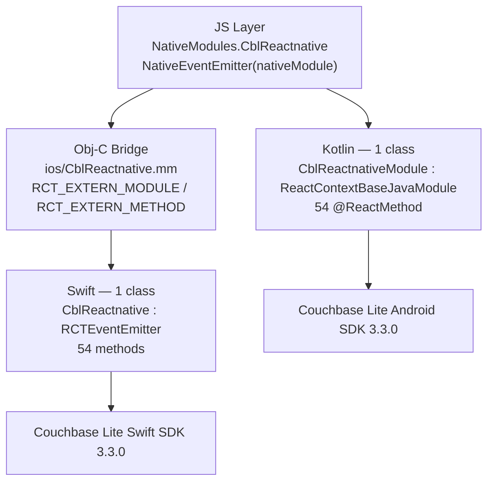
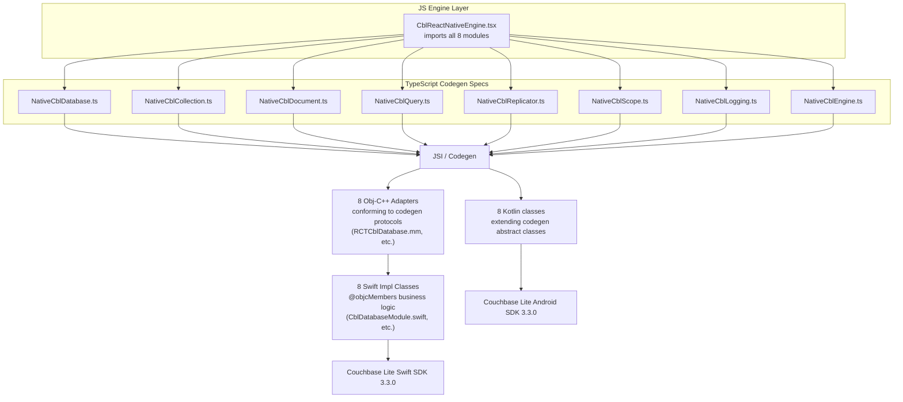

# Turbo Module Migration Plan — cbl-reactnative

## 1. Executive Summary

This plan migrates `cbl-reactnative` from the legacy React Native bridge to **8 domain-specific Turbo Modules**. Instead of one monolithic native module with 54+ methods, the library is decomposed into 8 focused modules — each with its own TypeScript codegen spec, codegen-generated native bindings, and clear domain boundary.

**What this delivers:**
- **Complete removal of the legacy bridge** — no backward compatibility layer, no interop mode, no old-arch fallback. The entire legacy bridge (`NativeModules`, `RCT_EXTERN_METHOD`, `ReactContextBaseJavaModule`, `@ReactMethod`, `RCTEventEmitter`, `ReactPackage`) is deleted.
- **8 independently validated TypeScript specs** — one per domain, each passing `tsc --noEmit` with zero errors
- **Codegen-generated native bindings** — static type safety across the JS ↔ native boundary
- **JSI-based calls** — no JSON serialization overhead, no async bridge queue
- **Lazy module loading** — each domain module loads on first access, not at startup
- **Lifecycle-scoped coroutines** — replaces deprecated `GlobalScope` on Android
- **New arch only** — minimum supported React Native version becomes 0.76+

> **This is a one-way migration.** After completion, the library will only work with React Native's New Architecture. The legacy bridge code is fully removed, not conditionally guarded.

**The 8 Domains:**

| # | Module Name | Spec File | Methods | Events |
|---|---|---|---|---|
| 1 | `CblDatabase` | `src/NativeCblDatabase.ts` | 9 | — |
| 2 | `CblCollection` | `src/NativeCblCollection.ts` | 13 | `collectionChange`, `collectionDocumentChange` |
| 3 | `CblDocument` | `src/NativeCblDocument.ts` | 7 | — |
| 4 | `CblQuery` | `src/NativeCblQuery.ts` | 4 | `queryChange` |
| 5 | `CblReplicator` | `src/NativeCblReplicator.ts` | 11 | `replicatorStatusChange`, `replicatorDocumentChange` |
| 6 | `CblScope` | `src/NativeCblScope.ts` | 3 | — |
| 7 | `CblLogging` | `src/NativeCblLogging.ts` | 5 | `customLogMessage` |
| 8 | `CblEngine` | `src/NativeCblEngine.ts` | 2 | — |

**Totals:** 54 async domain methods + 8 synchronous event-emitter infrastructure methods (on 4 modules) = **62 total method signatures**.

---

## 2. Architecture

### 2.1 Current Architecture (Single Monolithic Module)



### 2.2 Target Architecture (8 Domain Modules)



---

## 3. Domain Decomposition

### 3.1 Rationale

The current codebase already has domain-separated manager singletons on the native side (`DatabaseManager`, `CollectionManager`, `ReplicatorManager`, `LoggingManager`, `LogSinksManager`, `FileSystemHelper`). The 8-module split aligns the TypeScript specs with these existing native managers, making the native implementation a thin delegation layer.

### 3.2 Domain Boundaries

| Domain | Responsibility | Native Manager(s) Used |
|---|---|---|
| **Database** | Database lifecycle: open, close, delete, copy, exists, path, maintenance, encryption | `DatabaseManager` |
| **Collection** | Collection CRUD, count, fullName, default collection, index CRUD, collection/document change listeners | `CollectionManager`, `DatabaseManager` |
| **Document** | Document CRUD within collections, blob content, document expiration | `CollectionManager` |
| **Query** | SQL++ query execution, explain, query change listeners | `DatabaseManager`, `QueryHelper` |
| **Replicator** | Replicator lifecycle, status, pending docs, checkpoint, status/document change listeners | `ReplicatorManager`, `ReplicatorHelper`, `CollectionManager` |
| **Scope** | Scope discovery and access | `DatabaseManager` |
| **Logging** | Legacy log level/file config + new LogSinks API (console, file, custom with events) | `LoggingManager`, `LogSinksManager` |
| **Engine** | Cross-cutting: file system default path, generic listener token removal | `FileSystemHelper` |

### 3.3 Event Distribution

Four of the 8 modules emit native events. Each event-emitting module includes `addListener`/`removeListeners` in its spec (required by React Native's event emitter protocol). On the JS side, `NativeEventEmitter()` is instantiated without arguments (RN 0.76+ pattern) — all events flow through the global device event emitter regardless of which native module emits them.

| Module | Event Names |
|---|---|
| `CblCollection` | `collectionChange`, `collectionDocumentChange` |
| `CblQuery` | `queryChange` |
| `CblReplicator` | `replicatorStatusChange`, `replicatorDocumentChange` |
| `CblLogging` | `customLogMessage` |

---

## 4. Codebase Audit Findings

> Everything in this section must be addressed. The legacy bridge is being **fully removed** — not conditionally guarded or kept behind a flag. Items are grouped by category; the cleanup work is scheduled as the final migration phase (Phase 8).

### 4.1 Stale/Dead C Library References

| Location | Issue | Action |
|---|---|---|
| `package.json` line 50 | `"cpp"` listed in the `files` array — no `cpp/` directory exists in the repo | Remove from `files` |
| `.npmignore` line 6 | `cpp/**/*.dSYM` — references removed C library debug symbols | Remove line |
| `.npmignore` line 7 | `cpp/**/dSYMs` — references removed C library debug symbol folders | Remove line |
| `.npmignore` line 8 | `cpp/**/*.yml` — references removed C library CI config | Remove line |
| `cbl-reactnative.podspec` line 4 | `folly_compiler_flags` variable defined but only used inside the legacy new-arch guard | Delete variable |
| `cbl-reactnative.podspec` lines 29–41 | `if ENV['RCT_NEW_ARCH_ENABLED'] == '1'` block with stale Folly, RCT-Folly, RCTRequired, RCTTypeSafety, and ReactCommon dependencies | Delete entire conditional block; replace with `install_modules_dependencies(s)` |

### 4.2 Missing `codegenConfig` in `package.json`

`package.json` has **no** `codegenConfig` block. This is required for the React Native codegen to discover the TypeScript specs and generate native bindings. See Section 6.1 for the exact block to add, including `ios.modulesProvider` mappings.

### 4.3 Legacy Bridge APIs — Complete Inventory (All Must Be Removed)

| File | Legacy API | Occurrences | Line References |
|---|---|---|---|
| `src/CblReactNativeEngine.tsx` | `NativeModules` import | 1 | line 4 |
| `src/CblReactNativeEngine.tsx` | `NativeEventEmitter` import (used with module arg) | 1 | line 3 |
| `src/CblReactNativeEngine.tsx` | `NativeModules.CblReactnative` access with Proxy `LINKING_ERROR` fallback | 1 | lines 113–122 |
| `src/CblReactNativeEngine.tsx` | `new NativeEventEmitter(this.CblReactNative)` — passing module to constructor | 1 | line 133 |
| `ios/CblReactnative.mm` | `RCT_EXTERN_MODULE(CblReactnative, RCTEventEmitter)` | 1 | line 4 |
| `ios/CblReactnative.mm` | `RCT_EXTERN_METHOD` declarations | **47** | lines 6–388 (entire file) |
| `ios/CblReactnative.mm` | `#import <React/RCTBridgeModule.h>` | 1 | line 1 |
| `ios/CblReactnative.mm` | `#import <React/RCTEventEmitter.h>` | 1 | line 2 |
| `ios/CblReactnative.swift` | `class CblReactnative: RCTEventEmitter` | 1 | line 41 |
| `ios/CblReactnative.swift` | `override func supportedEvents()` | 1 | lines 101–108 |
| `ios/CblReactnative.swift` | `sendEvent(withName:body:)` call sites | **6** | lines 159, 215, 1277, 1408, 1442, 1867 |
| `ios/CblReactnative.swift` | `override func startObserving()` / `stopObserving()` | 2 | lines 83–89 |
| `ios/CblReactnative.swift` | `@objc override static func moduleName()` | 1 | lines 110–112 |
| `ios/CblReactnative.swift` | `@objc(...)` selector annotations on every method | ~52 | throughout file |
| `ios/CblReactnative-Bridging-Header.h` | `#import <React/RCTBridgeModule.h>` | 1 | line 1 |
| `ios/CblReactnative-Bridging-Header.h` | `#import <React/RCTEventEmitter.h>` | 1 | line 2 |
| `ios/CblReactnative-Bridging-Header.h` | `#import <React/RCTViewManager.h>` | 1 | line 3 |
| `android/.../CblReactnativeModule.kt` | `ReactContextBaseJavaModule` import and extends | 2 | lines 14, 59 |
| `android/.../CblReactnativeModule.kt` | `@ReactMethod` annotations | **48** | throughout file |
| `android/.../CblReactnativeModule.kt` | `@OptIn(DelicateCoroutinesApi::class)` | 1 | line 56 |
| `android/.../CblReactnativeModule.kt` | `GlobalScope.launch(Dispatchers.IO)` | **48+** | throughout file |
| `android/.../CblReactnativeModule.kt` | `sendEvent` helper using `DeviceEventManagerModule.RCTDeviceEventEmitter.emit()` | 1 | lines 94–101 |
| `android/.../CblReactnativeModule.kt` | `override fun getName(): String` | 1 | lines 77–79 |
| `android/.../CblReactnativePackage.kt` | `ReactPackage` import and extends | 2 | lines 3, 9 |
| `android/.../CblReactnativePackage.kt` | `createNativeModules` / `createViewManagers` | 2 | methods |

### 4.4 Dead Obj-C Bridge File — `ios/CblReactnative.mm` (Full Method Inventory)

This file will be **deleted entirely**. It declares the following methods via `RCT_EXTERN_METHOD` (47 declarations, 54 unique methods when counting the duplicate):

**Collection (22 declarations):**
1. `collection_AddChangeListener`
2. `collection_AddDocumentChangeListener`
3. `collection_RemoveChangeListener`
4. `collection_CreateCollection`
5. `collection_CreateIndex`
6. `collection_DeleteCollection`
7. `collection_DeleteDocument`
8. `collection_DeleteIndex`
9. `collection_GetBlobContent`
10. `collection_GetDocument` (**declared twice** — lines 83–89 and 124–130, duplicate bug)
11. `collection_GetCollection`
12. `collection_GetCollections`
13. `collection_GetCount`
14. `collection_GetFullName`
15. `collection_GetDefault`
16. `collection_GetDocumentExpiration`
17. `collection_GetIndexes`
18. `collection_PurgeDocument`
19. `collection_Save`
20. `collection_SetDocumentExpiration`

**Database (11):**
21. `database_ChangeEncryptionKey`
22. `database_Close`
23. `database_Copy`
24. `database_Delete`
25. `database_DeleteWithPath`
26. `database_Exists`
27. `database_GetPath`
28. `database_Open`
29. `database_PerformMaintenance`
30. `database_SetFileLoggingConfig`
31. `database_SetLogLevel`

**File System (1):**
32. `file_GetDefaultPath`

**Listener (1):**
33. `listenerToken_Remove`

**LogSinks (3):**
34. `logsinks_SetConsole`
35. `logsinks_SetFile`
36. `logsinks_SetCustom`

**Query (4):**
37. `query_AddChangeListener`
38. `query_RemoveChangeListener`
39. `query_Execute`
40. `query_Explain`

**Replicator (9):**
41. `replicator_AddChangeListener`
42. `replicator_AddDocumentChangeListener`
43. `replicator_Cleanup`
44. `replicator_Create`
45. `replicator_GetPendingDocumentIds`
46. `replicator_GetStatus`
47. `replicator_IsDocumentPending`
48. `replicator_RemoveChangeListener`
49. `replicator_ResetCheckpoint`
50. `replicator_Start`
51. `replicator_Stop`

**Scope (3):**
52. `scope_GetDefault`
53. `scope_GetScope`
54. `scope_GetScopes`

### 4.5 Platform Method Inconsistencies

Comparing every `RCT_EXTERN_METHOD` in `ios/CblReactnative.mm` against every `@ReactMethod` in `CblReactnativeModule.kt`:

| Method | iOS (.mm) | Android (.kt) | Issue |
|---|---|---|---|
| `collection_GetDocument` | Declared **twice** in `.mm` (lines 83–89 and 124–130) | Declared once | iOS has a duplicate extern declaration — bug |
| `database_SetFileLoggingConfig` | Parameter `shouldUsePlainText` is `BOOL` | Parameter `shouldUsePlainText` is `Boolean` | Types match across platform boundaries — OK |
| `database_PerformMaintenance` | iOS: `maintenanceType: NSNumber, databaseName: NSString` | Android: `maintenanceType: Double, databaseName: String` | Parameter order matches, types are platform-appropriate — OK |
| `addListener` / `removeListeners` | Not declared in `.mm` (inherited from `RCTEventEmitter`) | Explicitly declared as `@ReactMethod` in `.kt` (lines 83–92) | Android has explicit event emitter methods; iOS inherits them. Both must appear in codegen specs for event-emitting modules. |

**All other methods match in name, parameter count, and parameter order across both platforms.**

### 4.6 Event Names Cross-Platform Consistency

| Event Name | iOS (`CblReactnative.swift`) | Android (`CblReactnativeModule.kt`) | JS (`CblReactNativeEngine.tsx`) |
|---|---|---|---|
| `collectionChange` | line 94 `kCollectionChange` | line 699 literal | line 82 `_eventCollectionChange` |
| `collectionDocumentChange` | line 95 `kCollectionDocumentChange` | line 810 literal | line 83 `_eventCollectionDocumentChange` |
| `queryChange` | line 96 `kQueryChange` | line 1239 literal | line 84 `_eventQueryChange` |
| `replicatorStatusChange` | line 97 `kReplicatorStatusChange` | line 1288 literal | line 79 `_eventReplicatorStatusChange` |
| `replicatorDocumentChange` | line 98 `kReplicatorDocumentChange` | line 1325 literal | line 80 `_eventReplicatorDocumentChange` |
| `customLogMessage` | line 99 `kCustomLogMessage` | line 1720 literal | line 138 literal in constructor |

All 6 names are identical across all platforms. ✅

### 4.7 Deprecated Android Coroutine Pattern

`CblReactnativeModule.kt` uses `@OptIn(DelicateCoroutinesApi::class)` (line 56) and **every single `@ReactMethod`** wraps its body in `GlobalScope.launch(Dispatchers.IO)`. This is deprecated because:

- `GlobalScope` has no lifecycle — coroutines launched on it leak if the module is destroyed
- The `@OptIn(DelicateCoroutinesApi::class)` annotation is a static acknowledgment that the pattern is intentionally fragile

**Count:** 48+ occurrences of `GlobalScope.launch(Dispatchers.IO)` across the entire file.

**Replacement per module:** `CoroutineScope(SupervisorJob() + Dispatchers.IO)` cancelled in `invalidate()`.

### 4.8 `JavaScriptFilterEvaluator.kt` — Special Attention

`android/src/main/java/com/cblreactnative/cbl-js-kotlin/JavaScriptFilterEvaluator.kt` embeds a **J2V8 JavaScript engine** inside native code to evaluate replication push/pull filter functions.

Key details:
- Uses `ThreadLocal<V8Runtime>` for thread safety (line 14)
- Called from `ReplicatorHelper`/`ReplicatorManager` during replicator configuration setup, within `Dispatchers.IO` coroutine blocks
- The V8 runtime is independent of the Hermes/JSC runtime — this is **not** using the app's JS engine
- The `j2v8:6.2.1@aar` dependency (`android/build.gradle` line 111) is required solely for this evaluator
- **Risk:** Thread-local V8 instances may behave differently if Turbo Module methods are invoked from different threads than the legacy bridge. Since the evaluator runs inside `Dispatchers.IO`, the threading model should be unchanged.
- **No API changes required** during migration. **Must be tested** under new arch.

### 4.9 `EngineLocator` Registration

`EngineLocator.registerEngine(EngineLocator.key, this)` is called in the `CblReactNativeEngine` constructor (`src/CblReactNativeEngine.tsx` line 127).

- The engine class name is `CblReactNativeEngine`
- The registration key is the static string `'default'`
- This call remains unchanged — the class name does not change
- The `EngineLocator` itself (`src/cblite-js/cblite/src/engine-locator.ts`) has no native bridge dependencies and requires no modification

### 4.10 `uuid-fix.sh` Workaround

`uuid-fix.sh` copies `src/cblite-js/cblite/src/util/uuid-rn.ts` to `uuid.ts` and renames `uuid-ionic.ts` to `uuid-ionic.txt` at build time. This is a workaround for the multi-platform shared `cblite-js` codebase (shared between React Native and Ionic).

The Turbo Module migration does not change how TypeScript modules are resolved, so **this workaround remains necessary** unless the shared codebase adopts `tsconfig` path aliases or package.json conditional `exports`.

### 4.11 `create-react-native-library.type`

`package.json` line 197: `"type": "module-legacy"`. Must change to `"module-new"` to signal to `react-native-builder-bob` and the RN codegen that this library supports the new architecture natively.

### 4.12 Expo Config Plugin — Legacy Assumptions

`expo-example/cbl-reactnative-plugin.js` (line 9) appends `apply from: "../../android/build.gradle"` to the Expo app's `build.gradle`. Details:

- The `android/build.gradle` already conditionally applies `com.facebook.react` plugin (lines 30–32): `if (isNewArchitectureEnabled()) { apply plugin: "com.facebook.react" }`
- After migration, this plugin must still apply, and the Gradle plugin `com.facebook.react` must be active
- The plugin must be audited to ensure it doesn't duplicate the `apply from:` line or conflict with Expo's own new-arch Gradle wiring
- The `modifyXcodeProject` function (lines 17–22) is currently a no-op — no changes needed
- The `includeNativeModulePod` function (lines 25–35) is defined but **not called** — dead code that should be removed

### 4.13 `newArchEnabled` Flags

| Location | Current Value | Required Value |
|---|---|---|
| `expo-example/android/gradle.properties` line 38 | `newArchEnabled=false` | `newArchEnabled=true` |
| `expo-example/app.json` | **Missing** | Add `"newArchEnabled": true` inside the `"expo"` object |

### 4.14 Partially Migrated Pieces

**No existing Turbo Module artifacts were found.** A search for `TurboModule`, `TurboModuleRegistry`, `NativeCblReactnative`, `requireNativeModule`, and `codegenConfig` returned zero results in source files. The migration starts from scratch.

### 4.15 Other Code Quality Concerns

| Location | Issue | Action |
|---|---|---|
| `android/build.gradle` line 107 | `implementation "com.facebook.react:react-native:+"` uses dynamic version | Verify this is managed by the `com.facebook.react` Gradle plugin after migration |
| `ios/CblReactnative.mm` lines 124–130 | Duplicate `collection_GetDocument` `RCT_EXTERN_METHOD` | File is deleted entirely — no separate fix needed |
| `expo-example/cbl-reactnative-plugin.js` lines 25–35 | Dead `includeNativeModulePod` function (defined but never called) | Remove dead code |

---

## 5. The 8 TypeScript Module Specs

> **Codegen best practices applied:**
> - All domain operations are `async` (`Promise<T>`)
> - `addListener`/`removeListeners` remain synchronous (`void`) as required by RN event emitter protocol
> - Nullable parameters use `Type | null` (codegen-supported nullable syntax)
> - `Object` for generic dictionary/map returns; `string`/`boolean`/`number` for primitives
> - `string[]` for typed arrays
> - `import type` for tree-shaking; value import for `TurboModuleRegistry`
> - Every spec file is self-contained and independently passes `tsc --noEmit`

### 5.1 Database — `src/NativeCblDatabase.ts`

```typescript
import type { TurboModule } from 'react-native';
import { TurboModuleRegistry } from 'react-native';

export interface Spec extends TurboModule {
  database_Open(
    name: string,
    directory: string | null,
    encryptionKey: string | null
  ): Promise<Object>;

  database_Close(name: string): Promise<void>;

  database_Delete(name: string): Promise<void>;

  database_DeleteWithPath(path: string, name: string): Promise<void>;

  database_Copy(
    path: string,
    newName: string,
    directory: string | null,
    encryptionKey: string | null
  ): Promise<void>;

  database_Exists(name: string, directory: string): Promise<boolean>;

  database_GetPath(name: string): Promise<string>;

  database_PerformMaintenance(
    maintenanceType: number,
    databaseName: string
  ): Promise<void>;

  database_ChangeEncryptionKey(
    newKey: string,
    name: string
  ): Promise<void>;
}

export default TurboModuleRegistry.getEnforcing<Spec>('CblDatabase');
```

**Method count: 9 async**

---

### 5.2 Collection — `src/NativeCblCollection.ts`

```typescript
import type { TurboModule } from 'react-native';
import { TurboModuleRegistry } from 'react-native';

export interface Spec extends TurboModule {
  // Event emitter infrastructure (emits: collectionChange, collectionDocumentChange)
  addListener(eventType: string): void;
  removeListeners(count: number): void;

  // Collection CRUD
  collection_CreateCollection(
    collectionName: string,
    name: string,
    scopeName: string
  ): Promise<Object>;

  collection_DeleteCollection(
    collectionName: string,
    name: string,
    scopeName: string
  ): Promise<void>;

  collection_GetCollection(
    collectionName: string,
    name: string,
    scopeName: string
  ): Promise<Object>;

  collection_GetCollections(
    name: string,
    scopeName: string
  ): Promise<Object>;

  collection_GetDefault(name: string): Promise<Object>;

  collection_GetCount(
    collectionName: string,
    name: string,
    scopeName: string
  ): Promise<Object>;

  collection_GetFullName(
    collectionName: string,
    name: string,
    scopeName: string
  ): Promise<Object>;

  // Index operations
  collection_CreateIndex(
    indexName: string,
    index: Object,
    collectionName: string,
    scopeName: string,
    name: string
  ): Promise<void>;

  collection_DeleteIndex(
    indexName: string,
    collectionName: string,
    scopeName: string,
    name: string
  ): Promise<void>;

  collection_GetIndexes(
    collectionName: string,
    scopeName: string,
    name: string
  ): Promise<Object>;

  // Change listeners
  collection_AddChangeListener(
    changeListenerToken: string,
    collectionName: string,
    name: string,
    scopeName: string
  ): Promise<void>;

  collection_AddDocumentChangeListener(
    changeListenerToken: string,
    documentId: string,
    collectionName: string,
    name: string,
    scopeName: string
  ): Promise<void>;

  collection_RemoveChangeListener(
    changeListenerToken: string
  ): Promise<void>;
}

export default TurboModuleRegistry.getEnforcing<Spec>('CblCollection');
```

**Method count: 13 async + 2 event emitter = 15 total**

---

### 5.3 Document — `src/NativeCblDocument.ts`

```typescript
import type { TurboModule } from 'react-native';
import { TurboModuleRegistry } from 'react-native';

export interface Spec extends TurboModule {
  collection_GetDocument(
    docId: string,
    name: string,
    scopeName: string,
    collectionName: string
  ): Promise<Object>;

  collection_Save(
    document: string,
    blobs: string,
    docId: string,
    name: string,
    scopeName: string,
    collectionName: string,
    concurrencyControlValue: number
  ): Promise<Object>;

  collection_DeleteDocument(
    docId: string,
    name: string,
    scopeName: string,
    collectionName: string,
    concurrencyControl: number
  ): Promise<Object>;

  collection_PurgeDocument(
    docId: string,
    name: string,
    scopeName: string,
    collectionName: string
  ): Promise<void>;

  collection_GetDocumentExpiration(
    docId: string,
    name: string,
    scopeName: string,
    collectionName: string
  ): Promise<Object>;

  collection_SetDocumentExpiration(
    expiration: string,
    docId: string,
    name: string,
    scopeName: string,
    collectionName: string
  ): Promise<void>;

  collection_GetBlobContent(
    key: string,
    docId: string,
    name: string,
    scopeName: string,
    collectionName: string
  ): Promise<Object>;
}

export default TurboModuleRegistry.getEnforcing<Spec>('CblDocument');
```

**Method count: 7 async**

---

### 5.4 Query — `src/NativeCblQuery.ts`

```typescript
import type { TurboModule } from 'react-native';
import { TurboModuleRegistry } from 'react-native';

export interface Spec extends TurboModule {
  // Event emitter infrastructure (emits: queryChange)
  addListener(eventType: string): void;
  removeListeners(count: number): void;

  query_Execute(
    query: string,
    parameters: Object,
    name: string
  ): Promise<Object>;

  query_Explain(
    query: string,
    parameters: Object,
    name: string
  ): Promise<Object>;

  query_AddChangeListener(
    changeListenerToken: string,
    query: string,
    parameters: Object,
    name: string
  ): Promise<void>;

  query_RemoveChangeListener(
    changeListenerToken: string
  ): Promise<void>;
}

export default TurboModuleRegistry.getEnforcing<Spec>('CblQuery');
```

**Method count: 4 async + 2 event emitter = 6 total**

---

### 5.5 Replicator — `src/NativeCblReplicator.ts`

```typescript
import type { TurboModule } from 'react-native';
import { TurboModuleRegistry } from 'react-native';

export interface Spec extends TurboModule {
  // Event emitter infrastructure (emits: replicatorStatusChange, replicatorDocumentChange)
  addListener(eventType: string): void;
  removeListeners(count: number): void;

  replicator_Create(config: Object): Promise<Object>;

  replicator_Start(replicatorId: string): Promise<void>;

  replicator_Stop(replicatorId: string): Promise<void>;

  replicator_Cleanup(replicatorId: string): Promise<void>;

  replicator_GetStatus(replicatorId: string): Promise<Object>;

  replicator_ResetCheckpoint(replicatorId: string): Promise<void>;

  replicator_GetPendingDocumentIds(
    replicatorId: string,
    name: string,
    scopeName: string,
    collectionName: string
  ): Promise<Object>;

  replicator_IsDocumentPending(
    documentId: string,
    replicatorId: string,
    name: string,
    scopeName: string,
    collectionName: string
  ): Promise<Object>;

  replicator_AddChangeListener(
    changeListenerToken: string,
    replicatorId: string
  ): Promise<void>;

  replicator_AddDocumentChangeListener(
    changeListenerToken: string,
    replicatorId: string
  ): Promise<void>;

  replicator_RemoveChangeListener(
    changeListenerToken: string,
    replicatorId: string
  ): Promise<void>;
}

export default TurboModuleRegistry.getEnforcing<Spec>('CblReplicator');
```

**Method count: 11 async + 2 event emitter = 13 total**

---

### 5.6 Scope — `src/NativeCblScope.ts`

```typescript
import type { TurboModule } from 'react-native';
import { TurboModuleRegistry } from 'react-native';

export interface Spec extends TurboModule {
  scope_GetDefault(name: string): Promise<Object>;

  scope_GetScope(scopeName: string, name: string): Promise<Object>;

  scope_GetScopes(name: string): Promise<Object>;
}

export default TurboModuleRegistry.getEnforcing<Spec>('CblScope');
```

**Method count: 3 async**

---

### 5.7 Logging — `src/NativeCblLogging.ts`

```typescript
import type { TurboModule } from 'react-native';
import { TurboModuleRegistry } from 'react-native';

export interface Spec extends TurboModule {
  // Event emitter infrastructure (emits: customLogMessage)
  addListener(eventType: string): void;
  removeListeners(count: number): void;

  // Legacy logging API
  database_SetLogLevel(domain: string, logLevel: number): Promise<void>;

  database_SetFileLoggingConfig(
    name: string,
    directory: string,
    logLevel: number,
    maxSize: number,
    maxRotateCount: number,
    shouldUsePlainText: boolean
  ): Promise<void>;

  // New LogSinks API
  logsinks_SetConsole(level: number, domains: string[]): Promise<void>;

  logsinks_SetFile(level: number, config: Object): Promise<void>;

  logsinks_SetCustom(
    level: number,
    domains: string[],
    token: string
  ): Promise<void>;
}

export default TurboModuleRegistry.getEnforcing<Spec>('CblLogging');
```

**Method count: 5 async + 2 event emitter = 7 total**

---

### 5.8 Engine — `src/NativeCblEngine.ts`

```typescript
import type { TurboModule } from 'react-native';
import { TurboModuleRegistry } from 'react-native';

export interface Spec extends TurboModule {
  file_GetDefaultPath(): Promise<string>;

  listenerToken_Remove(changeListenerToken: string): Promise<void>;
}

export default TurboModuleRegistry.getEnforcing<Spec>('CblEngine');
```

**Method count: 2 async**

---

## 6. Codegen Configuration

### 6.1 `package.json` Changes

Add the following top-level block to `package.json`:

```json
"codegenConfig": {
  "name": "CblReactnativeSpecs",
  "type": "modules",
  "jsSrcsDir": "src",
  "android": {
    "javaPackageName": "com.cblreactnative"
  },
  "ios": {
    "modulesProvider": {
      "CblDatabase": "RCTCblDatabase",
      "CblCollection": "RCTCblCollection",
      "CblDocument": "RCTCblDocument",
      "CblQuery": "RCTCblQuery",
      "CblReplicator": "RCTCblReplicator",
      "CblScope": "RCTCblScope",
      "CblLogging": "RCTCblLogging",
      "CblEngine": "RCTCblEngine"
    }
  }
}
```

The `ios.modulesProvider` maps each JS module name (from `TurboModuleRegistry.getEnforcing('CblDatabase')`) to its Obj-C++ adapter class name (`RCTCblDatabase`). This replaces the old `RCT_EXPORT_MODULE` macro — module registration is now declarative via `package.json`.

The codegen scans `src/` for all files matching `Native*.ts` and generates per-module bindings.

Also change the `create-react-native-library` block:

```json
"create-react-native-library": {
  "type": "module-new",
  "languages": "kotlin-swift",
  "version": "0.38.1"
}
```

### 6.2 Cleanup in `package.json`

Remove `"cpp"` from the `files` array.

### 6.3 Cleanup in `.npmignore`

Remove the three `cpp/**` entries (lines 6–8).

### 6.4 Podspec Update — `cbl-reactnative.podspec`

Remove the `folly_compiler_flags` variable and the entire legacy conditional. Replace lines 4 and 21–42 with:

```ruby
install_modules_dependencies(s)
```

This single call handles all codegen, Folly, and React Native dependencies for RN 0.71+.

---

## 7. Async / Promise Architecture (How Codegen Handles Async)

In the **legacy bridge**, developers manually declared `RCTPromiseResolveBlock` / `RCTPromiseRejectBlock` (iOS) and `com.facebook.react.bridge.Promise` (Android) parameters in every async method. The Turbo Module codegen **eliminates this manual wiring entirely**.

### 7.1 TypeScript Spec → Codegen → Native

When you declare a method as `Promise<T>` in the TypeScript spec:

```typescript
database_Open(name: string, directory: string | null, encryptionKey: string | null): Promise<Object>;
```

The codegen automatically generates the correct native signature on each platform:

**iOS (Obj-C++ protocol method):**

```objc
- (void)database_Open:(NSString *)name
            directory:(NSString * _Nullable)directory
        encryptionKey:(NSString * _Nullable)encryptionKey
              resolve:(RCTPromiseResolveBlock)resolve
               reject:(RCTPromiseRejectBlock)reject;
```

**Android (abstract method in generated spec):**

```kotlin
abstract fun database_Open(name: String, directory: String?, encryptionKey: String?, promise: Promise)
```

> **You never write `RCTPromiseResolveBlock` or `@ReactMethod` yourself.** The codegen produces these from your TypeScript `Promise<T>` declaration. Your native code simply calls `resolve(result)` or `reject(error)` on the provided objects.

### 7.2 Why Every Database Operation Must Be Async

All Couchbase Lite operations involve disk I/O. In the codegen architecture:

1. The **JS thread** calls the Turbo Module method via JSI
2. The codegen plumbing creates a `Promise` and returns it to JS immediately
3. **Native code dispatches to a background thread** to do the actual work:
   - iOS: `DispatchQueue` (existing `backgroundQueue` pattern)
   - Android: `CoroutineScope(SupervisorJob() + Dispatchers.IO)` (replaces deprecated `GlobalScope`)
4. When the operation completes, native calls `resolve(result)` or `reject(error)`
5. The JS `Promise` settles, and `await` in the calling code resumes

This is identical in behavior to the old bridge async pattern, but without the JSON serialization overhead — parameters pass through JSI as C++ values.

### 7.3 Synchronous vs Async in the Spec

| Spec Return Type | Codegen Output | Use Case |
|---|---|---|
| `Promise<T>` | `resolve`/`reject` blocks (iOS) / `Promise` param (Android) | All I/O, network, database operations |
| `void` | No promise — synchronous void call | Event emitter infra (`addListener`, `removeListeners`) |
| `string`, `number`, `boolean` | Synchronous return on JSI thread | Only for trivial, non-blocking lookups (not used in this library) |

**In this library, all 54 domain operations return `Promise<T>`.** Only the 8 event-emitter infrastructure methods (`addListener`/`removeListeners`) are synchronous `void`.

### 7.4 Official Codegen Type Mapping (from RN 0.84 Appendix)

| TypeScript | Android (Kotlin/Java) | iOS (Obj-C) |
|---|---|---|
| `string` | `String` | `NSString` |
| `boolean` | `Boolean` | `NSNumber` (BOOL) |
| `number` | `double` | `NSNumber` |
| `Object` | `ReadableMap` | `NSDictionary` (untyped) |
| `string[]` | `ReadableArray` | `NSArray` |
| `string \| null` | `String?` | `NSString * _Nullable` |
| `Promise<T>` | `Promise` param | `RCTPromiseResolveBlock` + `RCTPromiseRejectBlock` |

---

## 8. JavaScript Layer Adaptation

### 8.1 `src/CblReactNativeEngine.tsx` Changes

The engine class currently uses a single `NativeModules.CblReactnative` reference. After migration, it imports all 8 modules:

```typescript
// BEFORE
import { NativeEventEmitter, NativeModules, Platform } from 'react-native';

// AFTER
import { EmitterSubscription, NativeEventEmitter, Platform } from 'react-native';
import NativeCblDatabase from './NativeCblDatabase';
import NativeCblCollection from './NativeCblCollection';
import NativeCblDocument from './NativeCblDocument';
import NativeCblQuery from './NativeCblQuery';
import NativeCblReplicator from './NativeCblReplicator';
import NativeCblScope from './NativeCblScope';
import NativeCblLogging from './NativeCblLogging';
import NativeCblEngine from './NativeCblEngine';
```

**Key changes:**

1. **Remove** the `NativeModules.CblReactnative` accessor and the `LINKING_ERROR` Proxy fallback entirely. `TurboModuleRegistry.getEnforcing()` in each spec throws a clear error if the module is not linked.

2. **Replace** `new NativeEventEmitter(this.CblReactNative)` with `new NativeEventEmitter()` (no argument). In RN 0.76+ new arch, all device events flow through a global emitter regardless of which native module emits them. A single `NativeEventEmitter()` instance handles all 6 event types.

3. **Route each method call** to the appropriate module:

   ```typescript
   // Database methods → NativeCblDatabase
   database_Open(args) { return NativeCblDatabase.database_Open(args.name, args.config.directory, args.config.encryptionKey); }

   // Collection methods → NativeCblCollection
   collection_CreateCollection(args) { return NativeCblCollection.collection_CreateCollection(args.collectionName, args.name, args.scopeName); }

   // Document methods → NativeCblDocument
   collection_GetDocument(args) { return NativeCblDocument.collection_GetDocument(args.docId, args.name, args.scopeName, args.collectionName); }

   // Query methods → NativeCblQuery
   query_Execute(args) { return NativeCblQuery.query_Execute(args.query, args.parameters, args.name); }

   // Replicator methods → NativeCblReplicator
   replicator_Create(args) { return NativeCblReplicator.replicator_Create(args.config); }

   // Scope methods → NativeCblScope
   scope_GetDefault(args) { return NativeCblScope.scope_GetDefault(args.name); }

   // Logging methods → NativeCblLogging
   logsinks_SetConsole(args) { return NativeCblLogging.logsinks_SetConsole(args.level, args.domains); }

   // Engine methods → NativeCblEngine
   file_GetDefaultPath() { return NativeCblEngine.file_GetDefaultPath(); }
   listenerToken_Remove(args) { return NativeCblEngine.listenerToken_Remove(args.changeListenerToken); }
   ```

4. **`EngineLocator.registerEngine`** call remains unchanged (line 127).

5. **Event name constants** remain unchanged — they already match native event names.

---

## 9. Native Implementation Guide

Each of the 8 specs generates a native protocol (iOS) or abstract class (Android) via codegen. The native implementation classes delegate to existing manager singletons.

### 9.1 iOS — Adapter Pattern (Required)

Swift **cannot** directly conform to codegen-generated protocols because codegen produces Objective-C++ headers containing C++ code that Swift cannot import. The official React Native pattern (RN 0.84 docs) is the **Adapter pattern**:

1. **Swift implementation class** — `@objcMembers public class` inheriting from `NSObject`, containing all business logic
2. **Obj-C++ adapter** (`.h` + `.mm`) — conforms to the codegen protocol, creates and holds a reference to the Swift class, forwards every method call to it

For each of the 8 modules, you need 3 files:

| Spec | Obj-C++ Adapter (.h + .mm) | Swift Implementation | Delegates To |
|---|---|---|---|
| `NativeCblDatabase.ts` | `RCTCblDatabase.h` / `.mm` | `CblDatabaseModule.swift` | `DatabaseManager.shared` |
| `NativeCblCollection.ts` | `RCTCblCollection.h` / `.mm` | `CblCollectionModule.swift` | `CollectionManager.shared`, `DatabaseManager.shared` |
| `NativeCblDocument.ts` | `RCTCblDocument.h` / `.mm` | `CblDocumentModule.swift` | `CollectionManager.shared` |
| `NativeCblQuery.ts` | `RCTCblQuery.h` / `.mm` | `CblQueryModule.swift` | `DatabaseManager.shared`, `QueryHelper` |
| `NativeCblReplicator.ts` | `RCTCblReplicator.h` / `.mm` | `CblReplicatorModule.swift` | `ReplicatorManager.shared`, `CollectionManager.shared` |
| `NativeCblScope.ts` | `RCTCblScope.h` / `.mm` | `CblScopeModule.swift` | `DatabaseManager.shared` |
| `NativeCblLogging.ts` | `RCTCblLogging.h` / `.mm` | `CblLoggingModule.swift` | `LoggingManager.shared`, `LogSinksManager.shared` |
| `NativeCblEngine.ts` | `RCTCblEngine.h` / `.mm` | `CblEngineModule.swift` | `FileSystemHelper` |

**Example — Database module Obj-C++ adapter:**

```objc
// RCTCblDatabase.h
#import <Foundation/Foundation.h>
#import <CblReactnativeSpecs/CblReactnativeSpecs.h>

@interface RCTCblDatabase : NSObject <NativeCblDatabaseSpec>
@end
```

```objc
// RCTCblDatabase.mm
#import "RCTCblDatabase.h"
#import "CblReactnative-Swift.h"  // Auto-generated header exposing Swift to ObjC

@implementation RCTCblDatabase {
    CblDatabaseModule *_impl;
}

- (id)init {
    if (self = [super init]) {
        _impl = [CblDatabaseModule new];
    }
    return self;
}

- (std::shared_ptr<facebook::react::TurboModule>)getTurboModule:
    (const facebook::react::ObjCTurboModule::InitParams &)params {
    return std::make_shared<facebook::react::NativeCblDatabaseSpecJSI>(params);
}

+ (NSString *)moduleName { return @"CblDatabase"; }

- (void)database_Open:(NSString *)name
            directory:(NSString *)directory
        encryptionKey:(NSString *)encryptionKey
              resolve:(RCTPromiseResolveBlock)resolve
               reject:(RCTPromiseRejectBlock)reject {
    [_impl database_OpenWithName:name directory:directory encryptionKey:encryptionKey resolve:resolve reject:reject];
}
// ... forward all other methods to _impl ...
@end
```

**Example — Database module Swift implementation:**

```swift
// CblDatabaseModule.swift
import Foundation

@objcMembers public class CblDatabaseModule: NSObject {
    private let backgroundQueue = DispatchQueue(label: "CblDatabaseModule", qos: .userInitiated)

    public func database_Open(
        name: String,
        directory: String?,
        encryptionKey: String?,
        resolve: @escaping RCTPromiseResolveBlock,
        reject: @escaping RCTPromiseRejectBlock
    ) {
        backgroundQueue.async {
            do {
                let result = try DatabaseManager.shared.openDatabase(name, directory: directory, encryptionKey: encryptionKey)
                resolve(result)
            } catch {
                reject("DATABASE_ERROR", error.localizedDescription, error)
            }
        }
    }
    // ... all other database methods follow the same async dispatch pattern ...
}
```

> **Key point:** The `resolve`/`reject` blocks are provided automatically by codegen from the `Promise<Object>` declaration in the TypeScript spec. You never import or declare `RCTPromiseResolveBlock` yourself — the codegen header supplies it.

The old `ios/CblReactnative.swift` and `ios/CblReactnative.mm` are **deleted**.

### 9.2 Android — Module Class Structure

| Spec | Native Class | Codegen Base Class | Delegates To |
|---|---|---|---|
| `NativeCblDatabase.ts` | `CblDatabaseModule.kt` | `NativeCblDatabaseSpec` | `DatabaseManager` |
| `NativeCblCollection.ts` | `CblCollectionModule.kt` | `NativeCblCollectionSpec` | `CollectionManager`, `DatabaseManager` |
| `NativeCblDocument.ts` | `CblDocumentModule.kt` | `NativeCblDocumentSpec` | `CollectionManager` |
| `NativeCblQuery.ts` | `CblQueryModule.kt` | `NativeCblQuerySpec` | `DatabaseManager` |
| `NativeCblReplicator.ts` | `CblReplicatorModule.kt` | `NativeCblReplicatorSpec` | `ReplicatorManager`, `CollectionManager` |
| `NativeCblScope.ts` | `CblScopeModule.kt` | `NativeCblScopeSpec` | `DatabaseManager` |
| `NativeCblLogging.ts` | `CblLoggingModule.kt` | `NativeCblLoggingSpec` | `LoggingManager`, `LogSinksManager` |
| `NativeCblEngine.ts` | `CblEngineModule.kt` | `NativeCblEngineSpec` | `FileSystemHelper` |

Each Kotlin module class:
- Extends the codegen-generated abstract class (e.g., `NativeCblDatabaseSpec(reactContext)`)
- The codegen-generated abstract class provides a `Promise` parameter for each `Promise<T>` method — you call `promise.resolve(result)` or `promise.reject(error)` instead of manually declaring `@ReactMethod` with Promise
- Uses `CoroutineScope(SupervisorJob() + Dispatchers.IO)` instead of deprecated `GlobalScope`
- Cancels the scope in `invalidate()`
- Has **no** `@ReactMethod` annotations — codegen provides all method signatures

**Example — Database module Kotlin implementation:**

```kotlin
class CblDatabaseModule(reactContext: ReactApplicationContext) :
    NativeCblDatabaseSpec(reactContext) {

    private val moduleScope = CoroutineScope(SupervisorJob() + Dispatchers.IO)

    override fun getName() = NAME

    override fun invalidate() {
        moduleScope.cancel()
        super.invalidate()
    }

    override fun database_Open(name: String, directory: String?, encryptionKey: String?, promise: Promise) {
        moduleScope.launch {
            try {
                val result = DatabaseManager.openDatabase(name, directory, encryptionKey, context)
                promise.resolve(result)
            } catch (e: Exception) {
                promise.reject("DATABASE_ERROR", e.message, e)
            }
        }
    }
    // ... all other database methods follow the same pattern ...

    companion object {
        const val NAME = "CblDatabase"
    }
}
```

> **Key point:** The `promise: Promise` parameter is auto-generated by codegen from the `Promise<Object>` in the TypeScript spec. You never write `@ReactMethod` annotations. The codegen abstract class defines the method signatures for you.

The old `CblReactnativeModule.kt` is **deleted**. `CblReactnativePackage.kt` is updated to register all 8 modules.

### 9.3 Android Package Registration

The latest React Native (0.77+/0.84) uses `BaseReactPackage` (not the deprecated `TurboReactPackage`):

```kotlin
import com.facebook.react.BaseReactPackage
import com.facebook.react.bridge.NativeModule
import com.facebook.react.bridge.ReactApplicationContext
import com.facebook.react.module.model.ReactModuleInfo
import com.facebook.react.module.model.ReactModuleInfoProvider

class CblReactnativePackage : BaseReactPackage() {
  override fun getModule(name: String, reactContext: ReactApplicationContext): NativeModule? {
    return when (name) {
      CblDatabaseModule.NAME -> CblDatabaseModule(reactContext)
      CblCollectionModule.NAME -> CblCollectionModule(reactContext)
      CblDocumentModule.NAME -> CblDocumentModule(reactContext)
      CblQueryModule.NAME -> CblQueryModule(reactContext)
      CblReplicatorModule.NAME -> CblReplicatorModule(reactContext)
      CblScopeModule.NAME -> CblScopeModule(reactContext)
      CblLoggingModule.NAME -> CblLoggingModule(reactContext)
      CblEngineModule.NAME -> CblEngineModule(reactContext)
      else -> null
    }
  }

  override fun getReactModuleInfoProvider() = ReactModuleInfoProvider {
    mapOf(
      CblDatabaseModule.NAME to ReactModuleInfo(
        name = CblDatabaseModule.NAME, className = CblDatabaseModule.NAME,
        canOverrideExistingModule = false, needsEagerInit = false,
        isCxxModule = false, isTurboModule = true
      ),
      CblCollectionModule.NAME to ReactModuleInfo(
        name = CblCollectionModule.NAME, className = CblCollectionModule.NAME,
        canOverrideExistingModule = false, needsEagerInit = false,
        isCxxModule = false, isTurboModule = true
      ),
      CblDocumentModule.NAME to ReactModuleInfo(
        name = CblDocumentModule.NAME, className = CblDocumentModule.NAME,
        canOverrideExistingModule = false, needsEagerInit = false,
        isCxxModule = false, isTurboModule = true
      ),
      CblQueryModule.NAME to ReactModuleInfo(
        name = CblQueryModule.NAME, className = CblQueryModule.NAME,
        canOverrideExistingModule = false, needsEagerInit = false,
        isCxxModule = false, isTurboModule = true
      ),
      CblReplicatorModule.NAME to ReactModuleInfo(
        name = CblReplicatorModule.NAME, className = CblReplicatorModule.NAME,
        canOverrideExistingModule = false, needsEagerInit = false,
        isCxxModule = false, isTurboModule = true
      ),
      CblScopeModule.NAME to ReactModuleInfo(
        name = CblScopeModule.NAME, className = CblScopeModule.NAME,
        canOverrideExistingModule = false, needsEagerInit = false,
        isCxxModule = false, isTurboModule = true
      ),
      CblLoggingModule.NAME to ReactModuleInfo(
        name = CblLoggingModule.NAME, className = CblLoggingModule.NAME,
        canOverrideExistingModule = false, needsEagerInit = false,
        isCxxModule = false, isTurboModule = true
      ),
      CblEngineModule.NAME to ReactModuleInfo(
        name = CblEngineModule.NAME, className = CblEngineModule.NAME,
        canOverrideExistingModule = false, needsEagerInit = false,
        isCxxModule = false, isTurboModule = true
      ),
    )
  }
}
```

### 9.4 Shared Listener State

The current codebase stores all listener tokens in a single `allChangeListenerTokenByUuid` dictionary on the monolithic module. After splitting into 8 modules:

- **Collection** module owns collection/document change listener tokens
- **Query** module owns query change listener tokens
- **Replicator** module owns replicator status/document change listener tokens
- **Engine** module's `listenerToken_Remove` needs access to all listener stores

**Solution:** Extract listener storage into a shared singleton (`ListenerTokenStore`) accessible by all modules. Alternatively, `listenerToken_Remove` on the Engine module can delegate removal to each domain module until one succeeds.

---

## 10. Validation & Exit Criteria

### 10.1 TypeScript Validation

Each of the 8 spec files must independently pass:

```bash
npx tsc --noEmit src/NativeCblDatabase.ts
npx tsc --noEmit src/NativeCblCollection.ts
npx tsc --noEmit src/NativeCblDocument.ts
npx tsc --noEmit src/NativeCblQuery.ts
npx tsc --noEmit src/NativeCblReplicator.ts
npx tsc --noEmit src/NativeCblScope.ts
npx tsc --noEmit src/NativeCblLogging.ts
npx tsc --noEmit src/NativeCblEngine.ts
```

And the full project must pass:

```bash
npx tsc --noEmit
npx eslint "**/*.{js,ts,tsx}"
```

### 10.2 Codegen Validation

```bash
yarn react-native codegen
```

Must produce generated files for all 8 specs:
- iOS: 8 `Native*Spec.h` protocol headers + 8 `Native*SpecJSI` C++ implementations (generated during `pod install`)
- Android: 8 `Native*Spec.java` abstract classes in `android/build/generated/source/codegen/`

### 10.3 Build Validation

```bash
# iOS
cd expo-example/ios && RCT_NEW_ARCH_ENABLED=1 pod install && xcodebuild -workspace ExpoExample.xcworkspace -scheme expo-example -configuration Debug -sdk iphonesimulator

# Android
cd expo-example/android && ./gradlew assembleDebug -PnewArchEnabled=true
```

### 10.4 Exit Criteria Checklist

- [ ] All 8 TypeScript spec files exist in `src/`
- [ ] `npx tsc --noEmit` passes with zero errors on all 8 specs
- [ ] `npx eslint` passes with zero errors on all 8 specs
- [ ] `codegenConfig` is present in `package.json`
- [ ] `create-react-native-library.type` is `module-new`
- [ ] Codegen generates native bindings for all 8 modules
- [ ] All 54 async domain methods are covered across the 8 specs
- [ ] All 4 event-emitting modules include `addListener`/`removeListeners`
- [ ] No spec uses deprecated patterns (`NativeModules`, `UnsafeObject`, synchronous domain methods)
- [ ] Parameter types match native implementations on both platforms

---

## 11. Migration Phases

### Phase 1 — Write the 8 TypeScript Specs (THIS TICKET)

Create all 8 spec files as defined in Section 5. Add `codegenConfig` to `package.json` (Section 6.1). Change `"type": "module-legacy"` to `"module-new"`. Validate per Section 10.1.

### Phase 2 — Update JavaScript Engine Layer

Update `src/CblReactNativeEngine.tsx` per Section 8.1:
- Import all 8 modules
- Remove `NativeModules` and Proxy fallback
- Replace `NativeEventEmitter(module)` with `NativeEventEmitter()`
- Route each method to the correct domain module

### Phase 3 — Implement Native Modules (iOS — Adapter Pattern)

- Create 8 Obj-C++ adapter classes (`.h` + `.mm`) conforming to codegen protocols per Section 9.1
- Create 8 Swift `@objcMembers` implementation classes delegating to existing managers
- Each adapter implements `getTurboModule:` returning the codegen JSI instance
- Codegen auto-generates `resolve`/`reject` blocks for all `Promise<T>` methods
- Delete `ios/CblReactnative.mm` and old `ios/CblReactnative.swift`
- Update bridging header and podspec

### Phase 4 — Implement Native Modules (Android)

- Create 8 Kotlin module classes extending codegen-generated specs per Section 9.2
- Codegen auto-generates `promise: Promise` param for all `Promise<T>` methods — call `promise.resolve()`/`promise.reject()` in each method
- Replace `GlobalScope` with `CoroutineScope(SupervisorJob() + Dispatchers.IO)` per module
- Delete old `CblReactnativeModule.kt`
- Update `CblReactnativePackage.kt` to `BaseReactPackage` per Section 9.3
- Extract shared listener storage per Section 9.4

### Phase 5 — Expo Example App Updates

- `expo-example/android/gradle.properties`: `newArchEnabled=true`
- `expo-example/app.json`: add `"newArchEnabled": true`
- Audit `expo-example/cbl-reactnative-plugin.js` for new-arch compatibility
- Run `npx expo prebuild --clean`

### Phase 6 — Build & Integration Testing

- Run codegen, verify generated files for all 8 modules
- Build both platforms with new arch enabled
- Run all integration tests under `expo-example/cblite-js-tests/`
- Verify all 6 event types emit correctly
- Verify replication filters (`JavaScriptFilterEvaluator.kt`) work under new arch

### Phase 7 — Full Legacy Removal & Cleanup

**All legacy bridge code is removed. No backward compatibility is maintained.** This is the final sweep addressing every issue catalogued in Section 4.

**Stale/dead code removal (Section 4.1):**
1. Remove `"cpp"` from `package.json` `files` array (line 50)
2. Remove the three `cpp/**` entries from `.npmignore` (lines 6–8)
3. Remove `folly_compiler_flags` variable from `cbl-reactnative.podspec` (line 4)
4. Remove the entire `if ENV['RCT_NEW_ARCH_ENABLED'] == '1'` conditional block from `cbl-reactnative.podspec` (lines 29–41); replace with `install_modules_dependencies(s)`

**Legacy bridge API removal verification (Section 4.3):**

Run the following grep to confirm zero legacy patterns remain in non-test source files:
```bash
rg -l "NativeModules|RCT_EXTERN_MODULE|RCT_EXTERN_METHOD|ReactContextBaseJavaModule|@ReactMethod|RCTEventEmitter|RCTBridgeModule|ReactPackage|TurboReactPackage|GlobalScope" --glob '!**/__tests__/**' --glob '!**/node_modules/**' src/ ios/ android/
```
This must return **zero results**.

**Expo config plugin cleanup (Section 4.12):**
- Remove dead `includeNativeModulePod` function from `expo-example/cbl-reactnative-plugin.js`
- Verify `modifyAndroidBuildGradle` still works with new arch Gradle setup

**Other cleanup (Section 4.15):**
- Verify `android/build.gradle` dependency `com.facebook.react:react-native:+` is properly managed by the `com.facebook.react` Gradle plugin
- Run `npx eslint "**/*.{js,ts,tsx}"` — zero errors
- Run `npx tsc --noEmit` — zero errors
- Confirm `lefthook.yml` pre-commit hooks pass on all new/modified files

**Documentation updates:**
- Update `README.md`: remove any legacy bridge setup instructions, add new-arch-only setup instructions, document minimum RN version 0.76+
- Update `CHANGELOG.md`: add entry for Turbo Module migration and legacy bridge removal

---

## 12. File Change Matrix

### TypeScript Specs (8 files created)

| File Path | Action | Summary |
|---|---|---|
| `src/NativeCblDatabase.ts` | **Create** | Database domain spec — 9 async methods |
| `src/NativeCblCollection.ts` | **Create** | Collection domain spec — 13 async + 2 event emitter methods |
| `src/NativeCblDocument.ts` | **Create** | Document domain spec — 7 async methods |
| `src/NativeCblQuery.ts` | **Create** | Query domain spec — 4 async + 2 event emitter methods |
| `src/NativeCblReplicator.ts` | **Create** | Replicator domain spec — 11 async + 2 event emitter methods |
| `src/NativeCblScope.ts` | **Create** | Scope domain spec — 3 async methods |
| `src/NativeCblLogging.ts` | **Create** | Logging domain spec — 5 async + 2 event emitter methods |
| `src/NativeCblEngine.ts` | **Create** | Engine domain spec — 2 async methods |

### Configuration & JS Layer

| File Path | Action | Summary |
|---|---|---|
| `package.json` | Modify | Remove `cpp` from `files`, add `codegenConfig` (incl. `ios.modulesProvider`), change type to `module-new` |
| `.npmignore` | Modify | Remove `cpp/**` entries |
| `cbl-reactnative.podspec` | Modify | Remove Folly flags; use `install_modules_dependencies(s)` unconditionally |
| `src/CblReactNativeEngine.tsx` | Modify | Import 8 modules; remove `NativeModules`; route methods per domain |

### iOS Native (8 Obj-C++ adapters + 8 Swift impls + 2 deleted)

| File Path | Action | Summary |
|---|---|---|
| `ios/CblReactnative.mm` | **Delete** | Old Obj-C extern bridge (RCT_EXTERN_MODULE / RCT_EXTERN_METHOD) |
| `ios/CblReactnative.swift` | **Delete** | Old monolithic Swift class (RCTEventEmitter subclass) |
| `ios/RCTCblDatabase.h` + `.mm` | **Create** | Obj-C++ adapter conforming to `NativeCblDatabaseSpec`, forwards to Swift |
| `ios/RCTCblCollection.h` + `.mm` | **Create** | Obj-C++ adapter conforming to `NativeCblCollectionSpec` |
| `ios/RCTCblDocument.h` + `.mm` | **Create** | Obj-C++ adapter conforming to `NativeCblDocumentSpec` |
| `ios/RCTCblQuery.h` + `.mm` | **Create** | Obj-C++ adapter conforming to `NativeCblQuerySpec` |
| `ios/RCTCblReplicator.h` + `.mm` | **Create** | Obj-C++ adapter conforming to `NativeCblReplicatorSpec` |
| `ios/RCTCblScope.h` + `.mm` | **Create** | Obj-C++ adapter conforming to `NativeCblScopeSpec` |
| `ios/RCTCblLogging.h` + `.mm` | **Create** | Obj-C++ adapter conforming to `NativeCblLoggingSpec` |
| `ios/RCTCblEngine.h` + `.mm` | **Create** | Obj-C++ adapter conforming to `NativeCblEngineSpec` |
| `ios/CblDatabaseModule.swift` | **Create** | Swift impl — `@objcMembers`, delegates to `DatabaseManager` |
| `ios/CblCollectionModule.swift` | **Create** | Swift impl — delegates to `CollectionManager` |
| `ios/CblDocumentModule.swift` | **Create** | Swift impl — delegates to `CollectionManager` |
| `ios/CblQueryModule.swift` | **Create** | Swift impl — delegates to `DatabaseManager` / `QueryHelper` |
| `ios/CblReplicatorModule.swift` | **Create** | Swift impl — delegates to `ReplicatorManager` |
| `ios/CblScopeModule.swift` | **Create** | Swift impl — delegates to `DatabaseManager` |
| `ios/CblLoggingModule.swift` | **Create** | Swift impl — delegates to `LoggingManager` / `LogSinksManager` |
| `ios/CblEngineModule.swift` | **Create** | Swift impl — delegates to `FileSystemHelper` |
| `ios/CblReactnative-Bridging-Header.h` | Modify | Remove legacy imports; add codegen header import |

### Android Native (8 Kotlin modules + 1 deleted + 1 modified)

| File Path | Action | Summary |
|---|---|---|
| `android/.../CblReactnativeModule.kt` | **Delete** | Old monolithic Kotlin module |
| `android/.../CblDatabaseModule.kt` | **Create** | Extends `NativeCblDatabaseSpec`; `CoroutineScope` + `promise.resolve()` |
| `android/.../CblCollectionModule.kt` | **Create** | Extends `NativeCblCollectionSpec` |
| `android/.../CblDocumentModule.kt` | **Create** | Extends `NativeCblDocumentSpec` |
| `android/.../CblQueryModule.kt` | **Create** | Extends `NativeCblQuerySpec` |
| `android/.../CblReplicatorModule.kt` | **Create** | Extends `NativeCblReplicatorSpec` |
| `android/.../CblScopeModule.kt` | **Create** | Extends `NativeCblScopeSpec` |
| `android/.../CblLoggingModule.kt` | **Create** | Extends `NativeCblLoggingSpec` |
| `android/.../CblEngineModule.kt` | **Create** | Extends `NativeCblEngineSpec` |
| `android/.../CblReactnativePackage.kt` | Modify | `BaseReactPackage` registering all 8 modules |
| `android/build.gradle` | Verify | Confirm `com.facebook.react` plugin applied |

### Expo Example App

| File Path | Action | Summary |
|---|---|---|
| `expo-example/android/gradle.properties` | Modify | `newArchEnabled=true` |
| `expo-example/app.json` | Modify | Add `"newArchEnabled": true` |

---

## 13. Risks and Mitigations

| Risk | Severity | Mitigation |
|---|---|---|
| **No backward compat with legacy bridge** — apps on RN < 0.76 or old arch cannot use this library after migration | **High** | This is intentional. The legacy bridge is fully removed. Minimum supported RN version becomes 0.76+. Existing users on older RN versions must either upgrade RN or pin to the last pre-migration library release. Document this as a **breaking change** in `CHANGELOG.md`. |
| 8 native modules = more module registration complexity | Medium | `BaseReactPackage.getModule()` switch is well-established official pattern. Each module is independently testable. |
| iOS Adapter pattern = 3 files per module (24 iOS files total) | Medium | Boilerplate is mechanical; the Obj-C++ adapters are thin forwarding layers. Existing manager classes are reused as-is. |
| Shared listener state across modules (`listenerToken_Remove`) | Medium | Extract into a `ListenerTokenStore` singleton shared across all native modules. |
| `GlobalScope` replacement may cancel in-flight operations | Low | Use `SupervisorJob()` so individual coroutine failures don't cascade. Cancel in `invalidate()`. |
| `JavaScriptFilterEvaluator.kt` J2V8 threading under JSI | Low | Evaluator runs on `Dispatchers.IO`, decoupled from JSI thread. Must be tested. |
| Expo config plugin conflicts with new-arch Gradle setup | Medium | Test `npx expo prebuild --clean` early. The plugin appends `apply from:` which should be idempotent. |
| Couchbase Lite SDK pinned to 3.3.0 | None | SDK version is orthogonal to bridge architecture. |

---

## 14. Definition of Done

**Spec Writing (Phase 1 — this ticket):**

- [ ] All 8 TypeScript spec files created in `src/`
- [ ] Every spec file passes `npx tsc --noEmit` with zero errors
- [ ] Every spec file passes `npx eslint` with zero errors
- [ ] All 54 async domain methods are represented across the 8 specs
- [ ] All 4 event-emitting modules include `addListener`/`removeListeners`
- [ ] `codegenConfig` (with `ios.modulesProvider`) added to `package.json`
- [ ] `create-react-native-library.type` changed to `module-new`

**Full Migration (all phases):**

- [ ] No `NativeModules`, `NativeEventEmitter(module)`, `RCT_EXTERN_MODULE`, `RCT_EXTERN_METHOD`, `ReactContextBaseJavaModule`, `@ReactMethod`, `ReactPackage`, `RCTEventEmitter`, `TurboReactPackage` remain in any non-test file
- [ ] 8 Obj-C++ adapter classes + 8 Swift impl classes created on iOS (Adapter pattern)
- [ ] 8 Kotlin module classes created on Android, each extending codegen-generated spec
- [ ] `ios/CblReactnative.mm` and `ios/CblReactnative.swift` deleted
- [ ] `android/.../CblReactnativeModule.kt` deleted
- [ ] Android uses `BaseReactPackage` (not deprecated `TurboReactPackage`)
- [ ] `GlobalScope` replaced with lifecycle-scoped `CoroutineScope` in every Android module
- [ ] All async methods use codegen-generated `Promise`/`resolve`/`reject` (no manual `RCTPromiseResolveBlock` declarations)
- [ ] `ios.modulesProvider` in `codegenConfig` maps all 8 JS module names to Obj-C++ adapter class names
- [ ] `newArchEnabled=true` in `expo-example/android/gradle.properties` and `expo-example/app.json`
- [ ] Both platforms build successfully with new arch enabled
- [ ] All existing integration tests pass
- [ ] All 6 event types emit correctly on both platforms
- [ ] `tsc --noEmit` passes with zero errors
- [ ] `eslint` passes with zero errors

**Legacy Cleanup (Phase 7):**

- [ ] `cpp` removed from `package.json` `files` array
- [ ] `cpp/**` entries removed from `.npmignore`
- [ ] `folly_compiler_flags` and legacy `RCT_NEW_ARCH_ENABLED` conditional removed from `cbl-reactnative.podspec`
- [ ] Dead `includeNativeModulePod` function removed from `expo-example/cbl-reactnative-plugin.js`
- [ ] `rg` search for legacy patterns returns zero results in source files
- [ ] `README.md` updated — legacy setup instructions removed, new-arch-only docs added, minimum RN 0.76+ documented
- [ ] `CHANGELOG.md` updated — breaking change documented
