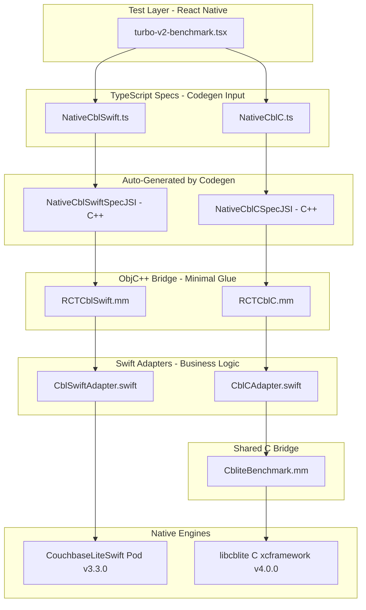

# Turbo V2: Production Codegen Turbo Modules + Full Performance Benchmark

## Why This Rewrite

The current "turbo" modules in [ios/turbo/](ios/turbo/) use `RCT_EXTERN_MODULE` / `RCT_EXTERN_METHOD` macros -- this is the **legacy bridge pattern**, not true Turbo Modules. True Codegen-based Turbo Modules:

- Auto-generate C++ JSI bindings from TypeScript specs (no manual `.mm` method mapping)
- Use `getTurboModule:` returning `std::make_shared<NativeXxxSpecJSI>(params)`
- Eliminate `RCT_EXTERN_METHOD` boilerplate entirely
- Give direct JSI thread access for synchronous methods

The project already has `codegenConfig` in [package.json](package.json) (lines 26-34) pointing to `src/specs`, and New Architecture is enabled in [expo-example/ios/Podfile.properties.json](expo-example/ios/Podfile.properties.json) (`newArchEnabled: true`). We just need to write proper specs and native implementations.

---

## Architecture Diagram




---

## File Map (9 New Files)


| #   | File                                               | Purpose                                             | Lines (est.) |
| --- | -------------------------------------------------- | --------------------------------------------------- | ------------ |
| 1   | `src/specs/NativeCblSwift.ts`                      | Codegen spec for Swift engine                       | ~120         |
| 2   | `src/specs/NativeCblC.ts`                          | Codegen spec for C engine                           | ~120         |
| 3   | `ios/turbo-v2/CblSwiftAdapter.swift`               | Swift business logic using CouchbaseLiteSwift       | ~500         |
| 4   | `ios/turbo-v2/CblCAdapter.swift`                   | Swift business logic wrapping libcblite C           | ~500         |
| 5   | `ios/turbo-v2/RCTCblSwift.h`                       | ObjC header for Swift bridge                        | ~15          |
| 6   | `ios/turbo-v2/RCTCblSwift.mm`                      | ObjC++ Codegen bridge forwarding to CblSwiftAdapter | ~250         |
| 7   | `ios/turbo-v2/RCTCblC.h`                           | ObjC header for C bridge                            | ~15          |
| 8   | `ios/turbo-v2/RCTCblC.mm`                          | ObjC++ Codegen bridge forwarding to CblCAdapter     | ~250         |
| 9   | `expo-example/app/database/turbo-v2-benchmark.tsx` | Full benchmark test screen                          | ~900         |


Existing files to modify:

- [ios/CblReactnative-Bridging-Header.h](ios/CblReactnative-Bridging-Header.h) -- add codegen header imports
- [cbl-reactnative.podspec](cbl-reactnative.podspec) -- ensure `ios/turbo-v2/**` is included in source_files (already covered by `ios/**/*.{h,m,mm,swift}`)
- [expo-example/hooks/useDatabaseNavigationSections.tsx](expo-example/hooks/useDatabaseNavigationSections.tsx) -- add navigation entry for new test screen

---

## API Consistency Rules

The existing customer-facing API is defined in [src/cblite-js/cblite/core-types.ts](src/cblite-js/cblite/core-types.ts). Our Turbo Module specs MUST replicate the same **object-arg** pattern and naming conventions as `ICoreEngine`:

- **All methods accept a single `args` object** whose shape matches the corresponding interface from `core-types.ts`. For example, `database_Close(args: { name: string })` mirrors `DatabaseArgs`, and `collection_Save(args: { name, scopeName, collectionName, id, document, blobs, concurrencyControl })` mirrors `CollectionSaveStringArgs` (fully flattened via `extends CollectionArgs`). Codegen cannot import from `core-types.ts` directly, so we replicate the shapes inline in the spec file.
- **Database operations** use `name` (the `databaseUniqueName` string returned by `database_Open`), NOT an opaque `dbHandle`
- **Collection operations** include `{ name, scopeName, collectionName }` in the args object every time (mirrors `CollectionArgs`)
- **`database_Delete(args: { name })`** deletes an open database (mirrors `DatabaseArgs`); **`database_DeleteWithPath(args: { databaseName, directory })`** deletes by path (mirrors `DatabaseExistsArgs`)
- **`database_GetPath`** returns `Promise<{ path: string }>` (mirrors `ICoreEngine`)
- **Document save** returns `{ _id, _revId, _sequence }` matching `CollectionDocumentSaveResult`
- **Replicator** uses `replicatorId` matching `ReplicatorArgs`
- **Method names** use `database_`, `collection_`, `query_`, `replicator_` prefixes (matching `ICoreEngine`)

> **Why object args, not flat params?** The existing `NativeCblCollection.ts` uses flat params (legacy approach). For the new V2 specs, we switch to object args because: (1) it exactly mirrors `ICoreEngine` — one contract, no mental translation; (2) Codegen generates typed C++ structs for each object, so type safety is preserved end-to-end; (3) no risk of parameter-ordering bugs with 7+ params; (4) adding a field later doesn't change the method signature. The ObjC++ bridge extracts fields from the Codegen struct and forwards them individually to the Swift adapter — the adapter code stays clean.

---

## STEP 1: TypeScript Specs

Both specs share the same interface shape (so the benchmark can swap between them). The only difference is the module name registered via `TurboModuleRegistry`. Every method accepts a **single `args` object** whose shape mirrors the corresponding interface from [src/cblite-js/cblite/core-types.ts](src/cblite-js/cblite/core-types.ts). Codegen generates typed C++ structs for each `args` object, and the ObjC++ bridge extracts individual fields before forwarding to the Swift adapter.

### File 1: `src/specs/NativeCblSwift.ts`

```typescript
/**
 * Turbo Module Spec: CouchbaseLite Swift Engine
 *
 * Codegen reads this file and auto-generates:
 *   - C++ JSI binding class: NativeCblSwiftSpecJSI
 *   - ObjC protocol: NativeCblSwiftSpec
 *
 * The ObjC++ bridge (RCTCblSwift.mm) implements NativeCblSwiftSpec
 * and forwards every call to CblSwiftAdapter.swift.
 *
 * IMPORTANT: Every method accepts a single `args` object whose shape
 * mirrors the corresponding interface from core-types.ts:
 *   DatabaseArgs           → { name }
 *   DatabaseOpenArgs        → { name, directory, encryptionKey }  (config flattened for Codegen)
 *   DatabaseExistsArgs      → { databaseName, directory }
 *   CollectionArgs          → { name, scopeName, collectionName }
 *   CollectionSaveStringArgs→ CollectionArgs + { id, document, blobs, concurrencyControl }
 *   CollectionGetDocumentArgs→ CollectionArgs + { docId }
 *   CollectionDeleteDocumentArgs→ CollectionArgs + { docId, concurrencyControl }
 *   CollectionPurgeDocumentArgs→ CollectionArgs + { docId }
 *   QueryExecuteArgs        → { name, query, parameters }
 *   ReplicatorArgs           → { replicatorId }
 */
import type { TurboModule } from 'react-native';
import { TurboModuleRegistry } from 'react-native';

export interface Spec extends TurboModule {
  // ── Database ──────────────────────────────────────────────────────────
  // Mirrors DatabaseOpenArgs: { name, config: { directory, encryptionKey } }
  // Config is flattened for Codegen compatibility (avoids nested struct generation).
  // Returns { databaseUniqueName } -- the "name" used in all subsequent calls.

  /** Opens (or creates) a database. Returns { databaseUniqueName }. */
  database_Open(args: {
    name: string;
    directory: string | null;
    encryptionKey: string | null;
  }): Promise<{ databaseUniqueName: string }>;

  /** Closes a database. Mirrors DatabaseArgs: { name }. */
  database_Close(args: { name: string }): Promise<void>;

  /** Deletes an open database by name. Mirrors DatabaseArgs: { name }. */
  database_Delete(args: { name: string }): Promise<void>;

  /**
   * Deletes a database file by path (static, db must be closed).
   * Mirrors DatabaseExistsArgs: { databaseName, directory }.
   */
  database_DeleteWithPath(args: {
    databaseName: string;
    directory: string;
  }): Promise<void>;

  /** Returns the filesystem path of an open database. Mirrors DatabaseArgs. */
  database_GetPath(args: { name: string }): Promise<{ path: string }>;

  /**
   * Checks if a database file exists at the given path.
   * Mirrors DatabaseExistsArgs: { databaseName, directory }.
   */
  database_Exists(args: {
    databaseName: string;
    directory: string;
  }): Promise<{ exists: boolean }>;

  // ── Collection ────────────────────────────────────────────────────────
  // Mirrors CollectionArgs: { name (=databaseUniqueName), scopeName, collectionName }

  /** Creates a collection (or returns existing). Mirrors CollectionArgs. */
  collection_CreateCollection(args: {
    name: string;
    scopeName: string;
    collectionName: string;
  }): Promise<{ name: string; scopeName: string; databaseName: string }>;

  /** Deletes a collection. Mirrors CollectionArgs. */
  collection_DeleteCollection(args: {
    name: string;
    scopeName: string;
    collectionName: string;
  }): Promise<void>;

  /** Total number of documents in a collection. Mirrors CollectionArgs. */
  collection_GetCount(args: {
    name: string;
    scopeName: string;
    collectionName: string;
  }): Promise<{ count: number }>;

  // ── Single Document CRUD ──────────────────────────────────────────────
  // Mirrors CollectionSaveStringArgs = CollectionArgs + { id, document, blobs, concurrencyControl }
  // Returns CollectionDocumentSaveResult: { _id, _revId, _sequence }

  /** Saves a document. Returns { _id, _revId, _sequence }. */
  collection_Save(args: {
    name: string;
    scopeName: string;
    collectionName: string;
    id: string;
    document: string;
    blobs: string;
    concurrencyControl: number;
  }): Promise<{ _id: string; _revId: string; _sequence: number }>;

  /** Gets a document by ID. Mirrors CollectionGetDocumentArgs. */
  collection_GetDocument(args: {
    name: string;
    scopeName: string;
    collectionName: string;
    docId: string;
  }): Promise<{
    _id: string;
    _data: Object;
    _sequence: number;
    _revId: string;
  } | null>;

  /** Deletes a document. Mirrors CollectionDeleteDocumentArgs. */
  collection_DeleteDocument(args: {
    name: string;
    scopeName: string;
    collectionName: string;
    docId: string;
    concurrencyControl: number;
  }): Promise<void>;

  /** Purges a document. Mirrors CollectionPurgeDocumentArgs. */
  collection_PurgeDocument(args: {
    name: string;
    scopeName: string;
    collectionName: string;
    docId: string;
  }): Promise<void>;

  // ── Batch Operations (NEW -- native-level batching) ───────────────────
  // These are new methods not in ICoreEngine. They follow the same args-object
  // pattern with CollectionArgs fields + batch-specific data as JSON strings
  // to avoid per-doc bridge overhead.

  /**
   * Saves many documents in ONE native call using inBatch (Swift) or Transaction (C).
   * @param args.docsJson - JSON string: array of { id: string, data: string }
   * @returns { saved, failed, timeMs, errors }
   */
  collection_BatchSave(args: {
    name: string;
    scopeName: string;
    collectionName: string;
    docsJson: string;
  }): Promise<{ saved: number; failed: number; timeMs: number; errors: string }>;

  /**
   * Gets many documents in ONE native call.
   * @param args.docIdsJson - JSON string: array of document ID strings
   * @returns JSON string: array of { _id, _data, _revId, _sequence }
   */
  collection_BatchGet(args: {
    name: string;
    scopeName: string;
    collectionName: string;
    docIdsJson: string;
  }): Promise<string>;

  /**
   * Deletes many documents in ONE native call using inBatch / Transaction.
   * @param args.docIdsJson - JSON string: array of document ID strings
   * @returns { deleted, failed, timeMs }
   */
  collection_BatchDelete(args: {
    name: string;
    scopeName: string;
    collectionName: string;
    docIdsJson: string;
  }): Promise<{ deleted: number; failed: number; timeMs: number }>;

  // ── Query ─────────────────────────────────────────────────────────────
  // Mirrors QueryExecuteArgs: { name (=databaseUniqueName), query, parameters }
  // `parameters` maps to Dictionary from core-types; use Object for Codegen.

  /** Executes a SQL++ query. Returns JSON array string of result rows. */
  query_Execute(args: {
    name: string;
    query: string;
    parameters: Object | null;
  }): Promise<string>;

  // ── Replicator ────────────────────────────────────────────────────────
  // replicator_Create takes a serialized config string (contains databaseName,
  // endpoint, collections, auth, etc.). Returns { replicatorId }.
  // All other replicator methods mirror ReplicatorArgs: { replicatorId }.

  /** Creates a replicator. Returns { replicatorId }. */
  replicator_Create(args: { config: string }): Promise<{ replicatorId: string }>;

  /** Starts the replicator. Mirrors ReplicatorArgs. */
  replicator_Start(args: { replicatorId: string }): Promise<void>;

  /** Stops the replicator. Mirrors ReplicatorArgs. */
  replicator_Stop(args: { replicatorId: string }): Promise<void>;

  /** Returns current replicator status. Mirrors ReplicatorArgs. */
  replicator_GetStatus(args: { replicatorId: string }): Promise<{
    activity: number;
    progress: { completed: number; total: number };
    error: string | null;
  }>;

  /** Stops and removes the replicator. Mirrors ReplicatorArgs. */
  replicator_Cleanup(args: { replicatorId: string }): Promise<void>;
}

export default TurboModuleRegistry.getEnforcing<Spec>('CblSwift');
```

### File 2: `src/specs/NativeCblC.ts`

Identical to above except the last two lines:

```typescript
// ... exact same Spec interface as NativeCblSwift.ts ...

export default TurboModuleRegistry.getEnforcing<Spec>('CblC');
```

---

## STEP 2: Swift Adapter for CouchbaseLite Swift

### File 3: `ios/turbo-v2/CblSwiftAdapter.swift`

This is the production-quality business logic layer using CouchbaseLiteSwift SDK. Key patterns:

- Thread-safe maps using concurrent DispatchQueue with `.barrier` for writes
- **Databases keyed by `name` (databaseUniqueName)** -- same string the JS layer uses, no opaque handles
- **Collections keyed by `name_scopeName_collectionName**` -- resolved on demand and cached internally; the caller always sends the triple
- Every operation validates its key before proceeding (like `DatabaseManager.getDatabase()` in [ios/cbl-js-swift/DatabaseManager.swift](ios/cbl-js-swift/DatabaseManager.swift) line 50-54)
- `collection_BatchSave` uses `database.inBatch(using:)` for optimal commit grouping
- **Replicators keyed by `replicatorId**` -- a UUID generated by the adapter
- Return values use underscore-prefixed keys (`_id`, `_revId`, `_sequence`) matching `CollectionDocumentSaveResult`

```swift
import Foundation
import CouchbaseLiteSwift

// MARK: - Error Types (same pattern as existing DatabaseError/CollectionError)

enum CblSwiftError: Error, LocalizedError {
    case databaseNotFound(name: String)
    case collectionNotFound(name: String, scope: String, collection: String)
    case databaseError(message: String)
    case collectionError(message: String)
    case documentError(message: String)
    case queryError(message: String)
    case replicatorError(message: String)
    case jsonParseError(message: String)

    var errorDescription: String? {
        switch self {
        case .databaseNotFound(let name):
            return "Database not found for name: '\(name)'"
        case .collectionNotFound(let name, let scope, let col):
            return "Collection not found: \(scope).\(col) in database '\(name)'"
        case .databaseError(let msg): return "Database error: \(msg)"
        case .collectionError(let msg): return "Collection error: \(msg)"
        case .documentError(let msg): return "Document error: \(msg)"
        case .queryError(let msg): return "Query error: \(msg)"
        case .replicatorError(let msg): return "Replicator error: \(msg)"
        case .jsonParseError(let msg): return "JSON parse error: \(msg)"
        }
    }
}

// MARK: - Adapter

@objcMembers
public class CblSwiftAdapter: NSObject {

    // Thread-safe storage (concurrent reads, barrier writes)
    private let queue = DispatchQueue(label: "com.cbl.swift.adapter", attributes: .concurrent)

    // Keyed by `name` (= databaseUniqueName)
    private var databases: [String: Database] = [:]

    // Keyed by "name::scopeName::collectionName" -- cached after first resolution
    private var collections: [String: Collection] = [:]

    // Keyed by replicatorId (UUID string)
    private var replicators: [String: Replicator] = [:]

    // MARK: - Key Helpers

    /// Build collection cache key from the triple that JS always sends
    private func collectionKey(name: String, scopeName: String, collectionName: String) -> String {
        return "\(name)::\(scopeName)::\(collectionName)"
    }

    /// Thread-safe read of a database by name
    private func getDatabase(_ name: String) -> Database? {
        return queue.sync { databases[name] }
    }

    /// Thread-safe resolve-or-cache for a collection.
    /// The caller always sends (name, scopeName, collectionName).
    /// We look up the cached Collection, or resolve it from the Database.
    private func resolveCollection(
        name: String, scopeName: String, collectionName: String
    ) -> Collection? {
        let key = collectionKey(name: name, scopeName: scopeName, collectionName: collectionName)

        // Fast path: already cached
        if let cached = queue.sync(execute: { collections[key] }) {
            return cached
        }

        // Slow path: resolve from database
        guard let db = getDatabase(name) else { return nil }
        guard let col = try? db.collection(name: collectionName, scope: scopeName) else {
            return nil
        }

        // Cache it (barrier write)
        queue.async(flags: .barrier) { self.collections[key] = col }
        return col
    }

    /// Thread-safe read of a replicator
    private func getReplicator(_ replicatorId: String) -> Replicator? {
        return queue.sync { replicators[replicatorId] }
    }

    // MARK: - Database Operations

    /// Opens (or creates) a database. Returns { databaseUniqueName }.
    /// The `name` parameter IS the databaseUniqueName -- it becomes the key.
    public func databaseOpen(
        name: String, directory: String?, encryptionKey: String?,
        resolve: @escaping RCTPromiseResolveBlock,
        reject: @escaping RCTPromiseRejectBlock
    ) {
        queue.async(flags: .barrier) {
            do {
                var config = DatabaseConfiguration()
                if let dir = directory, !dir.isEmpty {
                    config.directory = dir
                }
                if let key = encryptionKey, !key.isEmpty {
                    config.encryptionKey = EncryptionKey.password(key)
                }

                let db = try Database(name: name, config: config)
                self.databases[name] = db
                // Return the same name back -- JS uses it as the key
                resolve(["databaseUniqueName": name])
            } catch {
                reject("DB_OPEN", error.localizedDescription, error)
            }
        }
    }

    /// Closes a database by name.
    public func databaseClose(
        name: String,
        resolve: @escaping RCTPromiseResolveBlock,
        reject: @escaping RCTPromiseRejectBlock
    ) {
        queue.async(flags: .barrier) {
            guard let db = self.databases[name] else {
                reject("DB_CLOSE", "Database not found: \(name)", nil)
                return
            }
            do {
                try db.close()
                self.databases.removeValue(forKey: name)
                // Purge cached collections for this database
                self.collections = self.collections.filter { !$0.key.hasPrefix("\(name)::") }
                resolve(nil)
            } catch {
                reject("DB_CLOSE", error.localizedDescription, error)
            }
        }
    }

    /// Deletes an open database by name. Mirrors database_Delete(args: DatabaseArgs).
    /// Looks up the database by name, calls db.delete(), and removes from cache.
    public func databaseDelete(
        name: String,
        resolve: @escaping RCTPromiseResolveBlock,
        reject: @escaping RCTPromiseRejectBlock
    ) {
        queue.async(flags: .barrier) {
            guard let db = self.databases[name] else {
                reject("DB_DELETE", "Database not found: \(name)", nil)
                return
            }
            do {
                try db.delete()
                self.databases.removeValue(forKey: name)
                // Purge cached collections for this database
                self.collections = self.collections.filter { !$0.key.hasPrefix("\(name)::") }
                resolve(nil)
            } catch {
                reject("DB_DELETE", error.localizedDescription, error)
            }
        }
    }

    /// Deletes a database file by path (static, db must be closed).
    /// Mirrors database_DeleteWithPath(args: DatabaseExistsArgs = { databaseName, directory }).
    public func databaseDeleteWithPath(
        databaseName: String, directory: String,
        resolve: @escaping RCTPromiseResolveBlock,
        reject: @escaping RCTPromiseRejectBlock
    ) {
        queue.async(flags: .barrier) {
            do {
                try Database.delete(withName: databaseName, inDirectory: directory)
                resolve(nil)
            } catch {
                reject("DB_DELETE_PATH", error.localizedDescription, error)
            }
        }
    }

    /// Returns filesystem path of an open database.
    /// Mirrors database_GetPath(args: DatabaseArgs) -> { path: string }.
    public func databaseGetPath(
        name: String,
        resolve: @escaping RCTPromiseResolveBlock,
        reject: @escaping RCTPromiseRejectBlock
    ) {
        queue.async {
            guard let db = self.databases[name] else {
                reject("DB_PATH", "Database not found: \(name)", nil)
                return
            }
            resolve(["path": db.path ?? ""])
        }
    }

    /// Checks if a database file exists at the given path.
    /// Mirrors database_Exists(args: DatabaseExistsArgs = { databaseName, directory }).
    public func databaseExists(
        databaseName: String, directory: String,
        resolve: @escaping RCTPromiseResolveBlock,
        reject: @escaping RCTPromiseRejectBlock
    ) {
        queue.async {
            let exists = Database.exists(withName: databaseName, inDirectory: directory)
            resolve(["exists": exists])
        }
    }

    // MARK: - Collection Operations

    /// Creates (or returns existing) a collection.
    /// Mirrors CollectionArgs: { name, scopeName, collectionName }.
    public func collectionCreate(
        collectionName: String, name: String, scopeName: String,
        resolve: @escaping RCTPromiseResolveBlock,
        reject: @escaping RCTPromiseRejectBlock
    ) {
        queue.async(flags: .barrier) {
            guard let db = self.databases[name] else {
                reject("COL_CREATE", "Database not found: \(name)", nil)
                return
            }
            do {
                guard let collection = try db.createCollection(
                    name: collectionName, scope: scopeName
                ) else {
                    reject("COL_CREATE", "Failed to create collection '\(collectionName)'", nil)
                    return
                }
                // Cache it
                let key = self.collectionKey(name: name, scopeName: scopeName, collectionName: collectionName)
                self.collections[key] = collection
                resolve([
                    "name": collectionName,
                    "scopeName": scopeName,
                    "databaseName": name,
                ])
            } catch {
                reject("COL_CREATE", error.localizedDescription, error)
            }
        }
    }

    /// Document count for a collection. Async to match Promise<> spec.
    public func collectionGetCount(
        collectionName: String, name: String, scopeName: String,
        resolve: @escaping RCTPromiseResolveBlock,
        reject: @escaping RCTPromiseRejectBlock
    ) {
        queue.async {
            guard let col = self.resolveCollection(
                name: name, scopeName: scopeName, collectionName: collectionName
            ) else {
                reject("COL_COUNT", "Collection not found", nil)
                return
            }
            resolve(["count": col.count])
        }
    }

    // MARK: - Single Document CRUD

    /// Saves a document. Returns { _id, _revId, _sequence }.
    /// Params match CollectionSaveStringArgs: document, blobs, id, name, scopeName, collectionName, concurrencyControl
    public func collectionSave(
        document: String, blobs: String, id: String,
        name: String, scopeName: String, collectionName: String,
        concurrencyControl: Int,
        resolve: @escaping RCTPromiseResolveBlock,
        reject: @escaping RCTPromiseRejectBlock
    ) {
        queue.async(flags: .barrier) {
            guard let col = self.resolveCollection(
                name: name, scopeName: scopeName, collectionName: collectionName
            ) else {
                reject("DOC_SAVE", "Collection not found", nil)
                return
            }
            do {
                let mutableDoc: MutableDocument
                if id.isEmpty {
                    mutableDoc = try MutableDocument(json: document)
                } else {
                    mutableDoc = try MutableDocument(id: id, json: document)
                }

                // TODO: handle blobs if needed (for perf tests, blobs is typically "")

                if concurrencyControl == -9999 {
                    // No concurrency control specified
                    try col.save(document: mutableDoc)
                } else {
                    let cc: ConcurrencyControl = concurrencyControl == 0
                        ? .lastWriteWins : .failOnConflict
                    try col.save(document: mutableDoc, concurrencyControl: cc)
                }

                // Return format matches CollectionDocumentSaveResult
                let result: NSDictionary = [
                    "_id": mutableDoc.id,
                    "_revId": mutableDoc.revisionID ?? "",
                    "_sequence": mutableDoc.sequence,
                ]
                resolve(result)
            } catch {
                reject("DOC_SAVE", error.localizedDescription, error)
            }
        }
    }

    /// Gets a document. Returns { _id, _data, _sequence, _revId } or null.
    /// Key name `_revId` matches existing Collection.ts line 857: `docJson._revId`
    public func collectionGetDocument(
        docId: String, name: String, scopeName: String, collectionName: String,
        resolve: @escaping RCTPromiseResolveBlock,
        reject: @escaping RCTPromiseRejectBlock
    ) {
        queue.async {
            guard let col = self.resolveCollection(
                name: name, scopeName: scopeName, collectionName: collectionName
            ) else {
                reject("DOC_GET", "Collection not found", nil)
                return
            }
            do {
                guard let doc = try col.document(id: docId) else {
                    resolve(nil)
                    return
                }
                let result: NSDictionary = [
                    "_id": doc.id,
                    "_data": doc.toJSON(),
                    "_sequence": doc.sequence,
                    "_revId": doc.revisionID ?? "",
                ]
                resolve(result)
            } catch {
                reject("DOC_GET", error.localizedDescription, error)
            }
        }
    }

    /// Deletes a document.
    public func collectionDeleteDocument(
        docId: String, name: String, scopeName: String, collectionName: String,
        concurrencyControl: Int,
        resolve: @escaping RCTPromiseResolveBlock,
        reject: @escaping RCTPromiseRejectBlock
    ) {
        queue.async(flags: .barrier) {
            guard let col = self.resolveCollection(
                name: name, scopeName: scopeName, collectionName: collectionName
            ) else {
                reject("DOC_DEL", "Collection not found", nil)
                return
            }
            do {
                guard let doc = try col.document(id: docId) else {
                    reject("DOC_DEL", "Document not found: \(docId)", nil)
                    return
                }
                if concurrencyControl == -9999 {
                    try col.delete(document: doc)
                } else {
                    let cc: ConcurrencyControl = concurrencyControl == 0
                        ? .lastWriteWins : .failOnConflict
                    try col.delete(document: doc, concurrencyControl: cc)
                }
                resolve(nil)
            } catch {
                reject("DOC_DEL", error.localizedDescription, error)
            }
        }
    }

    // MARK: - Batch Operations

    /// Batch save using database.inBatch(using:) for optimal write performance.
    /// Receives ALL documents in ONE call as a JSON array, iterates natively.
    /// Takes the standard triple (name, scopeName, collectionName) -- NOT a handle.
    public func collectionBatchSave(
        name: String, scopeName: String, collectionName: String, docsJson: String,
        resolve: @escaping RCTPromiseResolveBlock,
        reject: @escaping RCTPromiseRejectBlock
    ) {
        queue.async(flags: .barrier) {
            guard let col = self.resolveCollection(
                name: name, scopeName: scopeName, collectionName: collectionName
            ) else {
                reject("BATCH_SAVE", "Collection not found", nil)
                return
            }
            guard let db = self.databases[name] else {
                reject("BATCH_SAVE", "Database not found: \(name)", nil)
                return
            }

            // Parse the JSON array of documents
            guard let jsonData = docsJson.data(using: .utf8),
                  let docsArray = try? JSONSerialization.jsonObject(with: jsonData) as? [[String: String]]
            else {
                reject("BATCH_SAVE", "Invalid docsJson format. Expected [{id:string, data:string}, ...]", nil)
                return
            }

            var saved = 0
            var failed = 0
            var errors: [String] = []
            let startTime = CFAbsoluteTimeGetCurrent()

            do {
                // inBatch: all writes share a single SQLite transaction
                try db.inBatch {
                    for docEntry in docsArray {
                        guard let docId = docEntry["id"],
                              let docData = docEntry["data"] else {
                            failed += 1
                            errors.append("Missing id or data field")
                            continue
                        }
                        do {
                            let mutableDoc = try MutableDocument(id: docId, json: docData)
                            try col.save(document: mutableDoc)
                            saved += 1
                        } catch {
                            failed += 1
                            errors.append("\(docId): \(error.localizedDescription)")
                        }
                    }
                }
            } catch {
                reject("BATCH_SAVE", "inBatch failed: \(error.localizedDescription)", error)
                return
            }

            let timeMs = (CFAbsoluteTimeGetCurrent() - startTime) * 1000.0
            let result: NSDictionary = [
                "saved": saved,
                "failed": failed,
                "timeMs": timeMs,
                "errors": errors.joined(separator: "; "),
            ]
            resolve(result)
        }
    }

    /// Batch get. Returns JSON string array of { _id, _data, _revId, _sequence }.
    public func collectionBatchGet(
        name: String, scopeName: String, collectionName: String, docIdsJson: String,
        resolve: @escaping RCTPromiseResolveBlock,
        reject: @escaping RCTPromiseRejectBlock
    ) {
        queue.async {
            guard let col = self.resolveCollection(
                name: name, scopeName: scopeName, collectionName: collectionName
            ) else {
                reject("BATCH_GET", "Collection not found", nil)
                return
            }
            guard let jsonData = docIdsJson.data(using: .utf8),
                  let docIds = try? JSONSerialization.jsonObject(with: jsonData) as? [String]
            else {
                reject("BATCH_GET", "Invalid docIdsJson format", nil)
                return
            }

            var results: [[String: Any]] = []
            for docId in docIds {
                do {
                    if let doc = try col.document(id: docId) {
                        results.append([
                            "_id": doc.id,
                            "_data": doc.toJSON(),
                            "_revId": doc.revisionID ?? "",
                            "_sequence": doc.sequence,
                        ])
                    }
                } catch {
                    // Skip failed reads
                }
            }

            do {
                let resultData = try JSONSerialization.data(withJSONObject: results)
                let resultString = String(data: resultData, encoding: .utf8) ?? "[]"
                resolve(resultString)
            } catch {
                reject("BATCH_GET", "JSON serialization failed", error)
            }
        }
    }

    /// Batch delete using inBatch.
    public func collectionBatchDelete(
        name: String, scopeName: String, collectionName: String, docIdsJson: String,
        resolve: @escaping RCTPromiseResolveBlock,
        reject: @escaping RCTPromiseRejectBlock
    ) {
        queue.async(flags: .barrier) {
            guard let col = self.resolveCollection(
                name: name, scopeName: scopeName, collectionName: collectionName
            ) else {
                reject("BATCH_DEL", "Collection not found", nil)
                return
            }
            guard let db = self.databases[name] else {
                reject("BATCH_DEL", "Database not found: \(name)", nil)
                return
            }
            guard let jsonData = docIdsJson.data(using: .utf8),
                  let docIds = try? JSONSerialization.jsonObject(with: jsonData) as? [String]
            else {
                reject("BATCH_DEL", "Invalid docIdsJson format", nil)
                return
            }

            var deleted = 0
            var failed = 0
            let startTime = CFAbsoluteTimeGetCurrent()

            do {
                try db.inBatch {
                    for docId in docIds {
                        do {
                            if let doc = try col.document(id: docId) {
                                try col.delete(document: doc)
                                deleted += 1
                            } else {
                                failed += 1
                            }
                        } catch {
                            failed += 1
                        }
                    }
                }
            } catch {
                reject("BATCH_DEL", "inBatch failed: \(error.localizedDescription)", error)
                return
            }

            let timeMs = (CFAbsoluteTimeGetCurrent() - startTime) * 1000.0
            let result: NSDictionary = [
                "deleted": deleted,
                "failed": failed,
                "timeMs": timeMs,
            ]
            resolve(result)
        }
    }

    // MARK: - Query

    /// Executes a SQL++ query. Takes (query, parametersJson, name) matching QueryExecuteArgs.
    public func queryExecute(
        query queryString: String, parametersJson: String?, name: String,
        resolve: @escaping RCTPromiseResolveBlock,
        reject: @escaping RCTPromiseRejectBlock
    ) {
        queue.async {
            guard let db = self.databases[name] else {
                reject("QUERY", "Database not found: \(name)", nil)
                return
            }
            do {
                let query = try db.createQuery(queryString)

                // Parse parameters if provided
                if let paramsJson = parametersJson, !paramsJson.isEmpty,
                   let paramsData = paramsJson.data(using: .utf8),
                   let paramsDict = try? JSONSerialization.jsonObject(with: paramsData) as? [String: Any]
                {
                    let params = Parameters()
                    for (key, value) in paramsDict {
                        params.setValue(value, forName: key)
                    }
                    query.parameters = params
                }

                let results = try query.execute()
                let resultJSONs = results.map { $0.toJSON() }
                let jsonArray = "[" + resultJSONs.joined(separator: ",") + "]"
                resolve(jsonArray)
            } catch {
                reject("QUERY", error.localizedDescription, error)
            }
        }
    }

    // MARK: - Replicator

    /// Creates a replicator. configJson includes: endpoint, username, password,
    /// replicatorType, continuous, collections [{scope, name}], and databaseName.
    /// Returns { replicatorId }.
    public func replicatorCreate(
        configJson: String,
        resolve: @escaping RCTPromiseResolveBlock,
        reject: @escaping RCTPromiseRejectBlock
    ) {
        queue.async(flags: .barrier) {
            guard let jsonData = configJson.data(using: .utf8),
                  let config = try? JSONSerialization.jsonObject(with: jsonData) as? [String: Any]
            else {
                reject("REPL_CREATE", "Invalid configJson", nil)
                return
            }

            // The databaseName is in the config (matches existing pattern)
            guard let dbName = config["databaseName"] as? String,
                  let db = self.databases[dbName]
            else {
                reject("REPL_CREATE", "Database not found in config", nil)
                return
            }

            // Parse endpoint
            guard let endpointUrl = config["endpoint"] as? String,
                  let url = URL(string: endpointUrl),
                  let endpoint = URLEndpoint(url: url) as URLEndpoint?
            else {
                reject("REPL_CREATE", "Invalid endpoint URL", nil)
                return
            }

            // Parse collections to replicate
            guard let colConfigs = config["collections"] as? [[String: String]] else {
                reject("REPL_CREATE", "Missing 'collections' array", nil)
                return
            }

            var collectionsToSync: [Collection] = []
            for colConfig in colConfigs {
                guard let scopeName = colConfig["scope"],
                      let colName = colConfig["name"] else { continue }
                do {
                    if let col = try db.collection(name: colName, scope: scopeName) {
                        collectionsToSync.append(col)
                    }
                } catch {
                    reject("REPL_CREATE", "Collection not found: \(colName)", error)
                    return
                }
            }

            // Build replicator config
            let replConfig = ReplicatorConfiguration(target: endpoint)
            let colConfig = CollectionConfiguration()
            replConfig.addCollections(collectionsToSync, config: colConfig)

            // Replicator type
            let replTypeStr = config["replicatorType"] as? String ?? "pushAndPull"
            switch replTypeStr {
            case "push": replConfig.replicatorType = .push
            case "pull": replConfig.replicatorType = .pull
            default: replConfig.replicatorType = .pushAndPull
            }

            // Continuous
            replConfig.continuous = config["continuous"] as? Bool ?? false

            // Authentication
            if let username = config["username"] as? String,
               let password = config["password"] as? String
            {
                replConfig.authenticator = BasicAuthenticator(
                    username: username, password: password
                )
            }

            let replicator = Replicator(config: replConfig)
            let replicatorId = UUID().uuidString
            self.replicators[replicatorId] = replicator
            resolve(["replicatorId": replicatorId])
        }
    }

    public func replicatorStart(
        replicatorId: String,
        resolve: @escaping RCTPromiseResolveBlock,
        reject: @escaping RCTPromiseRejectBlock
    ) {
        queue.async {
            guard let repl = self.replicators[replicatorId] else {
                reject("REPL_START", "Invalid replicatorId: \(replicatorId)", nil)
                return
            }
            repl.start()
            resolve(nil)
        }
    }

    public func replicatorStop(
        replicatorId: String,
        resolve: @escaping RCTPromiseResolveBlock,
        reject: @escaping RCTPromiseRejectBlock
    ) {
        queue.async {
            guard let repl = self.replicators[replicatorId] else {
                reject("REPL_STOP", "Invalid replicatorId: \(replicatorId)", nil)
                return
            }
            repl.stop()
            resolve(nil)
        }
    }

    /// Returns current replicator status. Async Promise<>.
    public func replicatorGetStatus(
        replicatorId: String,
        resolve: @escaping RCTPromiseResolveBlock,
        reject: @escaping RCTPromiseRejectBlock
    ) {
        queue.async {
            guard let repl = self.replicators[replicatorId] else {
                reject("REPL_STATUS", "Invalid replicatorId: \(replicatorId)", nil)
                return
            }
            let status = repl.status
            let errorMsg: String? = status.error?.localizedDescription
            let result: NSDictionary = [
                "activity": status.activity.rawValue,
                "progress": [
                    "completed": status.progress.completed,
                    "total": status.progress.total,
                ],
                "error": errorMsg ?? NSNull(),
            ]
            resolve(result)
        }
    }

    public func replicatorCleanup(
        replicatorId: String,
        resolve: @escaping RCTPromiseResolveBlock,
        reject: @escaping RCTPromiseRejectBlock
    ) {
        queue.async(flags: .barrier) {
            guard let repl = self.replicators[replicatorId] else {
                reject("REPL_CLEANUP", "Invalid replicatorId: \(replicatorId)", nil)
                return
            }
            repl.stop()
            self.replicators.removeValue(forKey: replicatorId)
            resolve(nil)
        }
    }
}
```

---

## STEP 3: Swift Adapter for CouchbaseLite C

### File 4: `ios/turbo-v2/CblCAdapter.swift`

Same public API shape as CblSwiftAdapter (databases keyed by `name`, collections by triple, replicators by `replicatorId`), but wraps the existing [ios/CbliteBenchmark.mm](ios/CbliteBenchmark.mm) for database/collection/document operations and calls C replicator APIs directly.

Key differences:

- Uses `CbliteBenchmark` for database/collection/document ops (already tested and working)
- Uses `CBLDatabase_BeginTransaction` / `CBLDatabase_EndTransaction` for batch ops (instead of `inBatch`)
- Internally stores `Int64` C pointers mapped from the same `name` / triple keys
- Uses C replicator API (`CBLReplicator_Create`, `CBLReplicator_Start`, etc.)

```swift
import Foundation

@objcMembers
public class CblCAdapter: NSObject {

    private let queue = DispatchQueue(label: "com.cbl.c.adapter", attributes: .concurrent)
    private let clib = CbliteBenchmark()

    // Keyed by `name` (databaseUniqueName) -> Int64 C pointer
    private var databases: [String: Int64] = [:]

    // Keyed by "name::scopeName::collectionName" -> (colPtr, dbName)
    private var collections: [String: (colPtr: Int64, dbName: String)] = [:]

    // Keyed by replicatorId -> Int64 C pointer
    private var replicators: [String: Int64] = [:]

    // MARK: - Key Helpers

    private func collectionKey(name: String, scopeName: String, collectionName: String) -> String {
        return "\(name)::\(scopeName)::\(collectionName)"
    }

    /// Resolve a collection pointer -- cache after first lookup
    private func resolveCollectionPtr(
        name: String, scopeName: String, collectionName: String
    ) -> Int64? {
        let key = collectionKey(name: name, scopeName: scopeName, collectionName: collectionName)
        if let cached = queue.sync(execute: { collections[key] }) {
            return cached.colPtr
        }
        guard let dbPtr = queue.sync(execute: { databases[name] }) else { return nil }
        let colPtr = clib.createCollection(withHandle: dbPtr, name: collectionName, scopeName: scopeName)
        if colPtr == 0 { return nil }
        queue.async(flags: .barrier) { self.collections[key] = (colPtr: colPtr, dbName: name) }
        return colPtr
    }

    // MARK: - Database Operations

    public func databaseOpen(
        name: String, directory: String?, encryptionKey: String?,
        resolve: @escaping RCTPromiseResolveBlock,
        reject: @escaping RCTPromiseRejectBlock
    ) {
        queue.async(flags: .barrier) {
            let dir = directory ?? ""
            guard !dir.isEmpty else {
                reject("DB_OPEN", "Directory is required for C library", nil)
                return
            }
            let ptr = self.clib.openDatabase(withName: name, directory: dir)
            if ptr == 0 {
                reject("DB_OPEN", "Failed to open database '\(name)'", nil)
                return
            }
            self.databases[name] = ptr
            resolve(["databaseUniqueName": name])
        }
    }

    public func databaseClose(
        name: String,
        resolve: @escaping RCTPromiseResolveBlock,
        reject: @escaping RCTPromiseRejectBlock
    ) {
        queue.async(flags: .barrier) {
            guard let ptr = self.databases[name] else {
                reject("DB_CLOSE", "Database not found: \(name)", nil)
                return
            }
            self.clib.closeDatabase(withHandle: ptr)
            self.databases.removeValue(forKey: name)
            self.collections = self.collections.filter { !$0.key.hasPrefix("\(name)::") }
            resolve(nil)
        }
    }

    /// Deletes an open database by name. Mirrors database_Delete(args: DatabaseArgs).
    public func databaseDelete(
        name: String,
        resolve: @escaping RCTPromiseResolveBlock,
        reject: @escaping RCTPromiseRejectBlock
    ) {
        queue.async(flags: .barrier) {
            guard let ptr = self.databases[name] else {
                reject("DB_DELETE", "Database not found: \(name)", nil)
                return
            }
            self.clib.closeDatabase(withHandle: ptr)
            // TODO: call CBLDatabase_Delete via CbliteBenchmark
            self.databases.removeValue(forKey: name)
            self.collections = self.collections.filter { !$0.key.hasPrefix("\(name)::") }
            resolve(nil)
        }
    }

    /// Deletes a database file by path (static, db must be closed).
    /// Mirrors database_DeleteWithPath(args: DatabaseExistsArgs = { databaseName, directory }).
    public func databaseDeleteWithPath(
        databaseName: String, directory: String,
        resolve: @escaping RCTPromiseResolveBlock,
        reject: @escaping RCTPromiseRejectBlock
    ) {
        queue.async(flags: .barrier) {
            self.clib.deleteDatabase(withName: databaseName, directory: directory)
            resolve(nil)
        }
    }

    /// Returns filesystem path of an open database.
    /// Mirrors database_GetPath(args: DatabaseArgs) -> { path: string }.
    public func databaseGetPath(
        name: String,
        resolve: @escaping RCTPromiseResolveBlock,
        reject: @escaping RCTPromiseRejectBlock
    ) {
        queue.async {
            // C library CBLDatabase_Path can be added to CbliteBenchmark;
            // for now return empty string wrapped in dict to match ICoreEngine
            resolve(["path": ""])
        }
    }

    /// Checks if a database file exists at the given path.
    /// Mirrors database_Exists(args: DatabaseExistsArgs = { databaseName, directory }).
    public func databaseExists(
        databaseName: String, directory: String,
        resolve: @escaping RCTPromiseResolveBlock,
        reject: @escaping RCTPromiseRejectBlock
    ) {
        queue.async {
            // TODO: implement via CBLDatabase_Exists in CbliteBenchmark
            resolve(["exists": false])
        }
    }

    // MARK: - Collection Operations

    public func collectionCreate(
        collectionName: String, name: String, scopeName: String,
        resolve: @escaping RCTPromiseResolveBlock,
        reject: @escaping RCTPromiseRejectBlock
    ) {
        queue.async(flags: .barrier) {
            guard let dbPtr = self.databases[name] else {
                reject("COL_CREATE", "Database not found: \(name)", nil)
                return
            }
            let colPtr = self.clib.createCollection(
                withHandle: dbPtr, name: collectionName, scopeName: scopeName
            )
            if colPtr == 0 {
                reject("COL_CREATE", "Failed to create collection '\(collectionName)'", nil)
                return
            }
            let key = self.collectionKey(name: name, scopeName: scopeName, collectionName: collectionName)
            self.collections[key] = (colPtr: colPtr, dbName: name)
            resolve([
                "name": collectionName,
                "scopeName": scopeName,
                "databaseName": name,
            ])
        }
    }

    public func collectionGetCount(
        collectionName: String, name: String, scopeName: String,
        resolve: @escaping RCTPromiseResolveBlock,
        reject: @escaping RCTPromiseRejectBlock
    ) {
        queue.async {
            guard let colPtr = self.resolveCollectionPtr(
                name: name, scopeName: scopeName, collectionName: collectionName
            ) else {
                reject("COL_COUNT", "Collection not found", nil)
                return
            }
            let count = self.clib.getDocumentCount(withCollectionHandle: colPtr)
            resolve(["count": count])
        }
    }

    // MARK: - Single Document CRUD

    public func collectionSave(
        document: String, blobs: String, id: String,
        name: String, scopeName: String, collectionName: String,
        concurrencyControl: Int,
        resolve: @escaping RCTPromiseResolveBlock,
        reject: @escaping RCTPromiseRejectBlock
    ) {
        queue.async(flags: .barrier) {
            guard let colPtr = self.resolveCollectionPtr(
                name: name, scopeName: scopeName, collectionName: collectionName
            ) else {
                reject("DOC_SAVE", "Collection not found", nil)
                return
            }
            let success = self.clib.saveDocument(
                withCollectionHandle: colPtr,
                documentId: id,
                jsonData: document
            )
            if success {
                // C lib doesn't return revId/sequence; use placeholders
                let result: NSDictionary = [
                    "_id": id, "_revId": "", "_sequence": 0,
                ]
                resolve(result)
            } else {
                reject("DOC_SAVE", "Failed to save document '\(id)'", nil)
            }
        }
    }

    public func collectionGetDocument(
        docId: String, name: String, scopeName: String, collectionName: String,
        resolve: @escaping RCTPromiseResolveBlock,
        reject: @escaping RCTPromiseRejectBlock
    ) {
        queue.async {
            guard let colPtr = self.resolveCollectionPtr(
                name: name, scopeName: scopeName, collectionName: collectionName
            ) else {
                reject("DOC_GET", "Collection not found", nil)
                return
            }
            if let json = self.clib.getDocument(
                withCollectionHandle: colPtr, documentId: docId
            ) {
                let result: NSDictionary = [
                    "_id": docId, "_data": json, "_revId": "", "_sequence": 0,
                ]
                resolve(result)
            } else {
                resolve(nil)
            }
        }
    }

    public func collectionDeleteDocument(
        docId: String, name: String, scopeName: String, collectionName: String,
        concurrencyControl: Int,
        resolve: @escaping RCTPromiseResolveBlock,
        reject: @escaping RCTPromiseRejectBlock
    ) {
        // Requires adding deleteDocument to CbliteBenchmark -- implemented in Step 3b
        reject("DOC_DEL", "deleteDocument not yet implemented in CbliteBenchmark", nil)
    }

    // MARK: - Batch Operations (using C transactions)

    public func collectionBatchSave(
        name: String, scopeName: String, collectionName: String, docsJson: String,
        resolve: @escaping RCTPromiseResolveBlock,
        reject: @escaping RCTPromiseRejectBlock
    ) {
        queue.async(flags: .barrier) {
            guard let colPtr = self.resolveCollectionPtr(
                name: name, scopeName: scopeName, collectionName: collectionName
            ) else {
                reject("BATCH_SAVE", "Collection not found", nil)
                return
            }
            guard let dbPtr = self.databases[name] else {
                reject("BATCH_SAVE", "Database not found: \(name)", nil)
                return
            }
            guard let jsonData = docsJson.data(using: .utf8),
                  let docsArray = try? JSONSerialization.jsonObject(with: jsonData) as? [[String: String]]
            else {
                reject("BATCH_SAVE", "Invalid docsJson format", nil)
                return
            }

            var saved = 0
            var failed = 0
            var errors: [String] = []
            let startTime = CFAbsoluteTimeGetCurrent()

            // Begin C transaction (equivalent to inBatch)
            self.clib.beginTransaction(withHandle: dbPtr)

            for docEntry in docsArray {
                guard let docId = docEntry["id"],
                      let docData = docEntry["data"] else {
                    failed += 1
                    errors.append("Missing id or data")
                    continue
                }
                let success = self.clib.saveDocument(
                    withCollectionHandle: colPtr,
                    documentId: docId,
                    jsonData: docData
                )
                if success { saved += 1 } else { failed += 1 }
            }

            // End C transaction (commit)
            self.clib.endTransaction(withHandle: dbPtr, commit: true)

            let timeMs = (CFAbsoluteTimeGetCurrent() - startTime) * 1000.0
            let result: NSDictionary = [
                "saved": saved,
                "failed": failed,
                "timeMs": timeMs,
                "errors": errors.joined(separator: "; "),
            ]
            resolve(result)
        }
    }

    public func collectionBatchGet(
        name: String, scopeName: String, collectionName: String, docIdsJson: String,
        resolve: @escaping RCTPromiseResolveBlock,
        reject: @escaping RCTPromiseRejectBlock
    ) {
        queue.async {
            guard let colPtr = self.resolveCollectionPtr(
                name: name, scopeName: scopeName, collectionName: collectionName
            ) else {
                reject("BATCH_GET", "Collection not found", nil)
                return
            }
            guard let jsonData = docIdsJson.data(using: .utf8),
                  let docIds = try? JSONSerialization.jsonObject(with: jsonData) as? [String]
            else {
                reject("BATCH_GET", "Invalid docIdsJson format", nil)
                return
            }

            var results: [[String: Any]] = []
            for docId in docIds {
                if let json = self.clib.getDocument(
                    withCollectionHandle: colPtr, documentId: docId
                ) {
                    results.append([
                        "_id": docId, "_data": json, "_revId": "", "_sequence": 0,
                    ])
                }
            }

            do {
                let resultData = try JSONSerialization.data(withJSONObject: results)
                resolve(String(data: resultData, encoding: .utf8) ?? "[]")
            } catch {
                reject("BATCH_GET", "JSON serialization failed", error)
            }
        }
    }

    public func collectionBatchDelete(
        name: String, scopeName: String, collectionName: String, docIdsJson: String,
        resolve: @escaping RCTPromiseResolveBlock,
        reject: @escaping RCTPromiseRejectBlock
    ) {
        // Requires adding deleteDocument to CbliteBenchmark -- implemented in Step 3b
        reject("BATCH_DEL", "deleteDocument not yet implemented in CbliteBenchmark", nil)
    }

    // MARK: - Query

    public func queryExecute(
        query queryString: String, parametersJson: String?, name: String,
        resolve: @escaping RCTPromiseResolveBlock,
        reject: @escaping RCTPromiseRejectBlock
    ) {
        // C library query API needs to be added to CbliteBenchmark.mm -- Step 3b
        reject("QUERY", "C library query not yet implemented in CbliteBenchmark", nil)
    }

    // MARK: - Replicator
    // C replicator API needs to be added to CbliteBenchmark.mm -- Step 3b

    public func replicatorCreate(
        configJson: String,
        resolve: @escaping RCTPromiseResolveBlock,
        reject: @escaping RCTPromiseRejectBlock
    ) {
        reject("REPL_CREATE", "C library replicator not yet implemented", nil)
    }

    public func replicatorStart(
        replicatorId: String,
        resolve: @escaping RCTPromiseResolveBlock,
        reject: @escaping RCTPromiseRejectBlock
    ) {
        reject("REPL_START", "C library replicator not yet implemented", nil)
    }

    public func replicatorStop(
        replicatorId: String,
        resolve: @escaping RCTPromiseResolveBlock,
        reject: @escaping RCTPromiseRejectBlock
    ) {
        reject("REPL_STOP", "C library replicator not yet implemented", nil)
    }

    public func replicatorGetStatus(
        replicatorId: String,
        resolve: @escaping RCTPromiseResolveBlock,
        reject: @escaping RCTPromiseRejectBlock
    ) {
        resolve([
            "activity": -1,
            "progress": ["completed": 0, "total": 0],
            "error": "Not implemented",
        ])
    }

    public func replicatorCleanup(
        replicatorId: String,
        resolve: @escaping RCTPromiseResolveBlock,
        reject: @escaping RCTPromiseRejectBlock
    ) {
        reject("REPL_CLEANUP", "C library replicator not yet implemented", nil)
    }
}
```

**Note on stubs**: The C adapter has stubs for `collectionDeleteDocument`, `queryExecute`, and replicator methods. These require adding new methods to [ios/CbliteBenchmark.mm](ios/CbliteBenchmark.mm) / [ios/CbliteBenchmark.h](ios/CbliteBenchmark.h). We will implement those in Step 3b as a sub-task.

---

## STEP 4: ObjC++ Codegen Bridges

### File 5: `ios/turbo-v2/RCTCblSwift.h`

```objc
#import <React/RCTBridgeModule.h>

@interface RCTCblSwift : NSObject <RCTBridgeModule>
@end
```

### File 6: `ios/turbo-v2/RCTCblSwift.mm`

This is the **proper Codegen bridge** -- the key difference from the current approach. It:

- Imports the codegen-generated header `<CouchbaseLiteSpec/CouchbaseLiteSpec.h>`
- Implements the `NativeCblSwiftSpec` protocol (auto-generated from `NativeCblSwift.ts`)
- Returns `NativeCblSwiftSpecJSI` from `getTurboModule:`
- Forwards every call to `CblSwiftAdapter` (the Swift class)
- **Each method receives a Codegen-generated C++ struct** for the `args` object, extracts fields via typed accessors (`.name()`, `.scopeName()`, etc.), and forwards them individually to the Swift adapter

> **Note on struct names**: Codegen generates struct types like `JS::NativeCblSwift::SpecDatabase_OpenArgs` from the spec. The exact names are in the auto-generated header. The pattern below uses these names. If the generated names differ slightly (e.g., underscores in method names may affect naming), adjust to match the actual header.

```objc
#import "RCTCblSwift.h"
#import <CouchbaseLiteSpec/CouchbaseLiteSpec.h>
#import <React/RCTBridge+Private.h>

// Import the auto-generated Swift header (exposes CblSwiftAdapter to ObjC)
#if __has_include("cbl_reactnative-Swift.h")
#import "cbl_reactnative-Swift.h"
#else
#import <cbl_reactnative/cbl_reactnative-Swift.h>
#endif

@interface RCTCblSwift () <NativeCblSwiftSpec>
@end

@implementation RCTCblSwift {
    CblSwiftAdapter *_adapter;
}

RCT_EXPORT_MODULE(CblSwift)

- (instancetype)init {
    if (self = [super init]) {
        _adapter = [[CblSwiftAdapter alloc] init];
    }
    return self;
}

- (std::shared_ptr<facebook::react::TurboModule>)getTurboModule:
    (const facebook::react::ObjCTurboModule::InitParams &)params {
    return std::make_shared<facebook::react::NativeCblSwiftSpecJSI>(params);
}

+ (NSString *)moduleName {
    return @"CblSwift";
}

+ (BOOL)requiresMainQueueSetup {
    return NO;
}

// ── Database ────────────────────────────────────────────────────────────
// Each method receives a Codegen-generated struct for the `args` object.
// Extract fields via typed accessors, then forward to the Swift adapter.

- (void)database_Open:(JS::NativeCblSwift::SpecDatabase_OpenArgs &)args
              resolve:(RCTPromiseResolveBlock)resolve
               reject:(RCTPromiseRejectBlock)reject {
    NSString *name = args.name();
    NSString *directory = args.directory();
    NSString *encryptionKey = args.encryptionKey();
    [_adapter databaseOpenWithName:name directory:directory encryptionKey:encryptionKey resolve:resolve reject:reject];
}

- (void)database_Close:(JS::NativeCblSwift::SpecDatabase_CloseArgs &)args
               resolve:(RCTPromiseResolveBlock)resolve
                reject:(RCTPromiseRejectBlock)reject {
    [_adapter databaseCloseWithName:args.name() resolve:resolve reject:reject];
}

- (void)database_Delete:(JS::NativeCblSwift::SpecDatabase_DeleteArgs &)args
                resolve:(RCTPromiseResolveBlock)resolve
                 reject:(RCTPromiseRejectBlock)reject {
    [_adapter databaseDeleteWithName:args.name() resolve:resolve reject:reject];
}

- (void)database_DeleteWithPath:(JS::NativeCblSwift::SpecDatabase_DeleteWithPathArgs &)args
                        resolve:(RCTPromiseResolveBlock)resolve
                         reject:(RCTPromiseRejectBlock)reject {
    [_adapter databaseDeleteWithPathWithDatabaseName:args.databaseName() directory:args.directory() resolve:resolve reject:reject];
}

- (void)database_GetPath:(JS::NativeCblSwift::SpecDatabase_GetPathArgs &)args
                 resolve:(RCTPromiseResolveBlock)resolve
                  reject:(RCTPromiseRejectBlock)reject {
    [_adapter databaseGetPathWithName:args.name() resolve:resolve reject:reject];
}

- (void)database_Exists:(JS::NativeCblSwift::SpecDatabase_ExistsArgs &)args
                resolve:(RCTPromiseResolveBlock)resolve
                 reject:(RCTPromiseRejectBlock)reject {
    [_adapter databaseExistsWithDatabaseName:args.databaseName() directory:args.directory() resolve:resolve reject:reject];
}

// ── Collection ──────────────────────────────────────────────────────────

- (void)collection_CreateCollection:(JS::NativeCblSwift::SpecCollection_CreateCollectionArgs &)args
                            resolve:(RCTPromiseResolveBlock)resolve
                             reject:(RCTPromiseRejectBlock)reject {
    [_adapter collectionCreateWithCollectionName:args.collectionName()
                                            name:args.name()
                                       scopeName:args.scopeName()
                                         resolve:resolve reject:reject];
}

- (void)collection_DeleteCollection:(JS::NativeCblSwift::SpecCollection_DeleteCollectionArgs &)args
                            resolve:(RCTPromiseResolveBlock)resolve
                             reject:(RCTPromiseRejectBlock)reject {
    [_adapter collectionDeleteWithCollectionName:args.collectionName()
                                            name:args.name()
                                       scopeName:args.scopeName()
                                         resolve:resolve reject:reject];
}

- (void)collection_GetCount:(JS::NativeCblSwift::SpecCollection_GetCountArgs &)args
                    resolve:(RCTPromiseResolveBlock)resolve
                     reject:(RCTPromiseRejectBlock)reject {
    [_adapter collectionGetCountWithCollectionName:args.collectionName()
                                              name:args.name()
                                         scopeName:args.scopeName()
                                           resolve:resolve reject:reject];
}

// ── Single Document CRUD ────────────────────────────────────────────────

- (void)collection_Save:(JS::NativeCblSwift::SpecCollection_SaveArgs &)args
                resolve:(RCTPromiseResolveBlock)resolve
                 reject:(RCTPromiseRejectBlock)reject {
    [_adapter collectionSaveWithDocument:args.document()
                                   blobs:args.blobs()
                                      id:args.id()
                                    name:args.name()
                               scopeName:args.scopeName()
                          collectionName:args.collectionName()
                      concurrencyControl:(int)args.concurrencyControl()
                                 resolve:resolve reject:reject];
}

- (void)collection_GetDocument:(JS::NativeCblSwift::SpecCollection_GetDocumentArgs &)args
                       resolve:(RCTPromiseResolveBlock)resolve
                        reject:(RCTPromiseRejectBlock)reject {
    [_adapter collectionGetDocumentWithDocId:args.docId()
                                        name:args.name()
                                   scopeName:args.scopeName()
                              collectionName:args.collectionName()
                                     resolve:resolve reject:reject];
}

- (void)collection_DeleteDocument:(JS::NativeCblSwift::SpecCollection_DeleteDocumentArgs &)args
                          resolve:(RCTPromiseResolveBlock)resolve
                           reject:(RCTPromiseRejectBlock)reject {
    [_adapter collectionDeleteDocumentWithDocId:args.docId()
                                           name:args.name()
                                      scopeName:args.scopeName()
                                 collectionName:args.collectionName()
                             concurrencyControl:(int)args.concurrencyControl()
                                        resolve:resolve reject:reject];
}

- (void)collection_PurgeDocument:(JS::NativeCblSwift::SpecCollection_PurgeDocumentArgs &)args
                         resolve:(RCTPromiseResolveBlock)resolve
                          reject:(RCTPromiseRejectBlock)reject {
    [_adapter collectionPurgeDocumentWithDocId:args.docId()
                                          name:args.name()
                                     scopeName:args.scopeName()
                                collectionName:args.collectionName()
                                       resolve:resolve reject:reject];
}

// ── Batch Operations ────────────────────────────────────────────────────

- (void)collection_BatchSave:(JS::NativeCblSwift::SpecCollection_BatchSaveArgs &)args
                     resolve:(RCTPromiseResolveBlock)resolve
                      reject:(RCTPromiseRejectBlock)reject {
    [_adapter collectionBatchSaveWithName:args.name()
                                scopeName:args.scopeName()
                           collectionName:args.collectionName()
                                 docsJson:args.docsJson()
                                  resolve:resolve reject:reject];
}

- (void)collection_BatchGet:(JS::NativeCblSwift::SpecCollection_BatchGetArgs &)args
                    resolve:(RCTPromiseResolveBlock)resolve
                     reject:(RCTPromiseRejectBlock)reject {
    [_adapter collectionBatchGetWithName:args.name()
                               scopeName:args.scopeName()
                          collectionName:args.collectionName()
                              docIdsJson:args.docIdsJson()
                                 resolve:resolve reject:reject];
}

- (void)collection_BatchDelete:(JS::NativeCblSwift::SpecCollection_BatchDeleteArgs &)args
                       resolve:(RCTPromiseResolveBlock)resolve
                        reject:(RCTPromiseRejectBlock)reject {
    [_adapter collectionBatchDeleteWithName:args.name()
                                 scopeName:args.scopeName()
                            collectionName:args.collectionName()
                                docIdsJson:args.docIdsJson()
                                   resolve:resolve reject:reject];
}

// ── Query ───────────────────────────────────────────────────────────────

- (void)query_Execute:(JS::NativeCblSwift::SpecQuery_ExecuteArgs &)args
              resolve:(RCTPromiseResolveBlock)resolve
               reject:(RCTPromiseRejectBlock)reject {
    // parameters comes as NSDictionary* (from Object type in spec); convert to JSON string for adapter
    NSDictionary *params = (NSDictionary *)args.parameters();
    NSString *paramsJson = nil;
    if (params) {
        NSData *data = [NSJSONSerialization dataWithJSONObject:params options:0 error:nil];
        if (data) paramsJson = [[NSString alloc] initWithData:data encoding:NSUTF8StringEncoding];
    }
    [_adapter queryExecuteWithQuery:args.query() parametersJson:paramsJson name:args.name() resolve:resolve reject:reject];
}

// ── Replicator ──────────────────────────────────────────────────────────

- (void)replicator_Create:(JS::NativeCblSwift::SpecReplicator_CreateArgs &)args
                  resolve:(RCTPromiseResolveBlock)resolve
                   reject:(RCTPromiseRejectBlock)reject {
    [_adapter replicatorCreateWithConfigJson:args.config() resolve:resolve reject:reject];
}

- (void)replicator_Start:(JS::NativeCblSwift::SpecReplicator_StartArgs &)args
                 resolve:(RCTPromiseResolveBlock)resolve
                  reject:(RCTPromiseRejectBlock)reject {
    [_adapter replicatorStartWithReplicatorId:args.replicatorId() resolve:resolve reject:reject];
}

- (void)replicator_Stop:(JS::NativeCblSwift::SpecReplicator_StopArgs &)args
                resolve:(RCTPromiseResolveBlock)resolve
                 reject:(RCTPromiseRejectBlock)reject {
    [_adapter replicatorStopWithReplicatorId:args.replicatorId() resolve:resolve reject:reject];
}

- (void)replicator_GetStatus:(JS::NativeCblSwift::SpecReplicator_GetStatusArgs &)args
                     resolve:(RCTPromiseResolveBlock)resolve
                      reject:(RCTPromiseRejectBlock)reject {
    [_adapter replicatorGetStatusWithReplicatorId:args.replicatorId() resolve:resolve reject:reject];
}

- (void)replicator_Cleanup:(JS::NativeCblSwift::SpecReplicator_CleanupArgs &)args
                   resolve:(RCTPromiseResolveBlock)resolve
                    reject:(RCTPromiseRejectBlock)reject {
    [_adapter replicatorCleanupWithReplicatorId:args.replicatorId() resolve:resolve reject:reject];
}

@end
```

### File 7: `ios/turbo-v2/RCTCblC.h`

```objc
#import <React/RCTBridgeModule.h>

@interface RCTCblC : NSObject <RCTBridgeModule>
@end
```

### File 8: `ios/turbo-v2/RCTCblC.mm`

Identical structure to `RCTCblSwift.mm` but:

- Implements `NativeCblCSpec` protocol (generated from `NativeCblC.ts`)
- Returns `NativeCblCSpecJSI` from `getTurboModule:`
- Uses `CblCAdapter` instead of `CblSwiftAdapter`
- Module name is `CblC`
- Codegen struct types are in `JS::NativeCblC::` namespace instead of `JS::NativeCblSwift::`

All method implementations follow the same pattern: extract fields from Codegen struct, forward to adapter.

```objc
#import "RCTCblC.h"
#import <CouchbaseLiteSpec/CouchbaseLiteSpec.h>
#import <React/RCTBridge+Private.h>

#if __has_include("cbl_reactnative-Swift.h")
#import "cbl_reactnative-Swift.h"
#else
#import <cbl_reactnative/cbl_reactnative-Swift.h>
#endif

@interface RCTCblC () <NativeCblCSpec>
@end

@implementation RCTCblC {
    CblCAdapter *_adapter;
}

RCT_EXPORT_MODULE(CblC)

- (instancetype)init {
    if (self = [super init]) {
        _adapter = [[CblCAdapter alloc] init];
    }
    return self;
}

- (std::shared_ptr<facebook::react::TurboModule>)getTurboModule:
    (const facebook::react::ObjCTurboModule::InitParams &)params {
    return std::make_shared<facebook::react::NativeCblCSpecJSI>(params);
}

+ (NSString *)moduleName {
    return @"CblC";
}

+ (BOOL)requiresMainQueueSetup {
    return NO;
}

// Every method below is IDENTICAL to RCTCblSwift.mm except:
//   1. Struct types are JS::NativeCblC::Spec... instead of JS::NativeCblSwift::Spec...
//   2. _adapter is CblCAdapter instead of CblSwiftAdapter
// The method names, field extraction, and adapter calls are the same.

// ── Database ────────────────────────────────────────────────────────────

- (void)database_Open:(JS::NativeCblC::SpecDatabase_OpenArgs &)args
              resolve:(RCTPromiseResolveBlock)resolve
               reject:(RCTPromiseRejectBlock)reject {
    [_adapter databaseOpenWithName:args.name() directory:args.directory() encryptionKey:args.encryptionKey() resolve:resolve reject:reject];
}

- (void)database_Close:(JS::NativeCblC::SpecDatabase_CloseArgs &)args
               resolve:(RCTPromiseResolveBlock)resolve
                reject:(RCTPromiseRejectBlock)reject {
    [_adapter databaseCloseWithName:args.name() resolve:resolve reject:reject];
}

- (void)database_Delete:(JS::NativeCblC::SpecDatabase_DeleteArgs &)args
                resolve:(RCTPromiseResolveBlock)resolve
                 reject:(RCTPromiseRejectBlock)reject {
    [_adapter databaseDeleteWithName:args.name() resolve:resolve reject:reject];
}

- (void)database_DeleteWithPath:(JS::NativeCblC::SpecDatabase_DeleteWithPathArgs &)args
                        resolve:(RCTPromiseResolveBlock)resolve
                         reject:(RCTPromiseRejectBlock)reject {
    [_adapter databaseDeleteWithPathWithDatabaseName:args.databaseName() directory:args.directory() resolve:resolve reject:reject];
}

- (void)database_GetPath:(JS::NativeCblC::SpecDatabase_GetPathArgs &)args
                 resolve:(RCTPromiseResolveBlock)resolve
                  reject:(RCTPromiseRejectBlock)reject {
    [_adapter databaseGetPathWithName:args.name() resolve:resolve reject:reject];
}

- (void)database_Exists:(JS::NativeCblC::SpecDatabase_ExistsArgs &)args
                resolve:(RCTPromiseResolveBlock)resolve
                 reject:(RCTPromiseRejectBlock)reject {
    [_adapter databaseExistsWithDatabaseName:args.databaseName() directory:args.directory() resolve:resolve reject:reject];
}

// ── Collection ──────────────────────────────────────────────────────────

- (void)collection_CreateCollection:(JS::NativeCblC::SpecCollection_CreateCollectionArgs &)args
                            resolve:(RCTPromiseResolveBlock)resolve
                             reject:(RCTPromiseRejectBlock)reject {
    [_adapter collectionCreateWithCollectionName:args.collectionName() name:args.name() scopeName:args.scopeName() resolve:resolve reject:reject];
}

- (void)collection_DeleteCollection:(JS::NativeCblC::SpecCollection_DeleteCollectionArgs &)args
                            resolve:(RCTPromiseResolveBlock)resolve
                             reject:(RCTPromiseRejectBlock)reject {
    [_adapter collectionDeleteWithCollectionName:args.collectionName() name:args.name() scopeName:args.scopeName() resolve:resolve reject:reject];
}

- (void)collection_GetCount:(JS::NativeCblC::SpecCollection_GetCountArgs &)args
                    resolve:(RCTPromiseResolveBlock)resolve
                     reject:(RCTPromiseRejectBlock)reject {
    [_adapter collectionGetCountWithCollectionName:args.collectionName() name:args.name() scopeName:args.scopeName() resolve:resolve reject:reject];
}

// ── Single Document CRUD ────────────────────────────────────────────────

- (void)collection_Save:(JS::NativeCblC::SpecCollection_SaveArgs &)args
                resolve:(RCTPromiseResolveBlock)resolve
                 reject:(RCTPromiseRejectBlock)reject {
    [_adapter collectionSaveWithDocument:args.document() blobs:args.blobs() id:args.id() name:args.name() scopeName:args.scopeName() collectionName:args.collectionName() concurrencyControl:(int)args.concurrencyControl() resolve:resolve reject:reject];
}

- (void)collection_GetDocument:(JS::NativeCblC::SpecCollection_GetDocumentArgs &)args
                       resolve:(RCTPromiseResolveBlock)resolve
                        reject:(RCTPromiseRejectBlock)reject {
    [_adapter collectionGetDocumentWithDocId:args.docId() name:args.name() scopeName:args.scopeName() collectionName:args.collectionName() resolve:resolve reject:reject];
}

- (void)collection_DeleteDocument:(JS::NativeCblC::SpecCollection_DeleteDocumentArgs &)args
                          resolve:(RCTPromiseResolveBlock)resolve
                           reject:(RCTPromiseRejectBlock)reject {
    [_adapter collectionDeleteDocumentWithDocId:args.docId() name:args.name() scopeName:args.scopeName() collectionName:args.collectionName() concurrencyControl:(int)args.concurrencyControl() resolve:resolve reject:reject];
}

- (void)collection_PurgeDocument:(JS::NativeCblC::SpecCollection_PurgeDocumentArgs &)args
                         resolve:(RCTPromiseResolveBlock)resolve
                          reject:(RCTPromiseRejectBlock)reject {
    [_adapter collectionPurgeDocumentWithDocId:args.docId() name:args.name() scopeName:args.scopeName() collectionName:args.collectionName() resolve:resolve reject:reject];
}

// ── Batch Operations ────────────────────────────────────────────────────

- (void)collection_BatchSave:(JS::NativeCblC::SpecCollection_BatchSaveArgs &)args
                     resolve:(RCTPromiseResolveBlock)resolve
                      reject:(RCTPromiseRejectBlock)reject {
    [_adapter collectionBatchSaveWithName:args.name() scopeName:args.scopeName() collectionName:args.collectionName() docsJson:args.docsJson() resolve:resolve reject:reject];
}

- (void)collection_BatchGet:(JS::NativeCblC::SpecCollection_BatchGetArgs &)args
                    resolve:(RCTPromiseResolveBlock)resolve
                     reject:(RCTPromiseRejectBlock)reject {
    [_adapter collectionBatchGetWithName:args.name() scopeName:args.scopeName() collectionName:args.collectionName() docIdsJson:args.docIdsJson() resolve:resolve reject:reject];
}

- (void)collection_BatchDelete:(JS::NativeCblC::SpecCollection_BatchDeleteArgs &)args
                       resolve:(RCTPromiseResolveBlock)resolve
                        reject:(RCTPromiseRejectBlock)reject {
    [_adapter collectionBatchDeleteWithName:args.name() scopeName:args.scopeName() collectionName:args.collectionName() docIdsJson:args.docIdsJson() resolve:resolve reject:reject];
}

// ── Query ───────────────────────────────────────────────────────────────

- (void)query_Execute:(JS::NativeCblC::SpecQuery_ExecuteArgs &)args
              resolve:(RCTPromiseResolveBlock)resolve
               reject:(RCTPromiseRejectBlock)reject {
    NSDictionary *params = (NSDictionary *)args.parameters();
    NSString *paramsJson = nil;
    if (params) {
        NSData *data = [NSJSONSerialization dataWithJSONObject:params options:0 error:nil];
        if (data) paramsJson = [[NSString alloc] initWithData:data encoding:NSUTF8StringEncoding];
    }
    [_adapter queryExecuteWithQuery:args.query() parametersJson:paramsJson name:args.name() resolve:resolve reject:reject];
}

// ── Replicator ──────────────────────────────────────────────────────────

- (void)replicator_Create:(JS::NativeCblC::SpecReplicator_CreateArgs &)args
                  resolve:(RCTPromiseResolveBlock)resolve
                   reject:(RCTPromiseRejectBlock)reject {
    [_adapter replicatorCreateWithConfigJson:args.config() resolve:resolve reject:reject];
}

- (void)replicator_Start:(JS::NativeCblC::SpecReplicator_StartArgs &)args
                 resolve:(RCTPromiseResolveBlock)resolve
                  reject:(RCTPromiseRejectBlock)reject {
    [_adapter replicatorStartWithReplicatorId:args.replicatorId() resolve:resolve reject:reject];
}

- (void)replicator_Stop:(JS::NativeCblC::SpecReplicator_StopArgs &)args
                resolve:(RCTPromiseResolveBlock)resolve
                 reject:(RCTPromiseRejectBlock)reject {
    [_adapter replicatorStopWithReplicatorId:args.replicatorId() resolve:resolve reject:reject];
}

- (void)replicator_GetStatus:(JS::NativeCblC::SpecReplicator_GetStatusArgs &)args
                     resolve:(RCTPromiseResolveBlock)resolve
                      reject:(RCTPromiseRejectBlock)reject {
    [_adapter replicatorGetStatusWithReplicatorId:args.replicatorId() resolve:resolve reject:reject];
}

- (void)replicator_Cleanup:(JS::NativeCblC::SpecReplicator_CleanupArgs &)args
                   resolve:(RCTPromiseResolveBlock)resolve
                    reject:(RCTPromiseRejectBlock)reject {
    [_adapter replicatorCleanupWithReplicatorId:args.replicatorId() resolve:resolve reject:reject];
}

@end
```

---

## STEP 5: Bridging Header Update

Add to [ios/CblReactnative-Bridging-Header.h](ios/CblReactnative-Bridging-Header.h):

```objc
#import <React/RCTBridgeModule.h>
#import <React/RCTEventEmitter.h>
#import <React/RCTViewManager.h>
#import "CbliteBenchmark.h"
// No additional imports needed -- Swift files auto-bridge via Xcode
```

No change needed since the existing header already imports what we need.

---

## STEP 6: Performance Benchmark Test

### File 9: `expo-example/app/database/turbo-v2-benchmark.tsx`

This is the comprehensive test screen. It will be long (~900 lines) so here is the structural outline with key code. The full implementation will be written during execution.

**Structure:**

- Imports both `NativeCblSwift` and `NativeCblC` specs
- Each test function accepts a `module` parameter (either spec) so logic is shared
- Tests run sequentially: Swift first, then C, then comparison
- Results include: operation count, total time, throughput (ops/sec), native-reported timeMs for batch
- Document generator: 3 sizes (small/medium/large)
- Configurable document count (default 100,000 for batch, 1,000 for single)
- Copy-to-clipboard support

**Test list:**

- Test 1: Single Save (1,000 docs, one-at-a-time)
- Test 2: Batch Save (100,000 docs, one native call, uses inBatch/Transaction)
- Test 3: Single Get (1,000 docs)
- Test 4: Batch Get (10,000 docs, one native call)
- Test 5: Single Update (1,000 docs -- save over existing)
- Test 6: Batch Update (100,000 docs, one native call)
- Test 7: Single Delete (1,000 docs)
- Test 8: Batch Delete (100,000 docs, one native call)
- Test 9: SQL++ Query (full scan + indexed query)
- Test 10: Replication to Capella (push/pull/bidirectional)

**Key benchmark helper:**

```typescript
const runTest = async (
  label: string,
  module: any, // NativeCblSwift or NativeCblC
  testFn: (mod: any) => Promise<{ timeMs: number; count: number }>
) => {
  const results = [];
  // Warm-up run (discarded)
  await testFn(module);
  // 3 measured runs
  for (let i = 0; i < 3; i++) {
    const result = await testFn(module);
    results.push(result);
  }
  // Report median
  results.sort((a, b) => a.timeMs - b.timeMs);
  const median = results[1]; // middle of 3
  return { label, ...median, throughput: Math.round((median.count / median.timeMs) * 1000) };
};
```

**Key batch_save test (showing the production pattern with object-arg API matching core-types.ts):**

```typescript
const DB_NAME = 'bench-batch';
const SCOPE = '_default';
const COLLECTION = 'test';

const testBatchSave = async (mod: any) => {
  const dir = getDocumentsDirectory();

  // database_Open mirrors DatabaseOpenArgs (config flattened for Codegen)
  const { databaseUniqueName } = await mod.database_Open({
    name: DB_NAME, directory: dir, encryptionKey: null,
  });

  // collection_CreateCollection mirrors CollectionArgs
  await mod.collection_CreateCollection({
    name: databaseUniqueName, scopeName: SCOPE, collectionName: COLLECTION,
  });

  // Build all 100K docs as a JSON array -- ONE bridge crossing
  const docs = [];
  for (let i = 0; i < BATCH_COUNT; i++) {
    docs.push({ id: `doc_${i}`, data: JSON.stringify(generateDoc(i)) });
  }
  const docsJson = JSON.stringify(docs);

  const start = performance.now();
  // collection_BatchSave uses CollectionArgs + docsJson
  const result = await mod.collection_BatchSave({
    name: databaseUniqueName, scopeName: SCOPE, collectionName: COLLECTION,
    docsJson,
  });
  const timeMs = performance.now() - start;

  // Verify count -- collection_GetCount mirrors CollectionArgs
  const { count } = await mod.collection_GetCount({
    name: databaseUniqueName, scopeName: SCOPE, collectionName: COLLECTION,
  });
  addResult(`  Saved: ${result.saved}, Count: ${count}, Native: ${result.timeMs.toFixed(0)}ms`);

  // Cleanup -- database_Close mirrors DatabaseArgs, database_DeleteWithPath mirrors DatabaseExistsArgs
  await mod.database_Close({ name: databaseUniqueName });
  await mod.database_DeleteWithPath({ databaseName: DB_NAME, directory: dir });

  return { timeMs, count: BATCH_COUNT };
};
```

---

## STEP 7: Add Navigation Entry

In [expo-example/hooks/useDatabaseNavigationSections.tsx](expo-example/hooks/useDatabaseNavigationSections.tsx), add a new entry pointing to the benchmark screen:

```typescript
{
  name: 'Turbo V2 Benchmark',
  component: 'database/turbo-v2-benchmark',
}
```

---

## Summary of What Changes vs What Stays

- **Stays untouched**: All existing code in `ios/turbo/`, `ios/cbl-js-swift/`, `src/specs/NativeCblCollection.ts`, `src/specs/NativeCblDatabase.ts`, and the existing test files
- **New directory**: `ios/turbo-v2/` for all new native code (completely independent)
- **New specs**: `src/specs/NativeCblSwift.ts` and `src/specs/NativeCblC.ts` (new codegen targets)
- **New test**: `expo-example/app/database/turbo-v2-benchmark.tsx`

This gives you a clean A/B comparison: old architecture vs new architecture, Swift engine vs C engine.