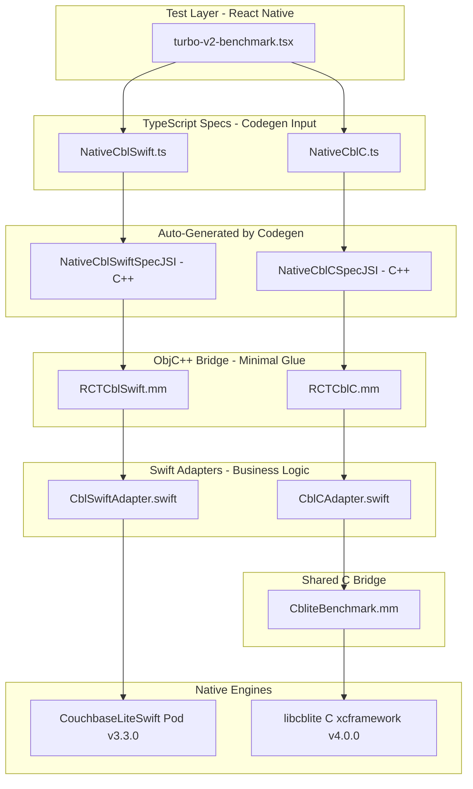

# Turbo V2: Production Codegen Turbo Modules + Full Performance Benchmark

## Why This Rewrite

The current "turbo" modules in [ios/turbo/](ios/turbo/) use `RCT_EXTERN_MODULE` / `RCT_EXTERN_METHOD` macros -- this is the **legacy bridge pattern**, not true Turbo Modules. True Codegen-based Turbo Modules:

- Auto-generate C++ JSI bindings from TypeScript specs (no manual `.mm` method mapping)
- Use `getTurboModule:` returning `std::make_shared<NativeXxxSpecJSI>(params)`
- Eliminate `RCT_EXTERN_METHOD` boilerplate entirely
- Give direct JSI thread access for synchronous methods

The project already has `codegenConfig` in [package.json](package.json) (lines 26-34) pointing to `src/specs`, and New Architecture is enabled in [expo-example/ios/Podfile.properties.json](expo-example/ios/Podfile.properties.json) (`newArchEnabled: true`). We just need to write proper specs and native implementations.

---

## Architecture Diagram




---

## File Map (9 New Files)


| #   | File                                               | Purpose                                             | Lines (est.) |
| --- | -------------------------------------------------- | --------------------------------------------------- | ------------ |
| 1   | `src/specs/NativeCblSwift.ts`                      | Codegen spec for Swift engine                       | ~120         |
| 2   | `src/specs/NativeCblC.ts`                          | Codegen spec for C engine                           | ~120         |
| 3   | `ios/turbo-v2/CblSwiftAdapter.swift`               | Swift business logic using CouchbaseLiteSwift       | ~500         |
| 4   | `ios/turbo-v2/CblCAdapter.swift`                   | Swift business logic wrapping libcblite C           | ~500         |
| 5   | `ios/turbo-v2/RCTCblSwift.h`                       | ObjC header for Swift bridge                        | ~15          |
| 6   | `ios/turbo-v2/RCTCblSwift.mm`                      | ObjC++ Codegen bridge forwarding to CblSwiftAdapter | ~250         |
| 7   | `ios/turbo-v2/RCTCblC.h`                           | ObjC header for C bridge                            | ~15          |
| 8   | `ios/turbo-v2/RCTCblC.mm`                          | ObjC++ Codegen bridge forwarding to CblCAdapter     | ~250         |
| 9   | `expo-example/app/database/turbo-v2-benchmark.tsx` | Full benchmark test screen                          | ~900         |


Existing files to modify:

- [ios/CblReactnative-Bridging-Header.h](ios/CblReactnative-Bridging-Header.h) -- add codegen header imports
- [cbl-reactnative.podspec](cbl-reactnative.podspec) -- ensure `ios/turbo-v2/**` is included in source_files (already covered by `ios/**/*.{h,m,mm,swift}`)
- [expo-example/hooks/useDatabaseNavigationSections.tsx](expo-example/hooks/useDatabaseNavigationSections.tsx) -- add navigation entry for new test screen

---

## STEP 1: TypeScript Specs

Both specs share the same interface shape (so the benchmark can swap between them). The only difference is the module name registered via `TurboModuleRegistry`.

### File 1: `src/specs/NativeCblSwift.ts`

```typescript
/**
 * Turbo Module Spec: CouchbaseLite Swift Engine
 *
 * Codegen reads this file and auto-generates:
 *   - C++ JSI binding class: NativeCblSwiftSpecJSI
 *   - ObjC protocol: NativeCblSwiftSpec
 *
 * The ObjC++ bridge (RCTCblSwift.mm) implements NativeCblSwiftSpec
 * and forwards every call to CblSwiftAdapter.swift.
 */
import type { TurboModule } from 'react-native';
import { TurboModuleRegistry } from 'react-native';

export interface Spec extends TurboModule {
  // ── Database ──────────────────────────────────────────────────────────
  /** Opens (or creates) a database. Returns a unique handle string. */
  db_open(name: string, directory: string | null, encryptionKey: string | null): Promise<string>;
  /** Closes an open database by handle. */
  db_close(dbHandle: string): Promise<void>;
  /** Deletes a database file by name and directory. */
  db_delete(name: string, directory: string): Promise<void>;
  /** Returns the filesystem path of an open database. */
  db_getPath(dbHandle: string): Promise<string>;

  // ── Collection ────────────────────────────────────────────────────────
  /** Creates a collection (or returns existing). Returns a colHandle string. */
  col_create(dbHandle: string, scopeName: string, collectionName: string): Promise<string>;
  /** Returns the document count for a collection. SYNC -- lightweight. */
  col_getCount(colHandle: string): number;

  // ── Single Document CRUD ──────────────────────────────────────────────
  /** Saves a single document. Returns {id, revId, sequence}. */
  doc_save(
    colHandle: string,
    docId: string,
    jsonData: string,
    concurrencyControl: number
  ): Promise<{ id: string; revId: string; sequence: number }>;

  /** Gets a single document by ID. Returns null if not found. */
  doc_get(
    colHandle: string,
    docId: string
  ): Promise<{ id: string; data: string; revId: string; sequence: number } | null>;

  /** Deletes a single document by ID. */
  doc_delete(
    colHandle: string,
    docId: string,
    concurrencyControl: number
  ): Promise<void>;

  // ── Batch Operations (native-level batching) ──────────────────────────
  /**
   * Saves many documents in ONE native call using inBatch / Transaction.
   * @param colHandle - collection handle
   * @param docsJson - JSON string: array of {id: string, data: string}
   * @returns {saved, failed, timeMs, errors}
   */
  batch_save(
    colHandle: string,
    docsJson: string
  ): Promise<{ saved: number; failed: number; timeMs: number; errors: string }>;

  /**
   * Gets many documents in ONE native call.
   * @param colHandle - collection handle
   * @param docIdsJson - JSON string: array of document ID strings
   * @returns JSON string: array of {id, data, revId, sequence}
   */
  batch_get(colHandle: string, docIdsJson: string): Promise<string>;

  /**
   * Deletes many documents in ONE native call using inBatch / Transaction.
   * @param colHandle - collection handle
   * @param docIdsJson - JSON string: array of document ID strings
   * @returns {deleted, failed, timeMs}
   */
  batch_delete(
    colHandle: string,
    docIdsJson: string
  ): Promise<{ deleted: number; failed: number; timeMs: number }>;

  // ── Query ─────────────────────────────────────────────────────────────
  /** Executes a SQL++ query. Returns JSON array string of result rows. */
  query_execute(
    dbHandle: string,
    queryString: string,
    parametersJson: string | null
  ): Promise<string>;

  // ── Replicator ────────────────────────────────────────────────────────
  /**
   * Creates a replicator. Returns replHandle string.
   * @param configJson - JSON string with: endpoint, username, password,
   *   replicatorType ("pushAndPull"|"push"|"pull"), continuous, collections [{scope, name}]
   */
  repl_create(dbHandle: string, configJson: string): Promise<string>;
  /** Starts the replicator. */
  repl_start(replHandle: string): Promise<void>;
  /** Stops the replicator (async, waits for stopped). */
  repl_stop(replHandle: string): Promise<void>;
  /** Returns current replicator status. SYNC -- lightweight read. */
  repl_getStatus(replHandle: string): {
    activity: number;
    completed: number;
    total: number;
    error: string | null;
  };
  /** Stops and removes the replicator. */
  repl_cleanup(replHandle: string): Promise<void>;
}

export default TurboModuleRegistry.getEnforcing<Spec>('CblSwift');
```

### File 2: `src/specs/NativeCblC.ts`

Identical to above except the last line:

```typescript
// ... exact same interface as NativeCblSwift.ts ...

export default TurboModuleRegistry.getEnforcing<Spec>('CblC');
```

---

## STEP 2: Swift Adapter for CouchbaseLite Swift

### File 3: `ios/turbo-v2/CblSwiftAdapter.swift`

This is the production-quality business logic layer using CouchbaseLiteSwift SDK. Key patterns:

- Thread-safe handle maps using concurrent DispatchQueue with `.barrier` for writes
- Every operation validates its handle before proceeding (like `DatabaseManager.getDatabase()` in [ios/cbl-js-swift/DatabaseManager.swift](ios/cbl-js-swift/DatabaseManager.swift) line 50-54)
- `batch_save` uses `database.inBatch(using:)` for optimal commit grouping
- Replicator uses the same config pattern as [ios/cbl-js-swift/ReplicatorManager.swift](ios/cbl-js-swift/ReplicatorManager.swift)

```swift
import Foundation
import CouchbaseLiteSwift

// MARK: - Error Types (same pattern as existing DatabaseError/CollectionError)

enum CblSwiftError: Error, LocalizedError {
    case invalidHandle(handle: String, type: String)
    case databaseError(message: String)
    case collectionError(message: String)
    case documentError(message: String)
    case queryError(message: String)
    case replicatorError(message: String)
    case jsonParseError(message: String)

    var errorDescription: String? {
        switch self {
        case .invalidHandle(let handle, let type):
            return "Invalid \(type) handle: '\(handle)'"
        case .databaseError(let msg): return "Database error: \(msg)"
        case .collectionError(let msg): return "Collection error: \(msg)"
        case .documentError(let msg): return "Document error: \(msg)"
        case .queryError(let msg): return "Query error: \(msg)"
        case .replicatorError(let msg): return "Replicator error: \(msg)"
        case .jsonParseError(let msg): return "JSON parse error: \(msg)"
        }
    }
}

// MARK: - Adapter

@objcMembers
public class CblSwiftAdapter: NSObject {

    // Thread-safe handle storage (concurrent reads, barrier writes)
    private let queue = DispatchQueue(label: "com.cbl.swift.adapter", attributes: .concurrent)

    // Handle maps: String handle -> native object
    private var databases: [String: Database] = [:]
    private var collections: [String: (collection: Collection, dbHandle: String)] = [:]
    private var replicators: [String: Replicator] = [:]

    // MARK: - Handle Helpers

    private func generateHandle(_ prefix: String) -> String {
        return "\(prefix)_\(UUID().uuidString.prefix(8))"
    }

    /// Thread-safe read of a database handle
    private func getDatabase(_ handle: String) -> Database? {
        return queue.sync { databases[handle] }
    }

    /// Thread-safe read of a collection handle
    private func getCollection(_ handle: String) -> (collection: Collection, dbHandle: String)? {
        return queue.sync { collections[handle] }
    }

    /// Thread-safe read of a replicator handle
    private func getReplicator(_ handle: String) -> Replicator? {
        return queue.sync { replicators[handle] }
    }

    // MARK: - Database Operations

    public func dbOpen(
        name: String, directory: String?, encryptionKey: String?,
        resolve: @escaping RCTPromiseResolveBlock,
        reject: @escaping RCTPromiseRejectBlock
    ) {
        queue.async(flags: .barrier) {
            do {
                var config = DatabaseConfiguration()
                if let dir = directory, !dir.isEmpty {
                    config.directory = dir
                }
                if let key = encryptionKey, !key.isEmpty {
                    config.encryptionKey = EncryptionKey.password(key)
                }

                let db = try Database(name: name, config: config)
                let handle = self.generateHandle("db")
                self.databases[handle] = db
                resolve(handle)
            } catch {
                reject("DB_OPEN", error.localizedDescription, error)
            }
        }
    }

    public func dbClose(
        dbHandle: String,
        resolve: @escaping RCTPromiseResolveBlock,
        reject: @escaping RCTPromiseRejectBlock
    ) {
        queue.async(flags: .barrier) {
            guard let db = self.databases[dbHandle] else {
                reject("DB_CLOSE", "Invalid database handle: \(dbHandle)", nil)
                return
            }
            do {
                try db.close()
                self.databases.removeValue(forKey: dbHandle)
                // Also remove any collections referencing this db
                self.collections = self.collections.filter { $0.value.dbHandle != dbHandle }
                resolve(nil)
            } catch {
                reject("DB_CLOSE", error.localizedDescription, error)
            }
        }
    }

    public func dbDelete(
        name: String, directory: String,
        resolve: @escaping RCTPromiseResolveBlock,
        reject: @escaping RCTPromiseRejectBlock
    ) {
        queue.async(flags: .barrier) {
            do {
                try Database.delete(withName: name, inDirectory: directory)
                resolve(nil)
            } catch {
                reject("DB_DELETE", error.localizedDescription, error)
            }
        }
    }

    public func dbGetPath(
        dbHandle: String,
        resolve: @escaping RCTPromiseResolveBlock,
        reject: @escaping RCTPromiseRejectBlock
    ) {
        queue.async {
            guard let db = self.databases[dbHandle] else {
                reject("DB_PATH", "Invalid database handle: \(dbHandle)", nil)
                return
            }
            resolve(db.path ?? "")
        }
    }

    // MARK: - Collection Operations

    public func colCreate(
        dbHandle: String, scopeName: String, collectionName: String,
        resolve: @escaping RCTPromiseResolveBlock,
        reject: @escaping RCTPromiseRejectBlock
    ) {
        queue.async(flags: .barrier) {
            guard let db = self.databases[dbHandle] else {
                reject("COL_CREATE", "Invalid database handle: \(dbHandle)", nil)
                return
            }
            do {
                guard let collection = try db.createCollection(
                    name: collectionName, scope: scopeName
                ) else {
                    reject("COL_CREATE", "Failed to create collection '\(collectionName)'", nil)
                    return
                }
                let handle = self.generateHandle("col")
                self.collections[handle] = (collection: collection, dbHandle: dbHandle)
                resolve(handle)
            } catch {
                reject("COL_CREATE", error.localizedDescription, error)
            }
        }
    }

    /// SYNC method -- called directly on JS thread (lightweight)
    public func colGetCount(colHandle: String) -> NSNumber {
        guard let entry = getCollection(colHandle) else { return NSNumber(value: -1) }
        return NSNumber(value: entry.collection.count)
    }

    // MARK: - Single Document CRUD

    public func docSave(
        colHandle: String, docId: String, jsonData: String, concurrencyControl: Int,
        resolve: @escaping RCTPromiseResolveBlock,
        reject: @escaping RCTPromiseRejectBlock
    ) {
        queue.async(flags: .barrier) {
            guard let entry = self.collections[colHandle] else {
                reject("DOC_SAVE", "Invalid collection handle: \(colHandle)", nil)
                return
            }
            do {
                let mutableDoc: MutableDocument
                if docId.isEmpty {
                    mutableDoc = try MutableDocument(json: jsonData)
                } else {
                    mutableDoc = try MutableDocument(id: docId, json: jsonData)
                }

                if concurrencyControl == -9999 {
                    // No concurrency control
                    try entry.collection.save(document: mutableDoc)
                } else {
                    let cc: ConcurrencyControl = concurrencyControl == 0
                        ? .lastWriteWins : .failOnConflict
                    try entry.collection.save(document: mutableDoc, concurrencyControl: cc)
                }

                let result: NSDictionary = [
                    "id": mutableDoc.id,
                    "revId": mutableDoc.revisionID ?? "",
                    "sequence": mutableDoc.sequence,
                ]
                resolve(result)
            } catch {
                reject("DOC_SAVE", error.localizedDescription, error)
            }
        }
    }

    public func docGet(
        colHandle: String, docId: String,
        resolve: @escaping RCTPromiseResolveBlock,
        reject: @escaping RCTPromiseRejectBlock
    ) {
        queue.async {
            guard let entry = self.collections[colHandle] else {
                reject("DOC_GET", "Invalid collection handle: \(colHandle)", nil)
                return
            }
            do {
                guard let doc = try entry.collection.document(id: docId) else {
                    resolve(nil)
                    return
                }
                let result: NSDictionary = [
                    "id": doc.id,
                    "data": doc.toJSON(),
                    "revId": doc.revisionID ?? "",
                    "sequence": doc.sequence,
                ]
                resolve(result)
            } catch {
                reject("DOC_GET", error.localizedDescription, error)
            }
        }
    }

    public func docDelete(
        colHandle: String, docId: String, concurrencyControl: Int,
        resolve: @escaping RCTPromiseResolveBlock,
        reject: @escaping RCTPromiseRejectBlock
    ) {
        queue.async(flags: .barrier) {
            guard let entry = self.collections[colHandle] else {
                reject("DOC_DEL", "Invalid collection handle: \(colHandle)", nil)
                return
            }
            do {
                guard let doc = try entry.collection.document(id: docId) else {
                    reject("DOC_DEL", "Document not found: \(docId)", nil)
                    return
                }
                if concurrencyControl == -9999 {
                    try entry.collection.delete(document: doc)
                } else {
                    let cc: ConcurrencyControl = concurrencyControl == 0
                        ? .lastWriteWins : .failOnConflict
                    try entry.collection.delete(document: doc, concurrencyControl: cc)
                }
                resolve(nil)
            } catch {
                reject("DOC_DEL", error.localizedDescription, error)
            }
        }
    }

    // MARK: - Batch Operations

    /// Batch save using database.inBatch(using:) for optimal write performance.
    /// Receives ALL documents in ONE call as a JSON array, iterates natively.
    public func batchSave(
        colHandle: String, docsJson: String,
        resolve: @escaping RCTPromiseResolveBlock,
        reject: @escaping RCTPromiseRejectBlock
    ) {
        queue.async(flags: .barrier) {
            guard let entry = self.collections[colHandle] else {
                reject("BATCH_SAVE", "Invalid collection handle: \(colHandle)", nil)
                return
            }

            // Find the database for this collection
            guard let db = self.databases[entry.dbHandle] else {
                reject("BATCH_SAVE", "Database not found for collection", nil)
                return
            }

            // Parse the JSON array of documents
            guard let jsonData = docsJson.data(using: .utf8),
                  let docsArray = try? JSONSerialization.jsonObject(with: jsonData) as? [[String: String]]
            else {
                reject("BATCH_SAVE", "Invalid docsJson format. Expected [{id:string, data:string}, ...]", nil)
                return
            }

            var saved = 0
            var failed = 0
            var errors: [String] = []
            let startTime = CFAbsoluteTimeGetCurrent()

            do {
                // Use inBatch for optimal write performance!
                // All writes share a single SQLite transaction.
                try db.inBatch {
                    for docEntry in docsArray {
                        guard let docId = docEntry["id"],
                              let docData = docEntry["data"] else {
                            failed += 1
                            errors.append("Missing id or data field")
                            continue
                        }
                        do {
                            let mutableDoc = try MutableDocument(id: docId, json: docData)
                            try entry.collection.save(document: mutableDoc)
                            saved += 1
                        } catch {
                            failed += 1
                            errors.append("\(docId): \(error.localizedDescription)")
                        }
                    }
                }
            } catch {
                reject("BATCH_SAVE", "inBatch failed: \(error.localizedDescription)", error)
                return
            }

            let timeMs = (CFAbsoluteTimeGetCurrent() - startTime) * 1000.0
            let result: NSDictionary = [
                "saved": saved,
                "failed": failed,
                "timeMs": timeMs,
                "errors": errors.joined(separator: "; "),
            ]
            resolve(result)
        }
    }

    public func batchGet(
        colHandle: String, docIdsJson: String,
        resolve: @escaping RCTPromiseResolveBlock,
        reject: @escaping RCTPromiseRejectBlock
    ) {
        queue.async {
            guard let entry = self.collections[colHandle] else {
                reject("BATCH_GET", "Invalid collection handle: \(colHandle)", nil)
                return
            }
            guard let jsonData = docIdsJson.data(using: .utf8),
                  let docIds = try? JSONSerialization.jsonObject(with: jsonData) as? [String]
            else {
                reject("BATCH_GET", "Invalid docIdsJson format", nil)
                return
            }

            var results: [[String: Any]] = []
            for docId in docIds {
                do {
                    if let doc = try entry.collection.document(id: docId) {
                        results.append([
                            "id": doc.id,
                            "data": doc.toJSON(),
                            "revId": doc.revisionID ?? "",
                            "sequence": doc.sequence,
                        ])
                    }
                } catch {
                    // Skip failed reads
                }
            }

            do {
                let resultData = try JSONSerialization.data(withJSONObject: results)
                let resultString = String(data: resultData, encoding: .utf8) ?? "[]"
                resolve(resultString)
            } catch {
                reject("BATCH_GET", "JSON serialization failed", error)
            }
        }
    }

    public func batchDelete(
        colHandle: String, docIdsJson: String,
        resolve: @escaping RCTPromiseResolveBlock,
        reject: @escaping RCTPromiseRejectBlock
    ) {
        queue.async(flags: .barrier) {
            guard let entry = self.collections[colHandle] else {
                reject("BATCH_DEL", "Invalid collection handle: \(colHandle)", nil)
                return
            }
            guard let db = self.databases[entry.dbHandle] else {
                reject("BATCH_DEL", "Database not found for collection", nil)
                return
            }
            guard let jsonData = docIdsJson.data(using: .utf8),
                  let docIds = try? JSONSerialization.jsonObject(with: jsonData) as? [String]
            else {
                reject("BATCH_DEL", "Invalid docIdsJson format", nil)
                return
            }

            var deleted = 0
            var failed = 0
            let startTime = CFAbsoluteTimeGetCurrent()

            do {
                try db.inBatch {
                    for docId in docIds {
                        do {
                            if let doc = try entry.collection.document(id: docId) {
                                try entry.collection.delete(document: doc)
                                deleted += 1
                            } else {
                                failed += 1
                            }
                        } catch {
                            failed += 1
                        }
                    }
                }
            } catch {
                reject("BATCH_DEL", "inBatch failed: \(error.localizedDescription)", error)
                return
            }

            let timeMs = (CFAbsoluteTimeGetCurrent() - startTime) * 1000.0
            let result: NSDictionary = [
                "deleted": deleted,
                "failed": failed,
                "timeMs": timeMs,
            ]
            resolve(result)
        }
    }

    // MARK: - Query

    public func queryExecute(
        dbHandle: String, queryString: String, parametersJson: String?,
        resolve: @escaping RCTPromiseResolveBlock,
        reject: @escaping RCTPromiseRejectBlock
    ) {
        queue.async {
            guard let db = self.databases[dbHandle] else {
                reject("QUERY", "Invalid database handle: \(dbHandle)", nil)
                return
            }
            do {
                let query = try db.createQuery(queryString)

                // Parse parameters if provided
                if let paramsJson = parametersJson, !paramsJson.isEmpty,
                   let paramsData = paramsJson.data(using: .utf8),
                   let paramsDict = try? JSONSerialization.jsonObject(with: paramsData) as? [String: Any]
                {
                    let params = Parameters()
                    for (key, value) in paramsDict {
                        params.setValue(value, forName: key)
                    }
                    query.parameters = params
                }

                let results = try query.execute()
                let resultJSONs = results.map { $0.toJSON() }
                let jsonArray = "[" + resultJSONs.joined(separator: ",") + "]"
                resolve(jsonArray)
            } catch {
                reject("QUERY", error.localizedDescription, error)
            }
        }
    }

    // MARK: - Replicator

    public func replCreate(
        dbHandle: String, configJson: String,
        resolve: @escaping RCTPromiseResolveBlock,
        reject: @escaping RCTPromiseRejectBlock
    ) {
        queue.async(flags: .barrier) {
            guard let db = self.databases[dbHandle] else {
                reject("REPL_CREATE", "Invalid database handle: \(dbHandle)", nil)
                return
            }
            guard let jsonData = configJson.data(using: .utf8),
                  let config = try? JSONSerialization.jsonObject(with: jsonData) as? [String: Any]
            else {
                reject("REPL_CREATE", "Invalid configJson", nil)
                return
            }

            // Parse endpoint
            guard let endpointUrl = config["endpoint"] as? String,
                  let url = URL(string: endpointUrl),
                  let endpoint = URLEndpoint(url: url) as URLEndpoint?
            else {
                reject("REPL_CREATE", "Invalid endpoint URL", nil)
                return
            }

            // Parse collections to replicate
            guard let colConfigs = config["collections"] as? [[String: String]] else {
                reject("REPL_CREATE", "Missing 'collections' array", nil)
                return
            }

            // Build collection configurations
            var collectionConfigs: [CollectionConfiguration: [Collection]] = [:]
            // Simplified: all collections share default config
            var collectionsToSync: [Collection] = []
            for colConfig in colConfigs {
                guard let scopeName = colConfig["scope"],
                      let colName = colConfig["name"] else { continue }
                do {
                    if let col = try db.collection(name: colName, scope: scopeName) {
                        collectionsToSync.append(col)
                    }
                } catch {
                    reject("REPL_CREATE", "Collection not found: \(colName)", error)
                    return
                }
            }

            // Build replicator config
            let replConfig = ReplicatorConfiguration(target: endpoint)

            // Add collections with default config
            let colConfig = CollectionConfiguration()
            replConfig.addCollections(collectionsToSync, config: colConfig)

            // Replicator type
            let replTypeStr = config["replicatorType"] as? String ?? "pushAndPull"
            switch replTypeStr {
            case "push": replConfig.replicatorType = .push
            case "pull": replConfig.replicatorType = .pull
            default: replConfig.replicatorType = .pushAndPull
            }

            // Continuous
            replConfig.continuous = config["continuous"] as? Bool ?? false

            // Authentication
            if let username = config["username"] as? String,
               let password = config["password"] as? String
            {
                replConfig.authenticator = BasicAuthenticator(
                    username: username, password: password
                )
            }

            let replicator = Replicator(config: replConfig)
            let handle = self.generateHandle("repl")
            self.replicators[handle] = replicator
            resolve(handle)
        }
    }

    public func replStart(
        replHandle: String,
        resolve: @escaping RCTPromiseResolveBlock,
        reject: @escaping RCTPromiseRejectBlock
    ) {
        queue.async {
            guard let repl = self.replicators[replHandle] else {
                reject("REPL_START", "Invalid replicator handle: \(replHandle)", nil)
                return
            }
            repl.start()
            resolve(nil)
        }
    }

    public func replStop(
        replHandle: String,
        resolve: @escaping RCTPromiseResolveBlock,
        reject: @escaping RCTPromiseRejectBlock
    ) {
        queue.async {
            guard let repl = self.replicators[replHandle] else {
                reject("REPL_STOP", "Invalid replicator handle: \(replHandle)", nil)
                return
            }
            repl.stop()
            resolve(nil)
        }
    }

    /// SYNC method -- called directly on JS thread (lightweight status read)
    public func replGetStatus(replHandle: String) -> NSDictionary {
        guard let repl = getReplicator(replHandle) else {
            return [
                "activity": -1,
                "completed": 0,
                "total": 0,
                "error": "Invalid replicator handle",
            ]
        }
        let status = repl.status
        let errorMsg: String? = status.error != nil
            ? status.error!.localizedDescription : nil
        return [
            "activity": status.activity.rawValue,
            "completed": status.progress.completed,
            "total": status.progress.total,
            "error": errorMsg ?? NSNull(),
        ]
    }

    public func replCleanup(
        replHandle: String,
        resolve: @escaping RCTPromiseResolveBlock,
        reject: @escaping RCTPromiseRejectBlock
    ) {
        queue.async(flags: .barrier) {
            guard let repl = self.replicators[replHandle] else {
                reject("REPL_CLEANUP", "Invalid replicator handle: \(replHandle)", nil)
                return
            }
            repl.stop()
            self.replicators.removeValue(forKey: replHandle)
            resolve(nil)
        }
    }
}
```

---

## STEP 3: Swift Adapter for CouchbaseLite C

### File 4: `ios/turbo-v2/CblCAdapter.swift`

Same interface shape as CblSwiftAdapter, but wraps the existing [ios/CbliteBenchmark.mm](ios/CbliteBenchmark.mm) for database/collection/document operations and calls C replicator APIs directly.

Key differences:

- Uses `CbliteBenchmark` for database/collection/document ops (already tested and working)
- Uses `CBLDatabase_BeginTransaction` / `CBLDatabase_EndTransaction` for batch ops (instead of `inBatch`)
- Uses C replicator API (`CBLReplicator_Create`, `CBLReplicator_Start`, etc.)
- Handle maps store `Int64` pointers from the C library

```swift
import Foundation

@objcMembers
public class CblCAdapter: NSObject {

    private let queue = DispatchQueue(label: "com.cbl.c.adapter", attributes: .concurrent)
    private let clib = CbliteBenchmark()

    // Handle maps: String handle -> Int64 (C pointer)
    private var databases: [String: Int64] = [:]          // dbHandle -> CBLDatabase*
    private var collections: [String: (colPtr: Int64, dbHandle: String)] = [:]
    private var replicators: [String: Int64] = [:]        // replHandle -> CBLReplicator*

    private func generateHandle(_ prefix: String) -> String {
        return "\(prefix)_\(UUID().uuidString.prefix(8))"
    }

    // MARK: - Database Operations

    public func dbOpen(
        name: String, directory: String?, encryptionKey: String?,
        resolve: @escaping RCTPromiseResolveBlock,
        reject: @escaping RCTPromiseRejectBlock
    ) {
        queue.async(flags: .barrier) {
            let dir = directory ?? ""
            guard !dir.isEmpty else {
                reject("DB_OPEN", "Directory is required for C library", nil)
                return
            }
            let ptr = self.clib.openDatabase(withName: name, directory: dir)
            if ptr == 0 {
                reject("DB_OPEN", "Failed to open database '\(name)'", nil)
                return
            }
            let handle = self.generateHandle("db")
            self.databases[handle] = ptr
            resolve(handle)
        }
    }

    public func dbClose(
        dbHandle: String,
        resolve: @escaping RCTPromiseResolveBlock,
        reject: @escaping RCTPromiseRejectBlock
    ) {
        queue.async(flags: .barrier) {
            guard let ptr = self.databases[dbHandle] else {
                reject("DB_CLOSE", "Invalid database handle: \(dbHandle)", nil)
                return
            }
            self.clib.closeDatabase(withHandle: ptr)
            self.databases.removeValue(forKey: dbHandle)
            self.collections = self.collections.filter { $0.value.dbHandle != dbHandle }
            resolve(nil)
        }
    }

    public func dbDelete(
        name: String, directory: String,
        resolve: @escaping RCTPromiseResolveBlock,
        reject: @escaping RCTPromiseRejectBlock
    ) {
        queue.async(flags: .barrier) {
            self.clib.deleteDatabase(withName: name, directory: directory)
            resolve(nil)
        }
    }

    public func dbGetPath(
        dbHandle: String,
        resolve: @escaping RCTPromiseResolveBlock,
        reject: @escaping RCTPromiseRejectBlock
    ) {
        queue.async {
            // C library does not have a direct "getPath" API;
            // Return the directory used during open for now
            resolve("")
        }
    }

    // MARK: - Collection Operations

    public func colCreate(
        dbHandle: String, scopeName: String, collectionName: String,
        resolve: @escaping RCTPromiseResolveBlock,
        reject: @escaping RCTPromiseRejectBlock
    ) {
        queue.async(flags: .barrier) {
            guard let dbPtr = self.databases[dbHandle] else {
                reject("COL_CREATE", "Invalid database handle: \(dbHandle)", nil)
                return
            }
            let colPtr = self.clib.createCollection(
                withHandle: dbPtr, name: collectionName, scopeName: scopeName
            )
            if colPtr == 0 {
                reject("COL_CREATE", "Failed to create collection '\(collectionName)'", nil)
                return
            }
            let handle = self.generateHandle("col")
            self.collections[handle] = (colPtr: colPtr, dbHandle: dbHandle)
            resolve(handle)
        }
    }

    public func colGetCount(colHandle: String) -> NSNumber {
        var colPtr: Int64 = 0
        queue.sync { colPtr = self.collections[colHandle]?.colPtr ?? 0 }
        if colPtr == 0 { return NSNumber(value: -1) }
        return NSNumber(value: clib.getDocumentCount(withCollectionHandle: colPtr))
    }

    // MARK: - Single Document CRUD

    public func docSave(
        colHandle: String, docId: String, jsonData: String, concurrencyControl: Int,
        resolve: @escaping RCTPromiseResolveBlock,
        reject: @escaping RCTPromiseRejectBlock
    ) {
        queue.async(flags: .barrier) {
            guard let entry = self.collections[colHandle] else {
                reject("DOC_SAVE", "Invalid collection handle: \(colHandle)", nil)
                return
            }
            let success = self.clib.saveDocument(
                withCollectionHandle: entry.colPtr,
                documentId: docId,
                jsonData: jsonData
            )
            if success {
                let result: NSDictionary = [
                    "id": docId, "revId": "", "sequence": 0,
                ]
                resolve(result)
            } else {
                reject("DOC_SAVE", "Failed to save document '\(docId)'", nil)
            }
        }
    }

    public func docGet(
        colHandle: String, docId: String,
        resolve: @escaping RCTPromiseResolveBlock,
        reject: @escaping RCTPromiseRejectBlock
    ) {
        queue.async {
            guard let entry = self.collections[colHandle] else {
                reject("DOC_GET", "Invalid collection handle: \(colHandle)", nil)
                return
            }
            if let json = self.clib.getDocument(
                withCollectionHandle: entry.colPtr, documentId: docId
            ) {
                let result: NSDictionary = [
                    "id": docId, "data": json, "revId": "", "sequence": 0,
                ]
                resolve(result)
            } else {
                resolve(nil)
            }
        }
    }

    public func docDelete(
        colHandle: String, docId: String, concurrencyControl: Int,
        resolve: @escaping RCTPromiseResolveBlock,
        reject: @escaping RCTPromiseRejectBlock
    ) {
        // Note: C library CbliteBenchmark doesn't have a deleteDocument method.
        // We will need to add one. For now, reject with not implemented.
        reject("DOC_DEL", "deleteDocument not yet implemented in CbliteBenchmark", nil)
    }

    // MARK: - Batch Operations (using C transactions)

    public func batchSave(
        colHandle: String, docsJson: String,
        resolve: @escaping RCTPromiseResolveBlock,
        reject: @escaping RCTPromiseRejectBlock
    ) {
        queue.async(flags: .barrier) {
            guard let entry = self.collections[colHandle] else {
                reject("BATCH_SAVE", "Invalid collection handle: \(colHandle)", nil)
                return
            }
            guard let dbPtr = self.databases[entry.dbHandle] else {
                reject("BATCH_SAVE", "Database not found", nil)
                return
            }
            guard let jsonData = docsJson.data(using: .utf8),
                  let docsArray = try? JSONSerialization.jsonObject(with: jsonData) as? [[String: String]]
            else {
                reject("BATCH_SAVE", "Invalid docsJson format", nil)
                return
            }

            var saved = 0
            var failed = 0
            var errors: [String] = []
            let startTime = CFAbsoluteTimeGetCurrent()

            // Begin C transaction (equivalent to inBatch)
            self.clib.beginTransaction(withHandle: dbPtr)

            for docEntry in docsArray {
                guard let docId = docEntry["id"],
                      let docData = docEntry["data"] else {
                    failed += 1
                    errors.append("Missing id or data")
                    continue
                }
                let success = self.clib.saveDocument(
                    withCollectionHandle: entry.colPtr,
                    documentId: docId,
                    jsonData: docData
                )
                if success { saved += 1 } else { failed += 1 }
            }

            // End C transaction (commit)
            self.clib.endTransaction(withHandle: dbPtr, commit: true)

            let timeMs = (CFAbsoluteTimeGetCurrent() - startTime) * 1000.0
            let result: NSDictionary = [
                "saved": saved,
                "failed": failed,
                "timeMs": timeMs,
                "errors": errors.joined(separator: "; "),
            ]
            resolve(result)
        }
    }

    public func batchGet(
        colHandle: String, docIdsJson: String,
        resolve: @escaping RCTPromiseResolveBlock,
        reject: @escaping RCTPromiseRejectBlock
    ) {
        queue.async {
            guard let entry = self.collections[colHandle] else {
                reject("BATCH_GET", "Invalid collection handle: \(colHandle)", nil)
                return
            }
            guard let jsonData = docIdsJson.data(using: .utf8),
                  let docIds = try? JSONSerialization.jsonObject(with: jsonData) as? [String]
            else {
                reject("BATCH_GET", "Invalid docIdsJson format", nil)
                return
            }

            var results: [[String: Any]] = []
            for docId in docIds {
                if let json = self.clib.getDocument(
                    withCollectionHandle: entry.colPtr, documentId: docId
                ) {
                    results.append([
                        "id": docId, "data": json, "revId": "", "sequence": 0,
                    ])
                }
            }

            do {
                let resultData = try JSONSerialization.data(withJSONObject: results)
                resolve(String(data: resultData, encoding: .utf8) ?? "[]")
            } catch {
                reject("BATCH_GET", "JSON serialization failed", error)
            }
        }
    }

    public func batchDelete(
        colHandle: String, docIdsJson: String,
        resolve: @escaping RCTPromiseResolveBlock,
        reject: @escaping RCTPromiseRejectBlock
    ) {
        // Requires adding deleteDocument to CbliteBenchmark
        reject("BATCH_DEL", "deleteDocument not yet implemented in CbliteBenchmark", nil)
    }

    // MARK: - Query

    public func queryExecute(
        dbHandle: String, queryString: String, parametersJson: String?,
        resolve: @escaping RCTPromiseResolveBlock,
        reject: @escaping RCTPromiseRejectBlock
    ) {
        // Note: C library query API (CBLDatabase_CreateQuery, CBLQuery_Execute)
        // needs to be added to CbliteBenchmark.mm. Stub for now.
        reject("QUERY", "C library query not yet implemented in CbliteBenchmark", nil)
    }

    // MARK: - Replicator
    // Note: C replicator API (CBLReplicator_Create, CBLReplicator_Start, etc.)
    // needs to be added to CbliteBenchmark.mm. These are stubs.

    public func replCreate(
        dbHandle: String, configJson: String,
        resolve: @escaping RCTPromiseResolveBlock,
        reject: @escaping RCTPromiseRejectBlock
    ) {
        reject("REPL_CREATE", "C library replicator not yet implemented", nil)
    }

    public func replStart(replHandle: String, resolve: @escaping RCTPromiseResolveBlock, reject: @escaping RCTPromiseRejectBlock) {
        reject("REPL_START", "C library replicator not yet implemented", nil)
    }

    public func replStop(replHandle: String, resolve: @escaping RCTPromiseResolveBlock, reject: @escaping RCTPromiseRejectBlock) {
        reject("REPL_STOP", "C library replicator not yet implemented", nil)
    }

    public func replGetStatus(replHandle: String) -> NSDictionary {
        return ["activity": -1, "completed": 0, "total": 0, "error": "Not implemented"]
    }

    public func replCleanup(replHandle: String, resolve: @escaping RCTPromiseResolveBlock, reject: @escaping RCTPromiseRejectBlock) {
        reject("REPL_CLEANUP", "C library replicator not yet implemented", nil)
    }
}
```

**Note on stubs**: The C adapter has stubs for `doc_delete`, `query_execute`, and replicator methods. These require adding new methods to [ios/CbliteBenchmark.mm](ios/CbliteBenchmark.mm) / [ios/CbliteBenchmark.h](ios/CbliteBenchmark.h). We will implement those in Step 3b as a sub-task.

---

## STEP 4: ObjC++ Codegen Bridges

### File 5: `ios/turbo-v2/RCTCblSwift.h`

```objc
#import <React/RCTBridgeModule.h>

@interface RCTCblSwift : NSObject <RCTBridgeModule>
@end
```

### File 6: `ios/turbo-v2/RCTCblSwift.mm`

This is the **proper Codegen bridge** -- the key difference from the current approach. It:

- Imports the codegen-generated header `<CouchbaseLiteSpec/CouchbaseLiteSpec.h>`
- Implements the `NativeCblSwiftSpec` protocol (auto-generated from `NativeCblSwift.ts`)
- Returns `NativeCblSwiftSpecJSI` from `getTurboModule:`
- Forwards every call to `CblSwiftAdapter` (the Swift class)

```objc
#import "RCTCblSwift.h"
#import <CouchbaseLiteSpec/CouchbaseLiteSpec.h>
#import <React/RCTBridge+Private.h>

// Import the auto-generated Swift header (exposes CblSwiftAdapter to ObjC)
// The prefix is your app/library target name. For cbl-reactnative library it is:
#if __has_include("cbl_reactnative-Swift.h")
#import "cbl_reactnative-Swift.h"
#else
#import <cbl_reactnative/cbl_reactnative-Swift.h>
#endif

@interface RCTCblSwift () <NativeCblSwiftSpec>
@end

@implementation RCTCblSwift {
    CblSwiftAdapter *_adapter;
}

RCT_EXPORT_MODULE(CblSwift)

- (instancetype)init {
    if (self = [super init]) {
        _adapter = [[CblSwiftAdapter alloc] init];
    }
    return self;
}

- (std::shared_ptr<facebook::react::TurboModule>)getTurboModule:
    (const facebook::react::ObjCTurboModule::InitParams &)params {
    return std::make_shared<facebook::react::NativeCblSwiftSpecJSI>(params);
}

+ (NSString *)moduleName {
    return @"CblSwift";
}

+ (BOOL)requiresMainQueueSetup {
    return NO;
}

// ── Database ────────────────────────────────────────────────────────────

- (void)db_open:(NSString *)name
      directory:(NSString *)directory
  encryptionKey:(NSString *)encryptionKey
        resolve:(RCTPromiseResolveBlock)resolve
         reject:(RCTPromiseRejectBlock)reject {
    [_adapter dbOpenWithName:name directory:directory encryptionKey:encryptionKey resolve:resolve reject:reject];
}

- (void)db_close:(NSString *)dbHandle
         resolve:(RCTPromiseResolveBlock)resolve
          reject:(RCTPromiseRejectBlock)reject {
    [_adapter dbCloseWithDbHandle:dbHandle resolve:resolve reject:reject];
}

- (void)db_delete:(NSString *)name
        directory:(NSString *)directory
          resolve:(RCTPromiseResolveBlock)resolve
           reject:(RCTPromiseRejectBlock)reject {
    [_adapter dbDeleteWithName:name directory:directory resolve:resolve reject:reject];
}

- (void)db_getPath:(NSString *)dbHandle
           resolve:(RCTPromiseResolveBlock)resolve
            reject:(RCTPromiseRejectBlock)reject {
    [_adapter dbGetPathWithDbHandle:dbHandle resolve:resolve reject:reject];
}

// ── Collection ──────────────────────────────────────────────────────────

- (void)col_create:(NSString *)dbHandle
         scopeName:(NSString *)scopeName
    collectionName:(NSString *)collectionName
           resolve:(RCTPromiseResolveBlock)resolve
            reject:(RCTPromiseRejectBlock)reject {
    [_adapter colCreateWithDbHandle:dbHandle scopeName:scopeName collectionName:collectionName resolve:resolve reject:reject];
}

- (NSNumber *)col_getCount:(NSString *)colHandle {
    return [_adapter colGetCountWithColHandle:colHandle];
}

// ── Single Document CRUD ────────────────────────────────────────────────

- (void)doc_save:(NSString *)colHandle
           docId:(NSString *)docId
        jsonData:(NSString *)jsonData
concurrencyControl:(double)concurrencyControl
         resolve:(RCTPromiseResolveBlock)resolve
          reject:(RCTPromiseRejectBlock)reject {
    [_adapter docSaveWithColHandle:colHandle docId:docId jsonData:jsonData concurrencyControl:(int)concurrencyControl resolve:resolve reject:reject];
}

- (void)doc_get:(NSString *)colHandle
          docId:(NSString *)docId
        resolve:(RCTPromiseResolveBlock)resolve
         reject:(RCTPromiseRejectBlock)reject {
    [_adapter docGetWithColHandle:colHandle docId:docId resolve:resolve reject:reject];
}

- (void)doc_delete:(NSString *)colHandle
             docId:(NSString *)docId
concurrencyControl:(double)concurrencyControl
           resolve:(RCTPromiseResolveBlock)resolve
            reject:(RCTPromiseRejectBlock)reject {
    [_adapter docDeleteWithColHandle:colHandle docId:docId concurrencyControl:(int)concurrencyControl resolve:resolve reject:reject];
}

// ── Batch Operations ────────────────────────────────────────────────────

- (void)batch_save:(NSString *)colHandle
          docsJson:(NSString *)docsJson
           resolve:(RCTPromiseResolveBlock)resolve
            reject:(RCTPromiseRejectBlock)reject {
    [_adapter batchSaveWithColHandle:colHandle docsJson:docsJson resolve:resolve reject:reject];
}

- (void)batch_get:(NSString *)colHandle
       docIdsJson:(NSString *)docIdsJson
          resolve:(RCTPromiseResolveBlock)resolve
           reject:(RCTPromiseRejectBlock)reject {
    [_adapter batchGetWithColHandle:colHandle docIdsJson:docIdsJson resolve:resolve reject:reject];
}

- (void)batch_delete:(NSString *)colHandle
          docIdsJson:(NSString *)docIdsJson
             resolve:(RCTPromiseResolveBlock)resolve
              reject:(RCTPromiseRejectBlock)reject {
    [_adapter batchDeleteWithColHandle:colHandle docIdsJson:docIdsJson resolve:resolve reject:reject];
}

// ── Query ───────────────────────────────────────────────────────────────

- (void)query_execute:(NSString *)dbHandle
          queryString:(NSString *)queryString
       parametersJson:(NSString *)parametersJson
              resolve:(RCTPromiseResolveBlock)resolve
               reject:(RCTPromiseRejectBlock)reject {
    [_adapter queryExecuteWithDbHandle:dbHandle queryString:queryString parametersJson:parametersJson resolve:resolve reject:reject];
}

// ── Replicator ──────────────────────────────────────────────────────────

- (void)repl_create:(NSString *)dbHandle
         configJson:(NSString *)configJson
            resolve:(RCTPromiseResolveBlock)resolve
             reject:(RCTPromiseRejectBlock)reject {
    [_adapter replCreateWithDbHandle:dbHandle configJson:configJson resolve:resolve reject:reject];
}

- (void)repl_start:(NSString *)replHandle
           resolve:(RCTPromiseResolveBlock)resolve
            reject:(RCTPromiseRejectBlock)reject {
    [_adapter replStartWithReplHandle:replHandle resolve:resolve reject:reject];
}

- (void)repl_stop:(NSString *)replHandle
          resolve:(RCTPromiseResolveBlock)resolve
           reject:(RCTPromiseRejectBlock)reject {
    [_adapter replStopWithReplHandle:replHandle resolve:resolve reject:reject];
}

- (NSDictionary *)repl_getStatus:(NSString *)replHandle {
    return [_adapter replGetStatusWithReplHandle:replHandle];
}

- (void)repl_cleanup:(NSString *)replHandle
             resolve:(RCTPromiseResolveBlock)resolve
              reject:(RCTPromiseRejectBlock)reject {
    [_adapter replCleanupWithReplHandle:replHandle resolve:resolve reject:reject];
}

@end
```

### File 7: `ios/turbo-v2/RCTCblC.h`

```objc
#import <React/RCTBridgeModule.h>

@interface RCTCblC : NSObject <RCTBridgeModule>
@end
```

### File 8: `ios/turbo-v2/RCTCblC.mm`

Identical structure to `RCTCblSwift.mm` but:

- Implements `NativeCblCSpec` protocol
- Returns `NativeCblCSpecJSI` from `getTurboModule:`
- Uses `CblCAdapter` instead of `CblSwiftAdapter`
- Module name is `CblC`

```objc
#import "RCTCblC.h"
#import <CouchbaseLiteSpec/CouchbaseLiteSpec.h>
#import <React/RCTBridge+Private.h>

#if __has_include("cbl_reactnative-Swift.h")
#import "cbl_reactnative-Swift.h"
#else
#import <cbl_reactnative/cbl_reactnative-Swift.h>
#endif

@interface RCTCblC () <NativeCblCSpec>
@end

@implementation RCTCblC {
    CblCAdapter *_adapter;
}

RCT_EXPORT_MODULE(CblC)

- (instancetype)init {
    if (self = [super init]) {
        _adapter = [[CblCAdapter alloc] init];
    }
    return self;
}

- (std::shared_ptr<facebook::react::TurboModule>)getTurboModule:
    (const facebook::react::ObjCTurboModule::InitParams &)params {
    return std::make_shared<facebook::react::NativeCblCSpecJSI>(params);
}

+ (NSString *)moduleName {
    return @"CblC";
}

+ (BOOL)requiresMainQueueSetup {
    return NO;
}

// All method implementations follow the EXACT same pattern as RCTCblSwift.mm
// but replace _adapter type with CblCAdapter and call CblCAdapter methods.
// (Same method names, same signatures, forwarding to CblCAdapter instead)

- (void)db_open:(NSString *)name directory:(NSString *)directory encryptionKey:(NSString *)encryptionKey resolve:(RCTPromiseResolveBlock)resolve reject:(RCTPromiseRejectBlock)reject {
    [_adapter dbOpenWithName:name directory:directory encryptionKey:encryptionKey resolve:resolve reject:reject];
}

- (void)db_close:(NSString *)dbHandle resolve:(RCTPromiseResolveBlock)resolve reject:(RCTPromiseRejectBlock)reject {
    [_adapter dbCloseWithDbHandle:dbHandle resolve:resolve reject:reject];
}

- (void)db_delete:(NSString *)name directory:(NSString *)directory resolve:(RCTPromiseResolveBlock)resolve reject:(RCTPromiseRejectBlock)reject {
    [_adapter dbDeleteWithName:name directory:directory resolve:resolve reject:reject];
}

- (void)db_getPath:(NSString *)dbHandle resolve:(RCTPromiseResolveBlock)resolve reject:(RCTPromiseRejectBlock)reject {
    [_adapter dbGetPathWithDbHandle:dbHandle resolve:resolve reject:reject];
}

- (void)col_create:(NSString *)dbHandle scopeName:(NSString *)scopeName collectionName:(NSString *)collectionName resolve:(RCTPromiseResolveBlock)resolve reject:(RCTPromiseRejectBlock)reject {
    [_adapter colCreateWithDbHandle:dbHandle scopeName:scopeName collectionName:collectionName resolve:resolve reject:reject];
}

- (NSNumber *)col_getCount:(NSString *)colHandle {
    return [_adapter colGetCountWithColHandle:colHandle];
}

- (void)doc_save:(NSString *)colHandle docId:(NSString *)docId jsonData:(NSString *)jsonData concurrencyControl:(double)concurrencyControl resolve:(RCTPromiseResolveBlock)resolve reject:(RCTPromiseRejectBlock)reject {
    [_adapter docSaveWithColHandle:colHandle docId:docId jsonData:jsonData concurrencyControl:(int)concurrencyControl resolve:resolve reject:reject];
}

- (void)doc_get:(NSString *)colHandle docId:(NSString *)docId resolve:(RCTPromiseResolveBlock)resolve reject:(RCTPromiseRejectBlock)reject {
    [_adapter docGetWithColHandle:colHandle docId:docId resolve:resolve reject:reject];
}

- (void)doc_delete:(NSString *)colHandle docId:(NSString *)docId concurrencyControl:(double)concurrencyControl resolve:(RCTPromiseResolveBlock)resolve reject:(RCTPromiseRejectBlock)reject {
    [_adapter docDeleteWithColHandle:colHandle docId:docId concurrencyControl:(int)concurrencyControl resolve:resolve reject:reject];
}

- (void)batch_save:(NSString *)colHandle docsJson:(NSString *)docsJson resolve:(RCTPromiseResolveBlock)resolve reject:(RCTPromiseRejectBlock)reject {
    [_adapter batchSaveWithColHandle:colHandle docsJson:docsJson resolve:resolve reject:reject];
}

- (void)batch_get:(NSString *)colHandle docIdsJson:(NSString *)docIdsJson resolve:(RCTPromiseResolveBlock)resolve reject:(RCTPromiseRejectBlock)reject {
    [_adapter batchGetWithColHandle:colHandle docIdsJson:docIdsJson resolve:resolve reject:reject];
}

- (void)batch_delete:(NSString *)colHandle docIdsJson:(NSString *)docIdsJson resolve:(RCTPromiseResolveBlock)resolve reject:(RCTPromiseRejectBlock)reject {
    [_adapter batchDeleteWithColHandle:colHandle docIdsJson:docIdsJson resolve:resolve reject:reject];
}

- (void)query_execute:(NSString *)dbHandle queryString:(NSString *)queryString parametersJson:(NSString *)parametersJson resolve:(RCTPromiseResolveBlock)resolve reject:(RCTPromiseRejectBlock)reject {
    [_adapter queryExecuteWithDbHandle:dbHandle queryString:queryString parametersJson:parametersJson resolve:resolve reject:reject];
}

- (void)repl_create:(NSString *)dbHandle configJson:(NSString *)configJson resolve:(RCTPromiseResolveBlock)resolve reject:(RCTPromiseRejectBlock)reject {
    [_adapter replCreateWithDbHandle:dbHandle configJson:configJson resolve:resolve reject:reject];
}

- (void)repl_start:(NSString *)replHandle resolve:(RCTPromiseResolveBlock)resolve reject:(RCTPromiseRejectBlock)reject {
    [_adapter replStartWithReplHandle:replHandle resolve:resolve reject:reject];
}

- (void)repl_stop:(NSString *)replHandle resolve:(RCTPromiseResolveBlock)resolve reject:(RCTPromiseRejectBlock)reject {
    [_adapter replStopWithReplHandle:replHandle resolve:resolve reject:reject];
}

- (NSDictionary *)repl_getStatus:(NSString *)replHandle {
    return [_adapter replGetStatusWithReplHandle:replHandle];
}

- (void)repl_cleanup:(NSString *)replHandle resolve:(RCTPromiseResolveBlock)resolve reject:(RCTPromiseRejectBlock)reject {
    [_adapter replCleanupWithReplHandle:replHandle resolve:resolve reject:reject];
}

@end
```

---

## STEP 5: Bridging Header Update

Add to [ios/CblReactnative-Bridging-Header.h](ios/CblReactnative-Bridging-Header.h):

```objc
#import <React/RCTBridgeModule.h>
#import <React/RCTEventEmitter.h>
#import <React/RCTViewManager.h>
#import "CbliteBenchmark.h"
// No additional imports needed -- Swift files auto-bridge via Xcode
```

No change needed since the existing header already imports what we need.

---

## STEP 6: Performance Benchmark Test

### File 9: `expo-example/app/database/turbo-v2-benchmark.tsx`

This is the comprehensive test screen. It will be long (~900 lines) so here is the structural outline with key code. The full implementation will be written during execution.

**Structure:**

- Imports both `NativeCblSwift` and `NativeCblC` specs
- Each test function accepts a `module` parameter (either spec) so logic is shared
- Tests run sequentially: Swift first, then C, then comparison
- Results include: operation count, total time, throughput (ops/sec), native-reported timeMs for batch
- Document generator: 3 sizes (small/medium/large)
- Configurable document count (default 100,000 for batch, 1,000 for single)
- Copy-to-clipboard support

**Test list:**

- Test 1: Single Save (1,000 docs, one-at-a-time)
- Test 2: Batch Save (100,000 docs, one native call, uses inBatch/Transaction)
- Test 3: Single Get (1,000 docs)
- Test 4: Batch Get (10,000 docs, one native call)
- Test 5: Single Update (1,000 docs -- save over existing)
- Test 6: Batch Update (100,000 docs, one native call)
- Test 7: Single Delete (1,000 docs)
- Test 8: Batch Delete (100,000 docs, one native call)
- Test 9: SQL++ Query (full scan + indexed query)
- Test 10: Replication to Capella (push/pull/bidirectional)

**Key benchmark helper:**

```typescript
const runTest = async (
  label: string,
  module: any, // NativeCblSwift or NativeCblC
  testFn: (mod: any) => Promise<{ timeMs: number; count: number }>
) => {
  const results = [];
  // Warm-up run (discarded)
  await testFn(module);
  // 3 measured runs
  for (let i = 0; i < 3; i++) {
    const result = await testFn(module);
    results.push(result);
  }
  // Report median
  results.sort((a, b) => a.timeMs - b.timeMs);
  const median = results[1]; // middle of 3
  return { label, ...median, throughput: Math.round((median.count / median.timeMs) * 1000) };
};
```

**Key batch_save test (showing the production pattern):**

```typescript
const testBatchSave = async (mod: any) => {
  const dir = getDocumentsDirectory();
  const dbHandle = await mod.db_open('bench-batch', dir, null);
  const colHandle = await mod.col_create(dbHandle, '_default', 'test');

  // Build all 100K docs as a JSON array -- ONE bridge crossing
  const docs = [];
  for (let i = 0; i < BATCH_COUNT; i++) {
    docs.push({ id: `doc_${i}`, data: JSON.stringify(generateDoc(i)) });
  }
  const docsJson = JSON.stringify(docs);

  const start = performance.now();
  const result = await mod.batch_save(colHandle, docsJson);
  const timeMs = performance.now() - start;

  // Verify
  const count = mod.col_getCount(colHandle);
  addResult(`  Saved: ${result.saved}, Count: ${count}, Native: ${result.timeMs.toFixed(0)}ms`);

  // Cleanup
  await mod.db_close(dbHandle);
  await mod.db_delete('bench-batch', dir);

  return { timeMs, count: BATCH_COUNT };
};
```

---

## STEP 7: Add Navigation Entry

In [expo-example/hooks/useDatabaseNavigationSections.tsx](expo-example/hooks/useDatabaseNavigationSections.tsx), add a new entry pointing to the benchmark screen:

```typescript
{
  name: 'Turbo V2 Benchmark',
  component: 'database/turbo-v2-benchmark',
}
```

---

## Summary of What Changes vs What Stays

- **Stays untouched**: All existing code in `ios/turbo/`, `ios/cbl-js-swift/`, `src/specs/NativeCblCollection.ts`, `src/specs/NativeCblDatabase.ts`, and the existing test files
- **New directory**: `ios/turbo-v2/` for all new native code (completely independent)
- **New specs**: `src/specs/NativeCblSwift.ts` and `src/specs/NativeCblC.ts` (new codegen targets)
- **New test**: `expo-example/app/database/turbo-v2-benchmark.tsx`

This gives you a clean A/B comparison: old architecture vs new architecture, Swift engine vs C engine.